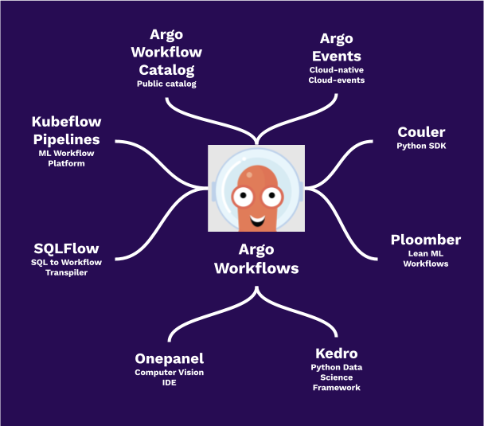

[](https://argoproj.github.io/community/join-slack)
[](https://github.com/argoproj/argo-workflows/actions?query=event%3Apush+branch%3Amaster)
[](https://bestpractices.coreinfrastructure.org/projects/3830)
[](https://twitter.com/argoproj)

## What is Argo Workflows?

Argo Workflows is an open source container-native workflow engine for orchestrating parallel jobs on Kubernetes. Argo
Workflows is implemented as a Kubernetes CRD (Custom Resource Definition).

* Define workflows where each step in the workflow is a container.
* Model multi-step workflows as a sequence of tasks or capture the dependencies between tasks using a directed acyclic
  graph (DAG).
* Easily run compute intensive jobs for machine learning or data processing in a fraction of the time using Argo
  Workflows on Kubernetes.

Argo is a [Cloud Native Computing Foundation (CNCF)](https://cncf.io/) hosted project.

[](https://www.youtube.com/watch?v=TZgLkCFQ2tk)

## Use Cases

* Machine Learning pipelines
* Data and batch processing
* ETL
* Infrastructure automation
* CI/CD

## Why Argo Workflows?

* Argo Workflows is the most popular workflow execution engine for Kubernetes.
* It can run 1000s of workflows a day, each with 1000s of concurrent tasks.
* Our users say it is lighter-weight, faster, more powerful, and easier to use
* Designed from the ground up for containers without the overhead and limitations of legacy VM and server-based
  environments.
* Cloud agnostic and can run on any Kubernetes cluster.

[Read what people said in our latest survey](https://blog.argoproj.io/argo-workflows-2021-survey-results-d6fa890030ee)

## Try Argo Workflows

[Access the demo environment](https://workflows.apps.argoproj.io/workflows/argo) (login using Github)


## Ecosystem



[Argo Events](https://github.com/argoproj/argo-events)
|
[Argo Workflows Catalog](https://argoproj-labs.github.io/argo-workflows-catalog/)
|
[Couler](https://github.com/couler-proj/couler)
|
[Katib](https://github.com/kubeflow/katib)
|
[Kedro](https://kedro.readthedocs.io/en/stable/)
|
[Kubeflow Pipelines](https://github.com/kubeflow/pipelines)
|
[Onepanel](https://www.onepanel.ai/)
|
[Ploomber](https://github.com/ploomber/ploomber)
|
[Seldon](https://github.com/SeldonIO/seldon-core)
|
[SQLFlow](https://github.com/sql-machine-learning/sqlflow)


## Client Libraries

Check out our [Java, Golang and Python clients](docs/client-libraries.md).

## Quickstart

```bash
kubectl create namespace argo
kubectl apply -n argo -f https://raw.githubusercontent.com/argoproj/argo-workflows/master/manifests/install.yaml
```

## Who uses Argo Workflows?

[Official Argo Workflows user list](USERS.md)

## Documentation

* [Get started here](docs/quick-start.md)
* [How to write Argo Workflow specs](https://github.com/argoproj/argo-workflows/blob/master/examples/README.md)
* [How to configure your artifact repository](docs/configure-artifact-repository.md)

## Features

* UI to visualize and manage Workflows
* Artifact support (S3, Artifactory, Alibaba Cloud OSS, HTTP, Git, GCS, raw)
* Workflow templating to store commonly used Workflows in the cluster
* Archiving Workflows after executing for later access
* Scheduled workflows using cron
* Server interface with REST API (HTTP and GRPC)
* DAG or Steps based declaration of workflows
* Step level input & outputs (artifacts/parameters)
* Loops
* Parameterization
* Conditionals
* Timeouts (step & workflow level)
* Retry (step & workflow level)
* Resubmit (memoized)
* Suspend & Resume
* Cancellation
* K8s resource orchestration
* Exit Hooks (notifications, cleanup)
* Garbage collection of completed workflow
* Scheduling (affinity/tolerations/node selectors)
* Volumes (ephemeral/existing)
* Parallelism limits
* Daemoned steps
* DinD (docker-in-docker)
* Script steps
* Event emission
* Prometheus metrics
* Multiple executors
* Multiple pod and workflow garbage collection strategies
* Automatically calculated resource usage per step
* Java/Golang/Python SDKs
* Pod Disruption Budget support
* Single-sign on (OAuth2/OIDC)
* Webhook triggering
* CLI
* Out-of-the box and custom Prometheus metrics
* Windows container support
* Embedded widgets
* Multiplex log viewer

## Community Meetings

We host monthly community meetings where we and the community showcase demos and discuss the current and future state of
the project. Feel free to join us! For Community Meeting information, minutes and recordings
please [see here](https://bit.ly/argo-wf-cmty-mtng).

Participation in the Argo Workflows project is governed by
the [CNCF Code of Conduct](https://github.com/cncf/foundation/blob/master/code-of-conduct.md)

## Community Blogs and Presentations

* [Awesome-Argo: A Curated List of Awesome Projects and Resources Related to Argo](https://github.com/terrytangyuan/awesome-argo)
* [Automation of Everything - How To Combine Argo Events, Workflows & Pipelines, CD, and Rollouts](https://youtu.be/XNXJtxkUKeY)
* [Argo Workflows and Pipelines - CI/CD, Machine Learning, and Other Kubernetes Workflows](https://youtu.be/UMaivwrAyTA)
* [Argo Ansible role: Provisioning Argo Workflows on OpenShift](https://medium.com/@marekermk/provisioning-argo-on-openshift-with-ansible-and-kustomize-340a1fda8b50)
* [Argo Workflows vs Apache Airflow](http://bit.ly/30YNIvT)
* [CI/CD with Argo on Kubernetes](https://medium.com/@bouwe.ceunen/ci-cd-with-argo-on-kubernetes-28c1a99616a9)
* [Running Argo Workflows Across Multiple Kubernetes Clusters](https://admiralty.io/blog/running-argo-workflows-across-multiple-kubernetes-clusters/)
* [Open Source Model Management Roundup: Polyaxon, Argo, and Seldon](https://www.anaconda.com/blog/developer-blog/open-source-model-management-roundup-polyaxon-argo-and-seldon/)
* [Producing 200 OpenStreetMap extracts in 35 minutes using a scalable data workflow](https://www.interline.io/blog/scaling-openstreetmap-data-workflows/)
* [Argo integration review](http://dev.matt.hillsdon.net/2018/03/24/argo-integration-review.html)
* TGI Kubernetes with Joe Beda: [Argo workflow system](https://www.youtube.com/watch?v=M_rxPPLG8pU&start=859)

## Project Resources

* Argo GitHub:  https://github.com/argoproj
* Argo Website: https://argoproj.github.io/
* Argo Slack:   [click here to join](https://argoproj.github.io/community/join-slack)

## Security

See [SECURITY.md](SECURITY.md).
