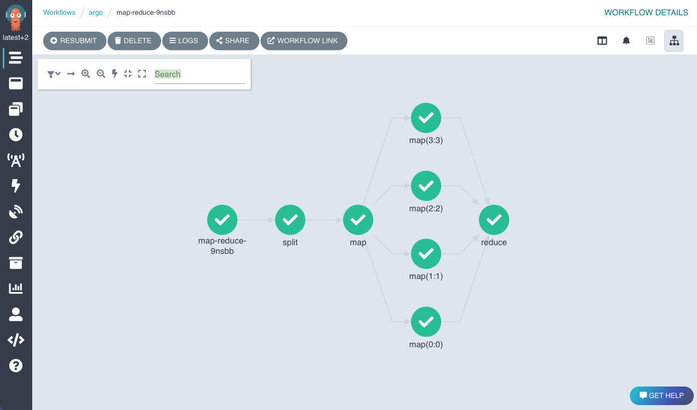

<!-- markdownlint-disable-next-line MD041 -->

## What is Argo Workflows?

Argo Workflows is an open source container-native workflow engine for orchestrating parallel jobs on Kubernetes.
Argo Workflows is implemented as a Kubernetes CRD (Custom Resource Definition).

* Define workflows where each step is a container.
* Model multi-step workflows as a sequence of tasks or capture the dependencies between tasks using a directed acyclic graph (DAG).
* Easily run compute intensive jobs for machine learning or data processing in a fraction of the time using Argo Workflows on Kubernetes.

Argo is a [Cloud Native Computing Foundation (CNCF)](https://cncf.io/) graduated project.

## Use Cases

* [Machine Learning pipelines](use-cases/machine-learning.md)
* [Data and batch processing](use-cases/data-processing.md)
* [Infrastructure automation](use-cases/infrastructure-automation.md)
* [CI/CD](use-cases/ci-cd.md)
* [Other use cases](use-cases/other.md)

## Why Argo Workflows?

* Argo Workflows is the most popular workflow execution engine for Kubernetes.
* Light-weight, scalable, and easier to use.
    * Including for Python users through [the Hera Python SDK for Argo Workflows](https://hera.readthedocs.io/en/stable/).
* Designed from the ground up for containers without the overhead and limitations of legacy VM and server-based environments.
* Cloud agnostic and can run on any Kubernetes cluster.

[Read what people said in our latest survey](https://blog.argoproj.io/argo-workflows-events-2023-user-survey-results-82c53bc30543)

## Try Argo Workflows

You can try Argo Workflows via one of the following:

1. [Interactive Training Material](https://killercoda.com/argoproj/course/argo-workflows/)
1. [Access the demo environment](https://workflows.apps.argoproj.io/workflows/argo)

## Who uses Argo Workflows?

[About 200+ organizations are officially using Argo Workflows](https://github.com/argoproj/argo-workflows/blob/main/USERS.md)

## Ecosystem

Just some of the projects that use or rely on Argo Workflows (complete list [here](https://github.com/akuity/awesome-argo#ecosystem-projects)):

* [Argo Events](https://github.com/argoproj/argo-events)
* [Couler](https://github.com/couler-proj/couler)
* [Hera](https://github.com/argoproj-labs/hera-workflows)
* [Katib](https://github.com/kubeflow/katib)
* [Kedro](https://kedro.readthedocs.io/en/stable/)
* [Kubeflow Pipelines](https://github.com/kubeflow/pipelines)
* [Netflix Metaflow](https://metaflow.org)
* [Onepanel](https://github.com/onepanelio/onepanel)
* [Orchest](https://github.com/orchest/orchest/)
* [Piper](https://github.com/quickube/piper)
* [Ploomber](https://github.com/ploomber/ploomber)
* [Seldon](https://github.com/SeldonIO/seldon-core)
* [SQLFlow](https://github.com/sql-machine-learning/sqlflow)

## Client Libraries

Check out our [Java, Golang and Python clients](client-libraries.md).

## Quickstart

* [Get started here](quick-start.md)
* [Walk-through examples](walk-through/index.md)

## Documentation

You're here!

## Features

An incomplete list of features Argo Workflows provide:

* UI to visualize and manage Workflows
* Artifact support (S3, Artifactory, Alibaba Cloud OSS, Azure Blob Storage, HTTP, Git, GCS, raw)
* Workflow templating to store commonly used Workflows in the cluster
* Archiving Workflows after executing for later access
* Scheduled workflows using cron
* Server interface with REST API (HTTP and GRPC)
* DAG or Steps based declaration of workflows
* Step level input & outputs (artifacts/parameters)
* Loops
* Parameterization
* Conditionals
* Timeouts (step & workflow level)
* Retry (step & workflow level)
* Resubmit (memoized)
* Suspend & Resume
* Cancellation
* K8s resource orchestration
* Exit Hooks (notifications, cleanup)
* Garbage collection of completed workflow
* Scheduling (affinity/tolerations/node selectors)
* Volumes (ephemeral/existing)
* Parallelism limits
* Daemoned steps
* DinD (docker-in-docker)
* Script steps
* Event emission
* Prometheus metrics
* Multiple executors
* Multiple pod and workflow garbage collection strategies
* Automatically calculated resource usage per step
* Java/Golang/Python SDKs
* Pod Disruption Budget support
* Single-sign on (OAuth2/OIDC)
* Webhook triggering
* CLI
* Out-of-the box and custom Prometheus metrics
* Windows container support
* Embedded widgets
* Multiplex log viewer

## Community Meetings

We host monthly community meetings where we and the community showcase demos and discuss the current and future state of the project. Feel free to join us!
For Community Meeting information, minutes and recordings, please [see here](https://bit.ly/argo-wf-cmty-mtng).

Participation in Argo Workflows is governed by the [CNCF Code of Conduct](https://github.com/cncf/foundation/blob/master/code-of-conduct.md)

## Community Blogs and Presentations

* [Awesome-Argo: A Curated List of Awesome Projects and Resources Related to Argo](https://github.com/terrytangyuan/awesome-argo)
* [Automation of Everything - How To Combine Argo Events, Workflows & Pipelines, CD, and Rollouts](https://youtu.be/XNXJtxkUKeY)
* [Argo Workflows and Pipelines - CI/CD, Machine Learning, and Other Kubernetes Workflows](https://youtu.be/UMaivwrAyTA)
* [Argo Ansible role: Provisioning Argo Workflows on OpenShift](https://medium.com/@marekermk/provisioning-argo-on-openshift-with-ansible-and-kustomize-340a1fda8b50)
* [Argo Workflows vs Apache Airflow](http://bit.ly/30YNIvT)
* [Beyond Prototypes: Production-Ready ML Systems with Metaflow and Argo](https://github.com/terrytangyuan/public-talks/tree/main/talks/kubecon-na-2023-metaflow-argo)
* [CI/CD with Argo on Kubernetes](https://medium.com/@bouwe.ceunen/ci-cd-with-argo-on-kubernetes-28c1a99616a9)
* [Define Your CI/CD Pipeline with Argo Workflows](https://haque-zubair.medium.com/define-your-ci-cd-pipeline-with-argo-workflows-25aefb02fa63)
* [Distributed Machine Learning Patterns from Manning Publication](https://github.com/terrytangyuan/distributed-ml-patterns)
* [Engineering Cloud Native AI Platform](https://github.com/terrytangyuan/public-talks/tree/main/talks/platform-con-2024-engineering-cloud-native-ai-platform)
* [Managing Thousands of Automatic Machine Learning Experiments with Argo and Katib](https://github.com/terrytangyuan/public-talks/blob/main/talks/argocon-automl-experiments-2022)
* [Revolutionizing Scientific Simulations with Argo Workflows](https://www.youtube.com/watch?v=BYVf7GhfiRg)
* [Running Argo Workflows Across Multiple Kubernetes Clusters](https://admiralty.io/blog/running-argo-workflows-across-multiple-kubernetes-clusters/)
* [Scaling Kubernetes: Best Practices for Managing Large-Scale Batch Jobs with Spark and Argo Workflow](https://www.youtube.com/watch?v=KqEKRPjy4aE)
* [Open Source Model Management Roundup: Polyaxon, Argo, and Seldon](https://www.anaconda.com/blog/developer-blog/open-source-model-management-roundup-polyaxon-argo-and-seldon/)
* [Producing 200 OpenStreetMap extracts in 35 minutes using a scalable data workflow](https://www.interline.io/blog/scaling-openstreetmap-data-workflows/)
* [Production-Ready AI Platform on Kubernetes](https://github.com/terrytangyuan/public-talks/tree/main/talks/kubecon-europe-2024-production-ai-platform-on-k8s)
* [Argo integration review](http://dev.matt.hillsdon.net/2018/03/24/argo-integration-review.html)
* TGI Kubernetes with Joe Beda: [Argo workflow system](https://www.youtube.com/watch?v=M_rxPPLG8pU&start=859)

## Project Resources

* [Argo Project GitHub organization](https://github.com/argoproj)
* [Argo Website](https://argoproj.github.io/)
* [Argo Slack](https://argoproj.github.io/community/join-slack)

## Security

See [Security](security.md).
