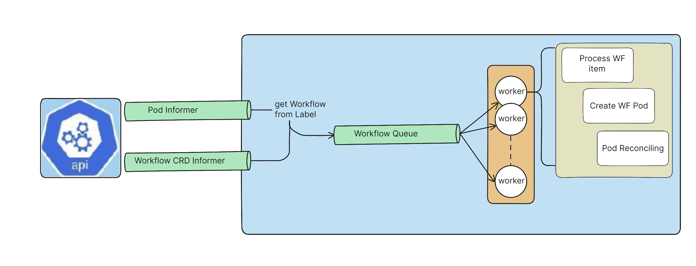

# Architecture

## Diagram

## Argo Workflow Overview

## Workflow controller architecture

## Various configurations for Argo UI and Argo Server

The top diagram below shows what happens if you run "make start UI=true" locally (recommended if you need the UI during local development). This runs a React application (`Webpack` HTTP server) locally which serves the `index.html` and typescript files from port 8080. From the typescript code there are calls made to the back end API (Argo Server) at port 2746. The `Webpack` HTTP server is configured for hot reload, meaning the UI will update automatically based on local code changes.

The second diagram is an alternative approach for rare occasions that the React files are broken and you're doing local development. In this case, everything is served from the Argo Server at port 2746.

The third diagram shows how things are configured for a Kubernetes environment. It is similar to the second diagram in that the Argo Server hosts everything for the UI.

