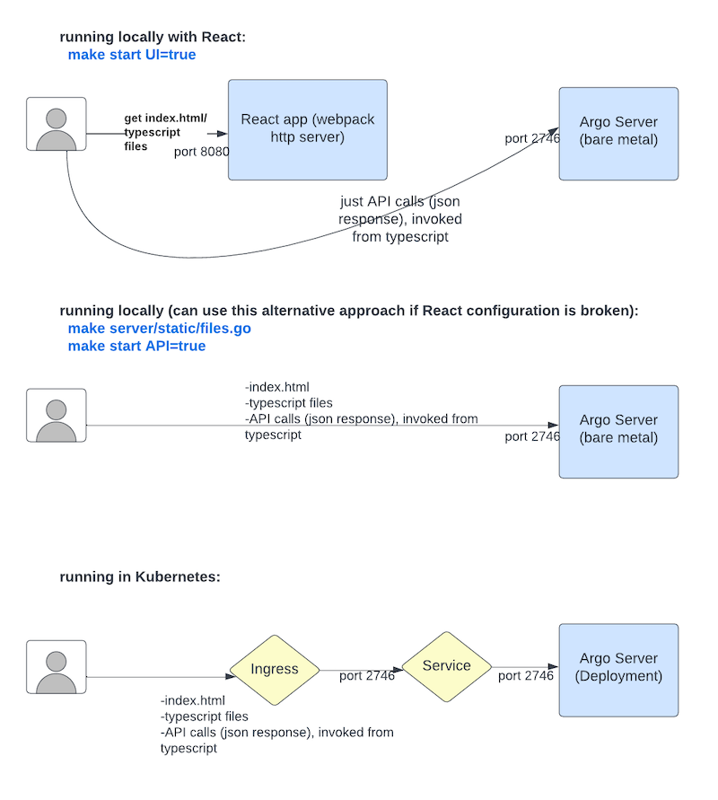

# Architecture

## Diagram

The following diagram shows the components of the Argo Workflows architecture. There are two Deployments: Workflow Controller and Argo Server. The former does all of the reconciling, and the latter serves the API. Note that the Controller can be used stand alone.

The reconciliation code for the `WorkflowController` can be found in [`workflow/controller/controller.go`](https://github.com/argoproj/argo-workflows/blob/master/workflow/controller/controller.go). The Argo Server opens up an HTTP(S) listener at [`server/apiserver/argoserver.go`](https://github.com/argoproj/argo-workflows/blob/master/server/apiserver/argoserver.go).

---

## Argo Workflow Overview

The diagram below provides a little more detail as far as namespaces. The Workflow Controller and Argo Server both run in the `argo` namespace. Assuming Argo Workflows was installed as a Cluster Install or as a Managed Namespace Install (described [here](installation.md)), the Workflows and the Pods generated from them run in a separate namespace.

The internals of a Pod are also shown. Each Step and each DAG Task cause a Pod to be generated, and each of these is composed of 3 containers:

- `main` container runs the Image that the user indicated, where the `argoexec` utility is volume mounted and serves as the main command which calls the configured Command as a sub-process
- `init` container is an `InitContainer`, fetching artifacts and parameters and making them available to the `main` container
- `wait` container performs tasks that are needed for clean up, including saving off parameters and artifacts

Look in [`cmd/argoexec`](https://github.com/argoproj/argo-workflows/blob/master/cmd/argoexec) for this code.

---

## Workflow controller architecture

The following diagram shows the process for reconciliation, whereby a set of worker goroutines process the Workflows which have been added to a Workflow queue based on adds and updates to Workflows and Workflow Pods. Note that in addition to the Informers shown, there are Informers for the other CRDs that Argo Workflows uses as well. You can find this code in [`workflow/controller/controller.go`](https://github.com/argoproj/argo-workflows/blob/master/workflow/controller/controller.go). Note that the controller only ever processes a single Workflow at a time.

---

## Various configurations for Argo UI and Argo Server

The top diagram below shows what happens if you run "make start UI=true" locally (recommended if you need the UI during local development). This runs a React application (`Webpack` HTTP server) locally which serves the `index.html` and typescript files from port 8080. From the typescript code there are calls made to the back end API (Argo Server) at port 2746. The `Webpack` HTTP server is configured for hot reload, meaning the UI will update automatically based on local code changes.

The second diagram is an alternative approach for rare occasions that the React files are broken and you're doing local development. In this case, everything is served from the Argo Server at port 2746.

The third diagram shows how things are configured for a Kubernetes environment. It is similar to the second diagram in that the Argo Server hosts everything for the UI.

