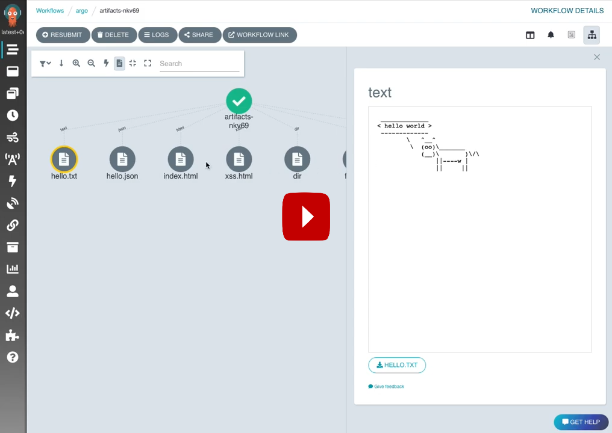
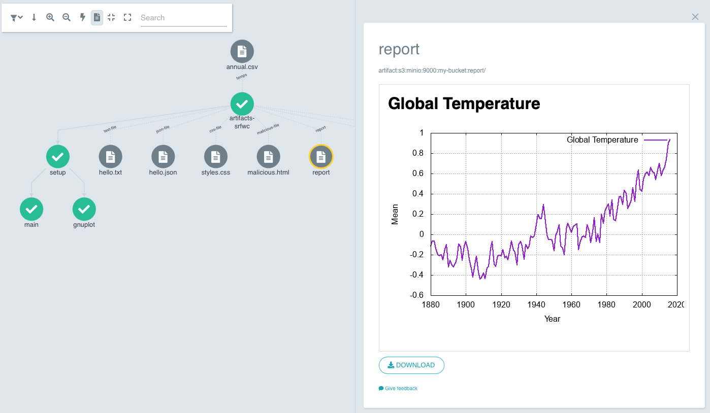
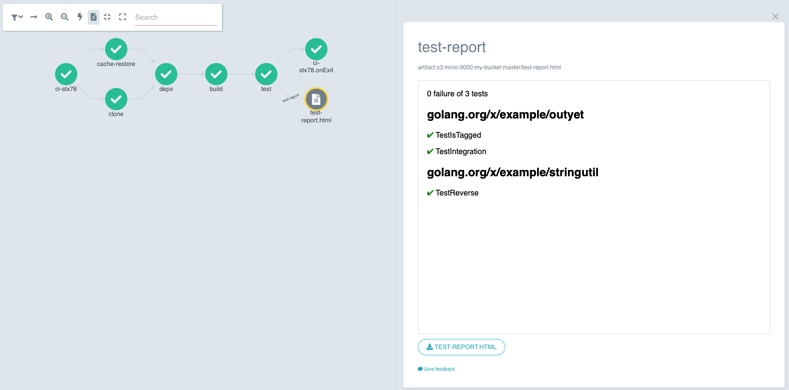

# Artifact Visualization

> since v3.4

Artifacts can be viewed in the UI.

Use cases:

* Comparing ML pipeline runs from generated charts.
* Visualizing end results of ML pipeline runs.
* Debugging workflows where visual artifacts are the most helpful.

[](https://youtu.be/whoRfYY9Fhk)

* Artifacts appear as elements in the workflow DAG that you can click on.
* When you click on the artifact, a panel appears.
* The first time this appears explanatory text is shown to help you understand if you might need to change your
  workflows to use this feature.
* Known file types such as images, text or HTML are shown in an inline-frame (`iframe`).
* Artifacts are sandboxed using a Content-Security-Policy that prevents JavaScript execution.
* JSON is shown with syntax highlighting.

To start, take a look at the [example](https://github.com/argoproj/argo-workflows/blob/main/examples/artifacts-workflowtemplate.yaml).




## Artifact Types

An artifact maybe a `.tgz`, file or directory.

### `.tgz`

Viewing of `.tgz` is not supported in the UI. By default artifacts are compressed as a `.tgz`. Only artifacts that were
not compressed can be viewed.

To prevent compression, set `archive` to `none` to prevent compression:

```yaml
- name: artifact
  # ...
  archive:
    none: { }
```

### File

Files maybe shown in the UI. To determine if a file can be shown, the UI checks if the artifact's file extension is
supported. The extension is found in the artifact's key.

To view a file, add the extension to the key:

```yaml
- name: single-file
  s3:
    key: visualization.png
```

### Directory

Directories are shown in the UI. The UI considers any key with a trailing-slash to be a directory.

To view a directory, add a trailing-slash:

```yaml
- name: reports
  s3:
    key: reports/
```

If the directory contains `index.html`, then that will be shown, otherwise a directory listing is displayed.

⚠️ HTML files may contain CSS and images served from the same origin. Scripts are not allowed. Nothing may be remotely
loaded.

## Security

### Content Security Policy

We assume that artifacts are not trusted, so by default, artifacts are served with a `Content-Security-Policy` that
disables JavaScript and remote files.

This is similar to what happens when you include third-party scripts, such as analytic tracking, in your website.
However, those tracking codes are normally served from a different domain to your main website. Artifacts are served
from the same origin, so normal browser controls are not secure enough.

### Sub-Path Access

Previously, users could access the artifacts of any workflows they could access. To allow HTML files to link to other files
within their tree, you can now access any sub-paths of the artifact's key.

Example:

The artifact produces a folder in an S3 bucket named `my-bucket`, with a key `report/`. You can also access anything
matching `report/*`.
