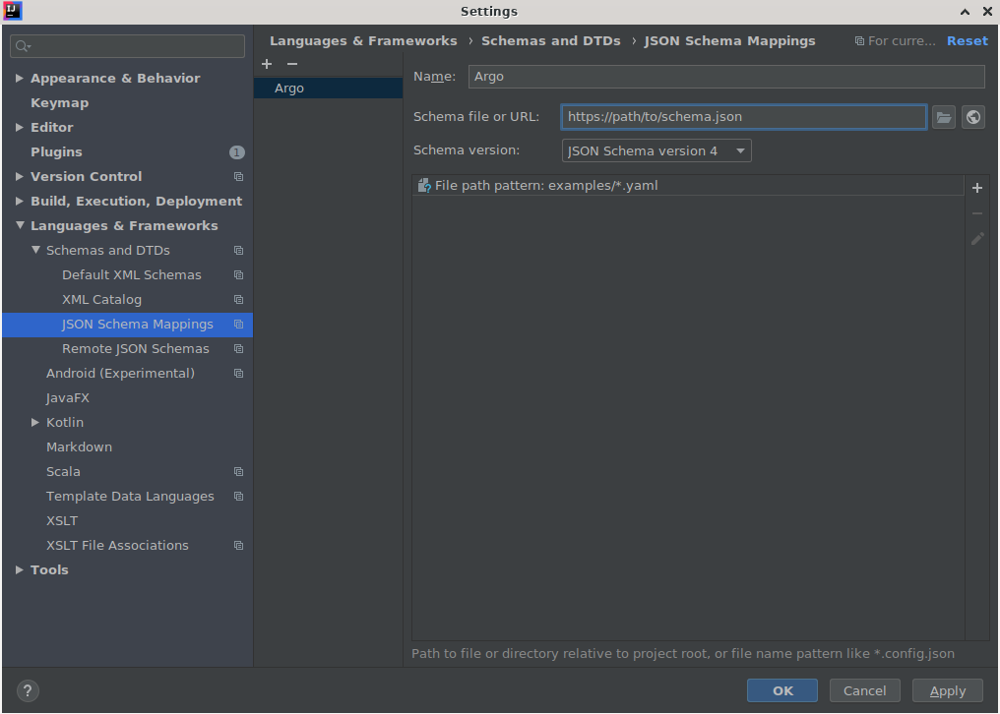
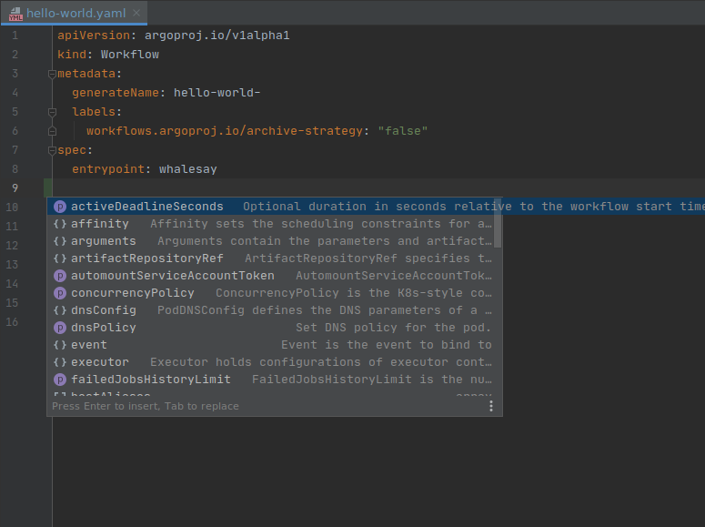

# IDE Set-Up

## Validating Argo YAML against the JSON Schema

Argo provides a [JSON Schema](https://raw.githubusercontent.com/argoproj/argo-workflows/master/api/jsonschema/schema.json) that enables validation of YAML resources in your IDE.

### IntelliJ IDEA (Community & Utimate Editions)

YAML validation is supported natively in IDEA.

Configure your IDE to reference the Argo schema and map it to your Argo YAML files:

- The schema is located at [https://raw.githubusercontent.com/argoproj/argo-workflows/master/api/jsonschema/schema.json](https://raw.githubusercontent.com/argoproj/argo-workflows/master/api/jsonschema/schema.json).
- Specify a file glob pattern that locates **your** Argo files. The example glob here is for the Argo Github project!
- Note that you may need to restart IDEA to pick up the changes.

That's it. Open an Argo YAML file and you should see smarter behaviour, including type errors and context-sensitive autocomplete.

### VSCode

The [Red Hat YAML](https://github.com/redhat-developer/vscode-yaml) plugin will provide error highlighting and autocompletion for Argo resources.

Install the Red Hat YAML plugin in VSCode and open extension settings:

Open the YAML schemas settings:

Add the Argo schema setting `yaml.schemas`:

- The schema is located at [https://raw.githubusercontent.com/argoproj/argo-workflows/master/api/jsonschema/schema.json](https://raw.githubusercontent.com/argoproj/argo-workflows/master/api/jsonschema/schema.json).
- Specify a file glob pattern that locates **your** Argo files. The example glob here is for the Argo Github project!
- Note that other defined schemas with overlapping glob patterns may cause errors.

That's it. Open an Argo YAML file and you should see smarter behaviour, including type errors and context-sensitive autocomplete.

