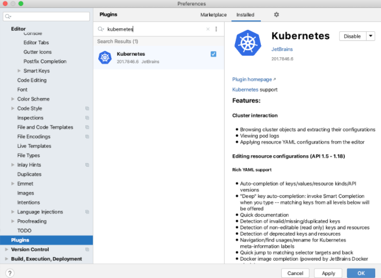
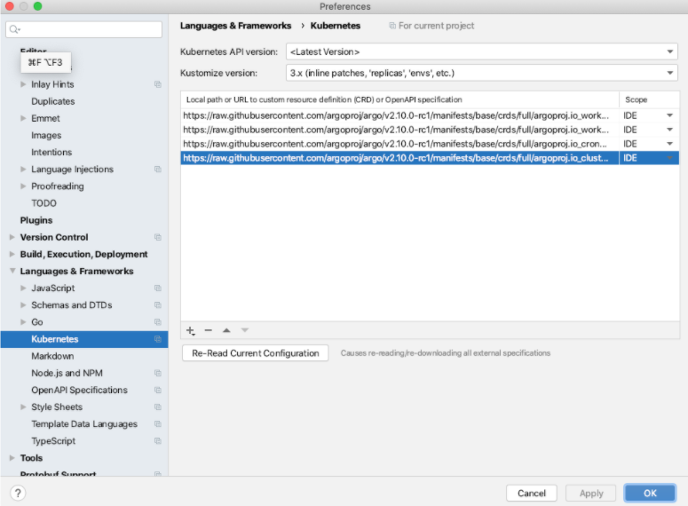
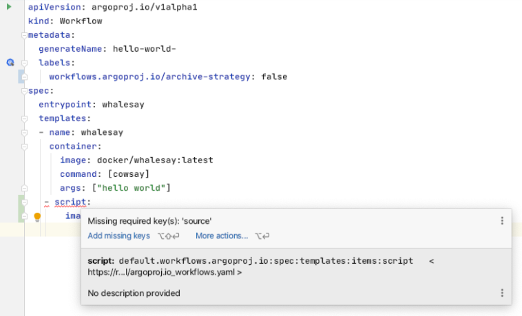

# IDE Set-Up

## How To Use CRD Validation With Your Editor

Use either VS Code or Kubernetes and load the full Custom Resource Definitions (CRDs) into an IDE that support CRD validation (e.g IntelliJ, VS Code).

CRD URLs:

* [ClusterWorkflowTemplate](https://raw.githubusercontent.com/argoproj/argo/master/manifests/base/crds/full/argoproj.io_clusterworkflowtemplates.yaml)
* [WorkflowTemplate](https://raw.githubusercontent.com/argoproj/argo/master/manifests/base/crds/full/argoproj.io_workflowtemplates.yaml)
* [CronWorkflow](https://raw.githubusercontent.com/argoproj/argo/master/manifests/base/crds/full/argoproj.io_cronworkflows.yaml)
* [Workflow](https://raw.githubusercontent.com/argoproj/argo/master/manifests/base/crds/full/argoproj.io_workflows.yaml) 

### IntelliJ

Install the Kubernetes plugin:

Add the CRD URLs to the Kubernetes configuration panel (choose “IDE” for the scope):

Finally, open your CRDs and verify no errors appear, example:

