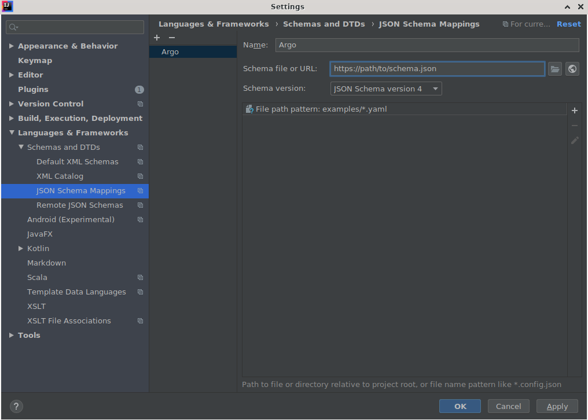
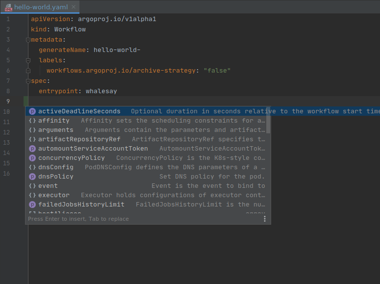
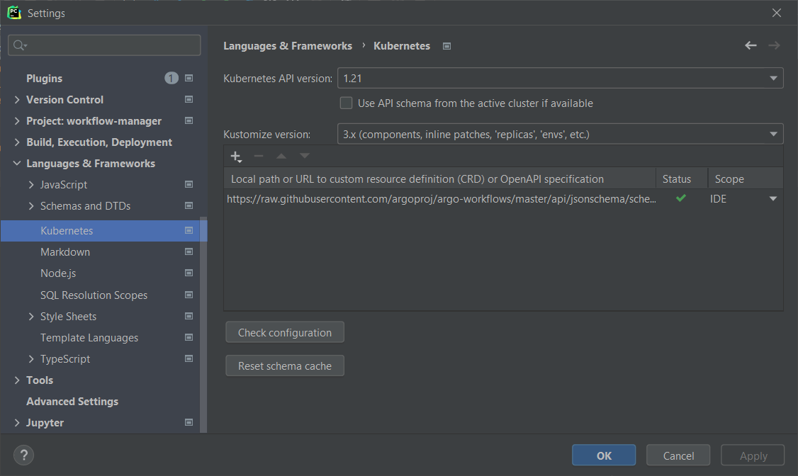
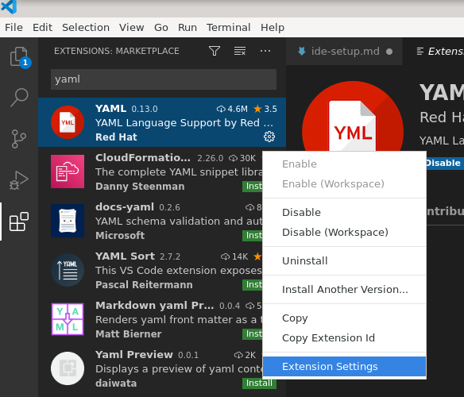
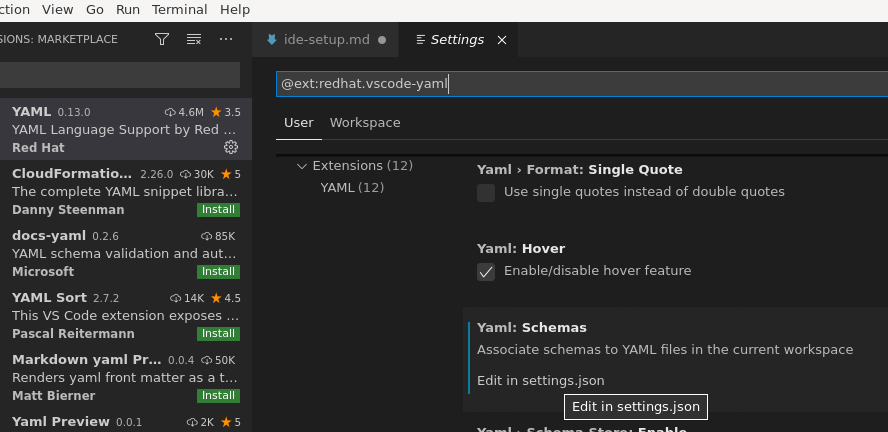
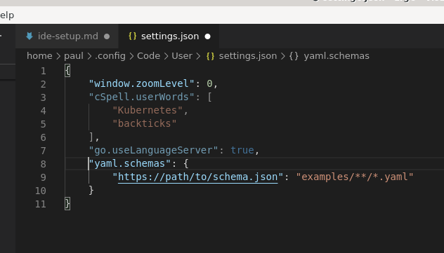
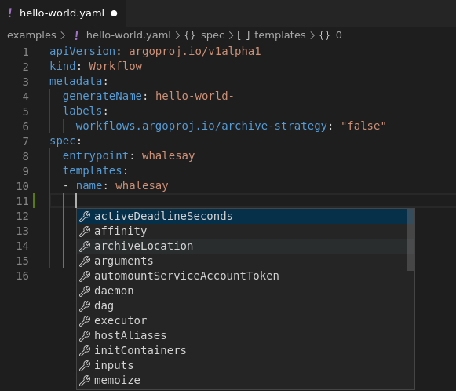

# IDE Set-Up

## Validating Argo YAML against the JSON Schema

Argo provides a [JSON Schema](https://raw.githubusercontent.com/argoproj/argo-workflows/master/api/jsonschema/schema.json) that enables validation of YAML resources in your IDE.

### JetBrains IDEs (Community & Ultimate Editions)

YAML validation is supported natively in IDEA.

Configure your IDE to reference the Argo schema and map it to your Argo YAML files:

- The schema is located [here](https://raw.githubusercontent.com/argoproj/argo-workflows/master/api/jsonschema/schema.json).
- Specify a file glob pattern that locates **your** Argo files. The example glob here is for the Argo Github project!
- Note that you may need to restart IDEA to pick up the changes.

That's it. Open an Argo YAML file and you should see smarter behavior, including type errors and context-sensitive auto-complete.

### JetBrains IDEs (Community & Ultimate Editions) + Kubernetes Plugin

If you have the [JetBrains Kubernetes Plugin](https://plugins.jetbrains.com/plugin/10485-kubernetes)
installed in your IDE, the validation can be configured in the Kubernetes plugin settings
instead of using the internal JSON schema file validator.

Unlike the previous JSON schema validation method, the plugin detects the necessary validation
based on Kubernetes resource definition keys and does not require a file glob pattern.
Like the previously described method:

- The schema is located [here](https://raw.githubusercontent.com/argoproj/argo-workflows/master/api/jsonschema/schema.json).
- Note that you may need to restart IDEA to pick up the changes.

### VSCode

The [Red Hat YAML](https://github.com/redhat-developer/vscode-yaml) plugin will provide error highlighting and auto-completion for Argo resources.

Install the Red Hat YAML plugin in VSCode and open extension settings:

Open the YAML schema settings:

Add the Argo schema setting `yaml.schemas`:

- The schema is located [here](https://raw.githubusercontent.com/argoproj/argo-workflows/master/api/jsonschema/schema.json).
- Specify a file glob pattern that locates **your** Argo files. The example glob here is for the Argo Github project!
- Note that other defined schema with overlapping glob patterns may cause errors.

That's it. Open an Argo YAML file and you should see smarter behavior, including type errors and context-sensitive auto-complete.

