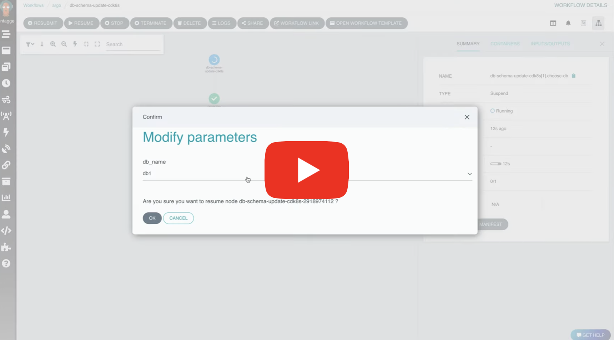

# Intermediate Parameters

> v3.4 and after

Traditionally, Argo workflows has supported input parameters from UI only when the workflow starts,
and after that, it's pretty much on autopilot. But, there are a lot of use cases where human interaction is required.

This interaction is in the form of providing input text in the middle of the workflow, choosing from a dropdown of the options which a workflow step itself is intelligently generating.

A similar feature which you can see in jenkins is [pipeline-input-step](https://www.jenkins.io/doc/pipeline/steps/pipeline-input-step/)

Example use cases include:

- A human approval before doing something in production environment.
- Programmatic generation of a list of inputs from which the user chooses.
Choosing from a list of available databases which the workflow itself is generating.

This feature is achieved via `suspend template`.

The workflow will pause at a `Suspend` node, and user will be able to update parameters using fields type text or dropdown.

## Intermediate Parameters Approval Example

- The [below example](https://raw.githubusercontent.com/argoproj/argo-workflows/master/examples/intermediate-parameters.yaml) shows static enum values `approval` step.
- The user will be able to choose between `[YES, NO]` which will be used in subsequent steps.

[](https://youtu.be/eyeZ2oddwWE)

```yaml
apiVersion: argoproj.io/v1alpha1
kind: Workflow
metadata:
  generateName: intermediate-parameters-cicd-
spec:
  entrypoint: cicd-pipeline
  templates:
    - name: cicd-pipeline
      steps:
          - - name: deploy-pre-prod
              template: deploy
          - - name: approval
              template: approval
          - - name: deploy-prod
              template: deploy
              when: '{{steps.approval.outputs.parameters.approve}} == YES'
    - name: approval
      suspend: {}
      inputs:
          parameters:
            - name: approve
              default: 'NO'
              enum:
                  - 'YES'
                  - 'NO'
              description: >-
                Choose YES to continue workflow and deploy to production
      outputs:
          parameters:
            - name: approve
              valueFrom:
                  supplied: {}
    - name: deploy
      container:
          image: 'argoproj/argosay:v2'
          command:
            - /argosay
          args:
            - echo
            - deploying
```

## Intermediate Parameters DB Schema Update Example

- The below example shows programmatic generation of `enum` values.
- The `generate-db-list` template generates an output called `db_list`.
- This output is of type `json`.
- Since this `json` has a `key` called `enum`, with an array of options, the UI will parse this and display it as a dropdown.
- The output can be any string also, in which case the UI will display it as a text field. Which the user can later edit.

[](https://youtu.be/QgE-1782YJc)

```yaml
apiVersion: argoproj.io/v1alpha1
kind: Workflow
metadata:
  generateName: intermediate-parameters-db-
spec:
  entrypoint: db-schema-update
  templates:
      - name: db-schema-update
        steps:
          - - name: generate-db-list
              template: generate-db-list
          - - name: choose-db
              template: choose-db
              arguments:
                parameters:
                  - name: db_name
                    value: '{{steps.generate-db-list.outputs.parameters.db_list}}'
          - - name: update-schema
              template: update-schema
              arguments:
                parameters:
                  - name: db_name
                    value: '{{steps.choose-db.outputs.parameters.db_name}}'
      - name: generate-db-list
        outputs:
          parameters:
            - name: db_list
              valueFrom:
                path: /tmp/db_list.txt
        container:
          name: main
          image: 'argoproj/argosay:v2'
          command:
            - sh
            - '-c'
          args:
            - >-
              echo "{\"enum\": [\"db1\", \"db2\", \"db3\"]}" | tee /tmp/db_list.txt
      - name: choose-db
        inputs:
          parameters:
            - name: db_name
              description: >-
                Choose DB to update a schema
        outputs:
          parameters:
            - name: db_name
              valueFrom:
                supplied: {}
        suspend: {}
      - name: update-schema
        inputs:
          parameters:
            - name: db_name
        container:
          name: main
          image: 'argoproj/argosay:v2'
          command:
            - sh
            - '-c'
          args:
            - echo Updating DB {{inputs.parameters.db_name}}
```

### Some Important Details

- The suspended node should have the **SAME** parameters defined in `inputs.parameters` and `outputs.parameters`.
- All the output parameters in the suspended node should have `valueFrom.supplied: {}`
- The selected values will be available at `<SUSPENDED_NODE>.outputs.parameters.<PARAMETER_NAME>`
