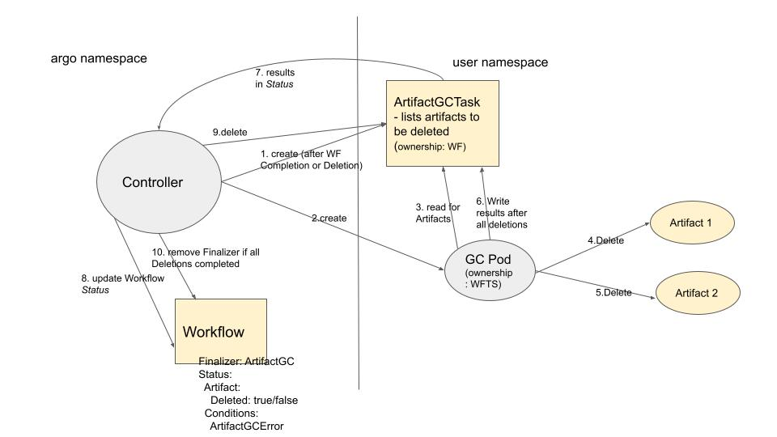

# Proposal for Artifact Garbage Collection

## Introduction

The motivation for this is to enable users to automatically have certain Artifacts specified to be automatically garbage collected.

Artifacts can be specified for Garbage Collection at different stages: `OnWorkflowCompletion`, `OnWorkflowDeletion`, `OnWorkflowSuccess`, `OnWorkflowFailure`, or `Never`

## Proposal Specifics

### Workflow Spec changes

1. `WorkflowSpec` has an `ArtifactGC` structure, which consists of an `ArtifactGCStrategy`, as well as the optional designation of a `ServiceAccount` and Pod metadata (labels and annotations) to be used by the Pod doing the deletion. The `ArtifactGCStrategy` can be set to `OnWorkflowCompletion`, `OnWorkflowDeletion`, `OnWorkflowSuccess`, `OnWorkflowFailure`, or `Never`
2. Artifact has an `ArtifactGC` section which can be used to override the Workflow level.

### Workflow Status changes

1. Artifact has a boolean `Deleted` flag
2. `WorkflowStatus.Conditions` can be set to `ArtifactGCError`
3. `WorkflowStatus` can include a new field `ArtGCStatus` which holds additional information to keep track of the state of Artifact Garbage Collection.

### How it will work

For each `ArtifactGCStrategy` the Controller will execute one Pod that runs in the user's namespace and deletes all artifacts pertaining to that strategy.

Since `OnWorkflowSuccess` happens at the same time as `OnWorkflowCompletion` and `OnWorkflowFailure` also happens at the same time as `OnWorkflowCompletion`, we can consider consolidating these GC Strategies together.

We will have a new CRD type called `ArtifactGCTask` and use one or more of them to specify the Artifacts which the GC Pod will read and then write Status to (note individual artifacts have individual statuses). The Controller will read the Status and reflect that in the Workflow Status. The Controller will deem the `ArtifactGCTasks` ready to read once the Pod has completed (in success or failure).

Once the GC Pod has completed and the Workflow status has been persisted, assuming the Pod completed with Success, the Controller can delete the `ArtifactGCTasks`, which will cause the GC Pod to also get deleted as it will be "owned" by the `ArtifactGCTasks`.

The Workflow will have a Finalizer on it to prevent it from being deleted until Artifact GC has occurred. Once all deletions for all GC Strategies have occurred, the Controller will remove the Finalizer.

### Failures

If a deletion fails, the Pod will retry a few times through exponential back off. Note: it will not be considered a failure if the key does not exist - the principal of idempotence will allow this (i.e. if a Pod were to get evicted and then re-run it should be okay if some artifacts were previously deleted).

Once it retries a few times, if it didn't succeed, it will end in a "Failed" state. The user will manually need to delete the `ArtifactGCTasks` (which will delete the GC Pod), and remove the Finalizer on the Workflow.

The Failure will be reflected in both the Workflow Conditions as well as as a Kubernetes Event (and the Artifacts that failed will have "Deleted"=false).

### Alternatives Considered

For reference, these [slides](../assets/artifact-gc-proposal.pptx) were presented to the Argo Contributor meeting on 7/12/22 which go through some of the alternative options that were weighed. These alternatives are explained below:

#### One Pod Per Artifact

The [POC](https://github.com/argoproj/argo-workflows/pull/8530) that was done, which uses just one Pod to delete each Artifact, was considered as an alternative for MVP (Option 1 from the slides).

This option has these benefits:

- simpler in that the Pod doesn't require any additional Object to report status (e.g. `ArtifactGCTask`) because it simply succeeds or fails based on its exit code (whereas in Option 2 the Pod needs to report individual failure statuses for each artifact)
- could have a very minimal Service Account which provides access to just that one artifact's location

and these drawbacks:

- deletion is slower when performed by multiple Pods
- a Workflow with thousands of artifacts causes thousands of Pods to get executed, which could overwhelm kube-scheduler and kube-apiserver.
- if we delay the Artifact GC Pods by giving them a lower priority than the Workflow Pods, users will not get their artifacts deleted when they expect and may log bugs

Summarizing ADR statement:
"In the context of Artifact Garbage Collection, facing whether to use a separate Pod for every artifact or not, we decided not to, to achieve faster garbage collection and reduced load on K8S, accepting that we will require a new CRD type."

#### Service Account/IAM roles

We considered some alternatives for how to specify Service Account and/or Annotations, which are applied to give the GC Pod access (slide 12). We will have them specify this information in a new `ArtifactGC` section of the spec that lives on the Workflow level but can be overridden on the Artifact level (option 3 from slide). Another option considered was to just allow specification on the Workflow level (option 2 from slide) so as to reduce the complexity of the code and reduce the potential number of Pods running, but Option 3 was selected in the end to maximize flexibility.

Summarizing ADR statement:
"In the context of Artifact Garbage Collection, facing the question of how users should specify Service Account and annotations, we decided to give them the option to specify them on the Workflow level and/or override them on the Artifact level, to maximize flexibility for user needs, accepting that the code will be more complicated, and sometimes there will be many Pods running."

### MVP vs post-MVP

We will start with just S3.

We can also make other determinations if it makes sense to postpone some parts for after MVP.

### Workflow Spec Validation

We can reject the Workflow during validation if `ArtifactGC` is configured along with a non-supported storage engine (for now probably anything besides S3).

### Documentation

Need to clarify certain things in our documentation:

1. Users need to know that if they don't name their artifacts with unique keys, they risk the same key being deleted by one Workflow and created by another at the same time. One recommendation is to parametrize the key, e.g. `{{workflow.uid}}/hello.txt`.
2. Requirement to specify Service Account or Annotation for `ArtifactGC` specifically if they are needed (we won't fall back to default Workflow SA/annotations). Also, the Service Account needs to either be bound to the "agent" role or otherwise allow the same access to `ArtifactGCTasks`.
