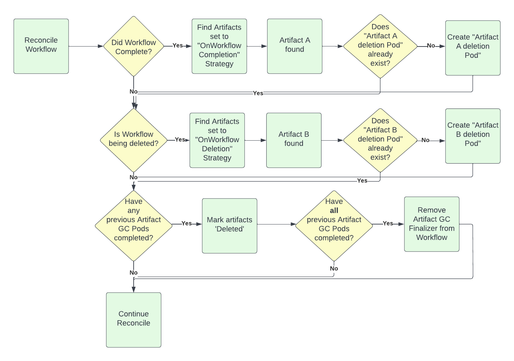

# Proposal for Artifact Garbage Collection

## Introduction
The motivation for this is to enable users to automatically have certain Artifacts specified to be automatically garbage collected. 

Artifacts can be specified for GC at different stages: currently "OnWorkflowCompletion" and "OnWorkflowDeletion".

## Proposal Specifics

### Workflow Spec changes
1. WorkflowSpec has an ArtifactGCStrategy, which is the default for all artifacts: can be "OnWorkflowCompletion", "OnWorkflowDeletion", "OnWorkflowSuccess", "OnWorkflowFailure", or "Never"
2. Artifact has an ArtifactGCStrategy (only really applies to Output Artifacts), which can override the setting for WorkflowSpec

### Workflow Status changes
1. Artifact has a boolean 'Deleted' flag
2. WorkflowStatus.Conditions can be set to "ArtifactGCError"

These  go over the trade offs in options that were presented in the Argo Commmunity on 7/12/22.

#### Proposal Option 1:
We can have a Pod that runs in the user's namespace and deletes all artifacts for a Workflow that are set to "OnWorkflowCompletion" which runs once the Workflow completes. And we can have a separate Pod that deletes all artifacts that are set to "OnWorkflowDeletion" which runs when the Workflow is being deleted. A Finalizer will be added to the Workflow which will only be removed once the Pods are completed (todo: determine what to do if Pod completes in failure). 

The Pod can be uniquely named by the Workflow and the GC strategy, so we can easily query if it already exists and prevent it from being reinstantiated.

The Pod can run argoexec, which can handle a new command for artifact deletion.

Passing the artifact spec to the GC Pod: we could JSON-serialize the spec for the artifacts, or if we want to reduce the byte count we could base64 encode it. We could volume mount it as a ConfigMap. 

Issues: 
1. what if we reach the maximum size of a ConfigMap? We could introduce an additional ConfigMap once we reach capacity. 
2. How would the GC Pod report back the failure of individual deletions? Would it do it in the ConfigMaps? (if so, it would need to have write access to them - i.e. it wouldn't be volume mounted) Or would we create some new CRD type that it can write to and the Controller can read from?

#### Proposal Option 2:
To address these two issues, instead of having a single Pod for the <Workflow+GC Strategy>, we could have a single Pod per artifact being deleted. This is simpler and probably doesn't require a ConfigMap because a single Artifact spec is small and can go inside an Environment Variable. Also, the exit code of the Pod alone could be used to determine success vs failure. So, the Pod doesn't really need to "report" back anything.

The only issue is that there could potentially be a very large number of Pods (thousands if there are thousands of Artifacts) that need to be run.

In Kubernetes there is a capability to limit the number of total pods that can run in a namespace concurrently (["pod quota"](https://kubernetes.io/docs/tasks/administer-cluster/manage-resources/quota-pod-namespace/)). In addition, the GC Pods could have a lower priority than our other Pods. They can also set CPU and memory requests/limits low.

#### Considerations
1. How do we want to handle the Pod failing? Could be a transient error. Allow some number of retries? Should the Pod do the retries itself, or should the Controller start up new Pods later?
2. Should we use a Job or a standard Pod? I guess if a node fails, Kubernetes will reschedule a Job, but not a Pod. But if we use a Job, we need to add new permissions related to Jobs, and also add a Job informer which requires some additional memory.
3. Users should be recommended to uniquely name artifact keys such as through parameterization like so: 'key: "{{workflow.uid}}/hello.txt'. Otherwise, they could get into a scenario in which running a Workflow produces an artifact which is being GC'ed while an artifact of the same name is being created. 
