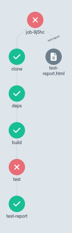

# Proposal for Job Template

## Why

Argo Workflows is often used for sequential execution of a series of steps. Those steps must run in separate pods.
Creation of pods is expensive. Steps within a workflow do not have access to the same disk as previous steps, which
means you have to use artifact storage to share data between steps. This is a lot of overhead for simple jobs that could
be run in a single pod.

## What

A job template is a way to define a job that can be used in a workflow. A job is an ordered list of named steps. For
example:

```yaml
      job:
        image: golang:1.18
        workingDir: /go/src/github.com/golang/example
        steps:
          - name: clone
            run: git clone -v -b "{{workflow.parameters.branch}}" --single-branch --depth 1 https://github.com/golang/example.git .
          - name: deps
            run: go mod download -x
          - name: build
            run: go build ./...
          - name: test
            run: go test -v ./... 2>&1 > test.out
```

For steps than must always run:

```yaml
          - name: test-report
            if: always()
            run: |
              cat test.out | go-junit-report | junit2html > test-report.html
```

This will display in the user interface as a single node with sub-nodes for each step:



The logs for each step will be displayed in the UI.

## How

- Introduce a template type `Job`. A job maps to a `Pod` node. This is similar to a `ContainerSet`.
- Introduce a node type `JobStep` that is a child of a `Pod` node. A `JobStep` is similar to a `Container`.
- Jobs run in a `Pod` node. They pass the steps via the `ARGO_TEMPLATE` environment variable.
- Use `TaskResult` to pass data between the `wait` container and the controller.