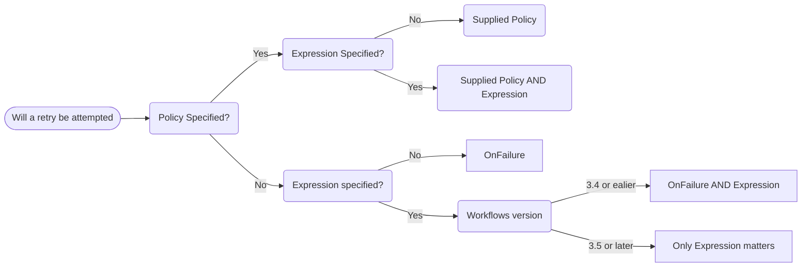

# Retries

Argo Workflows offers a range of options for retrying failed steps.

## Configuring `retryStrategy` in `WorkflowSpec`

```yaml
apiVersion: argoproj.io/v1alpha1
kind: Workflow
metadata:
  generateName: retry-container-
spec:
  entrypoint: retry-container
  templates:
  - name: retry-container
    retryStrategy:
      limit: "10"
    container:
      image: python:alpine3.6
      command: ["python", -c]
      # fail with a 66% probability
      args: ["import random; import sys; exit_code = random.choice([0, 1, 1]); sys.exit(exit_code)"]
```

The `retryPolicy` and `expression` are re-evaluated after each attempt. For example, if you set `retryPolicy: OnFailure` and your first attempt produces a failure then a retry will be attempted. If the second attempt produces an error, then another attempt will not be made.

## Retry policies

Use `retryPolicy` to choose which failure types to retry:

- `Always`: Retry all failed steps
- `OnFailure`: Retry steps whose main container is marked as failed in Kubernetes
- `OnError`: Retry steps that encounter Argo controller errors, or whose init or wait containers fail
- `OnTransientError`: Retry steps that encounter errors [defined as transient](https://github.com/argoproj/argo-workflows/blob/main/util/errors/errors.go), or errors matching the `TRANSIENT_ERROR_PATTERN` [environment variable](environment-variables.md). Available in version 3.0 and later.

The `retryPolicy` applies even if you also specify an `expression`, but in version 3.5 or later the default policy means the expression makes the decision unless you explicitly specify a policy.

The default `retryPolicy` is `OnFailure`, except in version 3.5 or later when an expression is also supplied, when it is `Always`. This may be easier to understand in this diagram.



An example retry strategy:

```yaml
apiVersion: argoproj.io/v1alpha1
kind: Workflow
metadata:
  generateName: retry-on-error-
spec:
  entrypoint: error-container
  templates:
  - name: error-container
    retryStrategy:
      limit: "2"
      retryPolicy: "Always"
    container:
      image: python
      command: ["python", "-c"]
      # fail with a 80% probability
      args: ["import random; import sys; exit_code = random.choice(range(0, 5)); sys.exit(exit_code)"]
```

## Conditional retries

> v3.2 and after

You can also use `expression` to control retries. The `expression` field
accepts an [expr](https://github.com/antonmedv/expr) expression and has
access to the following variables:

- `lastRetry.exitCode`: The exit code of the last retry, or "-1" if not available
- `lastRetry.status`: The phase of the last retry: Error, Failed
- `lastRetry.duration`: The duration of the last retry, in seconds
- `lastRetry.message`: The message output from the last retry (available from version 3.5)

If `expression` evaluates to false, the step will not be retried.

The `expression` result will be logical *and* with the `retryPolicy`. Both must be true to retry.

See [example](https://raw.githubusercontent.com/argoproj/argo-workflows/main/examples/retry-conditional.yaml) for usage.

## Back-Off

You can configure the delay between retries with `backoff`. See [example](https://raw.githubusercontent.com/argoproj/argo-workflows/main/examples/retry-backoff.yaml) for usage.
