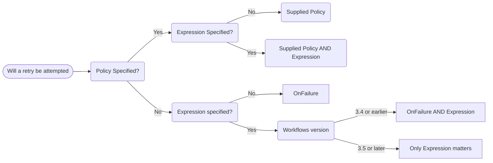

# Retries

Argo Workflows offers a range of options for retrying failed steps.

!!! Note "restarts"
    For infrastructure-level failures that occur before your container starts (like node evictions or disk pressure), see [Automatic Pod Restarts](pod-restarts.md).
    This page covers application-level retries using `retryStrategy`.

## Configuring `retryStrategy` in `WorkflowSpec`

```yaml
apiVersion: argoproj.io/v1alpha1
kind: Workflow
metadata:
  generateName: retry-container-
spec:
  entrypoint: retry-container
  templates:
  - name: retry-container
    retryStrategy:
      limit: "10"
    container:
      image: python:alpine3.23
      command: ["python", -c]
      # fail with a 66% probability
      args: ["import random; import sys; exit_code = random.choice([0, 1, 1]); sys.exit(exit_code)"]
```

The `retryPolicy` and `expression` are re-evaluated after each attempt. For example, if you set `retryPolicy: OnFailure` and your first attempt produces a failure then a retry will be attempted. If the second attempt produces an error, then another attempt will not be made.

## Retry policies

Use `retryPolicy` to choose which failure types to retry:

- `Always`: Retry all failed steps
- `OnFailure`: Retry steps whose main container is marked as failed in Kubernetes
- `OnError`: Retry steps that encounter Argo controller errors, or whose init or wait containers fail
- `OnTransientError`: Retry steps that encounter errors [defined as transient](https://github.com/argoproj/argo-workflows/blob/main/util/errors/errors.go), or errors matching the `TRANSIENT_ERROR_PATTERN` [environment variable](environment-variables.md). Available in version 3.0 and later.

The `retryPolicy` applies even if you also specify an `expression`, but in version 3.5 or later the default policy means the expression makes the decision unless you explicitly specify a policy.

The default `retryPolicy` is `OnFailure`, except in version 3.5 or later when an expression is also supplied, when it is `Always`. This may be easier to understand in this diagram.


```mermaid
flowchart LR
  start([Will a retry be attempted])
  start --> policy
  policy(Policy Specified?)
  policy-->|No|expressionNoPolicy
  policy-->|Yes|policyGiven
  policyGiven(Expression Specified?)
  policyGiven-->|No|policyGivenApplies
  policyGiven-->|Yes|policyAndExpression
  policyGivenApplies(Supplied Policy)
  policyAndExpression(Supplied Policy AND Expression)
  expressionNoPolicy(Expression specified?)
  expressionNoPolicy-->|No|onfailureNoExpr
  expressionNoPolicy-->|Yes|version
  onfailureNoExpr[OnFailure]
  onfailure[OnFailure AND Expression]
  version(Workflows version)
  version-->|3.4 or earlier|onfailure
  always[Only Expression matters]
  version-->|3.5 or later|always
```

An example retry strategy:

```yaml
apiVersion: argoproj.io/v1alpha1
kind: Workflow
metadata:
  generateName: retry-on-error-
spec:
  entrypoint: error-container
  templates:
  - name: error-container
    retryStrategy:
      limit: "2"
      retryPolicy: "Always"
    container:
      image: python
      command: ["python", "-c"]
      # fail with a 80% probability
      args: ["import random; import sys; exit_code = random.choice(range(0, 5)); sys.exit(exit_code)"]
```

## Conditional retries

> v3.2 and after

You can also use `expression` to control retries.
This is an [expr expression](variables.md#expression) with access to the following variables:

- `lastRetry.exitCode`: The exit code of the last retry as a string, or "-1" if not available

    ```yaml
    expression: asInt(lastRetry.exitCode) > 1 # Retry if code is greater than 1
    ```

- `lastRetry.status`: The phase of the last retry: Error, Failed

    ```yaml
    expression: lastRetry.status != "Error" # Retry if not an error
    ```

- `lastRetry.duration`: The duration of the last retry, in seconds

    ```yaml
    expression: asInt(lastRetry.duration) < 60 # Retry unless duration >= 1 minute
    ```

- `lastRetry.message`: The message output from the last retry (available from version 3.5)

    ```yaml
    # Retry if message matches the regular expression
    expression: lastRetry.message matches 'imminent node shutdown|pod deleted'
    ```

If `expression` evaluates to false, the step will not be retried.

The `expression` result will be logical *and* with the `retryPolicy`. Both must be true to retry.

Boolean operators can be used to combine multiple conditions. See [example](https://raw.githubusercontent.com/argoproj/argo-workflows/main/examples/retry-conditional.yaml) for usage.

## Maximum execution duration

Use `retryStrategy.maxExecutionDuration` to limit the cumulative execution time of failed or errored Pod attempts without charging Pod startup latency or retry back-off against the limit.

```yaml
retryStrategy:
  limit: "5"
  maxExecutionDuration: 30m
```

For each completed attempt, Argo measures one wall-clock interval from the earliest observed main-container start to the latest main-container finish.
If the available timestamps do not establish that finish, Argo conservatively counts through the time it marks the attempt complete.
For a ContainerSet template, this interval spans all main containers, so overlapping containers are not counted more than once and gaps between their executions do count.
Pod scheduling and Pending time, init-container time, post-main output processing, and retry back-off waits (the idle delays between attempts) do not count.
`maxExecutionDuration` does not bound how long a Pod may remain Pending, so set the template-level `pendingTimeout` if startup also needs a wall-clock limit.
In init-less mode, the main container is `argoexec`, so any in-container wait before the user command starts counts.
Argo evaluates the cumulative duration only after an attempt fails or errors and before it starts another retry.
It does not terminate an active attempt, and a successful attempt is accepted even if its execution causes the cumulative duration to reach or exceed the limit.
Attempts that fail before any main container starts do not consume this budget.
Argo resolves a parameterized value when the retry sequence starts and keeps that value for every attempt; `retries` and `lastRetry` variables are therefore not supported in this field.
`maxExecutionDuration` is supported only for Pod-backed templates (`container`, `script`, `containerSet`, `resource`, and `data`) and is independent of `backoff.maxDuration`; when both are set, whichever prevents the next retry first takes effect.
When inherited from a workflow-level strategy or `templateDefaults`, this budget is ignored for non-Pod templates while the other retry settings still apply.
Monitor exhausted execution budgets with the [`retry_strategy_terminations_total`](metrics.md#retry_strategy_terminations_total) controller metric and its `MaxExecutionDurationExceeded` reason.

## Back-Off

You can configure the delay between retries with `backoff`. See [example](https://raw.githubusercontent.com/argoproj/argo-workflows/main/examples/retry-backoff.yaml) for usage.
