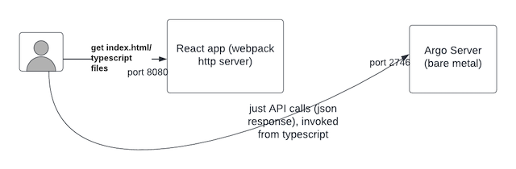

# Running Locally

## Development Environment Setup

You have two options for setting up your development environment:

1. Use the [Dev Container](#development-container), either locally or via [GitHub Codespaces](https://github.com/codespaces). This is usually the fastest and easiest way to get started.
1. [Manual installation](#manual-installation) of the necessary tooling. This requires a basic understanding of administering Kubernetes and package management for your OS.

### Initial Local Setup

Unless you're using GitHub Codespaces, the first step is cloning the Git repo into `$GOPATH/src/github.com/argoproj/argo-workflows`. Any other path will break the code generation.

Next, add the following to your `/etc/hosts`:

```text
127.0.0.1 dex
127.0.0.1 minio
127.0.0.1 postgres
127.0.0.1 mysql
127.0.0.1 azurite
```

### Development Container

Prebuilt [development container](https://containers.dev/) images are provided for both `amd64` and `arm64` containing all you need to develop Argo Workflows, without installing tools on your local machine. Provisioning a dev container is fully automated and typically takes ~1 minute.

You can use the development container in a few different ways:

1. [Visual Studio Code](https://code.visualstudio.com/) with [Dev Containers extension](https://marketplace.visualstudio.com/items?itemName=ms-vscode-remote.remote-containers). Open your `argo-workflows` folder in VSCode and it should offer to use the development container automatically. VSCode will allow you to forward ports to allow your external browser to access the running components.
1. [`devcontainer` CLI](https://github.com/devcontainers/cli). In your `argo-workflows` folder, run `make devcontainer-up`, which will automatically install the CLI and start the container. Then, use `devcontainer exec --workspace-folder . /bin/bash` to get a shell where you can build the code. You can use any editor outside the container to edit code; any changes will be mirrored inside the container. Due to a limitation of the CLI, only port 8080 (the Web UI) will be exposed for you to access if you run this way. Other services are usable from the shell inside.
1. [GitHub Codespaces](https://github.com/codespaces). You can start editing as soon as VSCode is open, though you may want to wait for `pre-build.sh` to finish installing dependencies, building binaries, and setting up the cluster before running any commands in the terminal. Once you start running services (see next steps below), you can click on the "PORTS" tab in the VSCode terminal to see all forwarded ports. You can open the Web UI in a new tab from there.

Once you have entered the container, continue to [Developing Locally](#developing-locally).

The container runs [k3d](https://k3d.io/) via [docker-in-docker](https://github.com/devcontainers/features/tree/main/src/docker-in-docker) so you have a cluster to test against. To communicate with services running either in other development containers or directly on the local machine (e.g. a database), the following URL can be used in the workflow spec: `host.docker.internal:<PORT>`. This facilitates the implementation of workflows which need to connect to a database or an API server.

Note for Windows: configure [`.wslconfig`](https://docs.microsoft.com/en-us/windows/wsl/wsl-config#configuration-setting-for-wslconfig) to limit memory usage by the WSL2 to prevent VSCode OOM.

### Manual Installation

To build on your own machine without using the Dev Container you will need:

* [Go](https://golang.org/dl/)
* [Yarn](https://classic.yarnpkg.com/en/docs/install/#mac-stable)
* [Docker](https://docs.docker.com/get-docker/)
* [`protoc`](http://google.github.io/proto-lens/installing-protoc.html)
* [`node`](https://nodejs.org/download/release/latest-v16.x/) for running the UI
* A local Kubernetes cluster ([`k3d`](https://k3d.io/), [`kind`](https://kind.sigs.k8s.io/docs/user/quick-start/#installation), or [`minikube`](https://minikube.sigs.k8s.io/docs/start/))

We recommend using [K3D](https://k3d.io/) to set up the local Kubernetes cluster since this will allow you to test RBAC
set-up and is fast. You can set-up K3D to be part of your default kube config as follows:

```bash
k3d cluster start --wait
```

Alternatively, you can use [Minikube](https://github.com/kubernetes/minikube) to set up the local Kubernetes cluster.
Once a local Kubernetes cluster has started via `minikube start`, your kube config will use Minikube's context
automatically.

!!! Warning
    Do not use Docker Desktop's embedded Kubernetes, it does not support Kubernetes RBAC (i.e. `kubectl auth can-i` always returns `allowed`).

## Developing locally

To start:

* The controller, so you can run workflows.
* MinIO (<http://localhost:9000>, use admin/password) so you can use artifacts.

Run:

```bash
make start
```

Make sure you don't see any errors in your terminal. This runs the Workflow Controller locally on your machine (not in Docker/Kubernetes).

You can submit a workflow for testing using `kubectl`:

```bash
kubectl create -f examples/hello-world.yaml
```

We recommend running `make clean` before `make start` to ensure recompilation.

If you made changes to the executor, you need to build the image:

```bash
make argoexec-image
```

You can use the `TARGET_PLATFORM` environment variable to compile images for specific platforms:

```bash
# compile for both arm64 and amd64
make argoexec-image TARGET_PLATFORM=linux/arm64,linux/amd64
```

!!! Note "Error `expected 'package', found signal_darwin`"
    You may see this error if symlinks are not configured for your `git` installation.
    Run `git config core.symlinks true` to correct this.

To also start the API on <http://localhost:2746>:

```bash
make start API=true
```

This runs the Argo Server (in addition to the Workflow Controller) locally on your machine.

To also start the UI on <http://localhost:8080> (`UI=true` implies `API=true`):

```bash
make start UI=true
```



If you are making change to the CLI (i.e. Argo Server), you can build it separately if you want:

```bash
make cli
./dist/argo submit examples/hello-world.yaml ;# new CLI is created as `./dist/argo`
```

Although, note that this will be built automatically if you do: `make start API=true`.

To test the workflow archive, use `PROFILE=mysql` or `PROFILE=postgres`:

```bash
make start PROFILE=mysql
```

You'll have, either:

* Postgres on <http://localhost:5432>, run `make postgres-cli` to access.
* MySQL on <http://localhost:3306>, run `make mysql-cli` to access.

To back up the database, use `make postgres-dump` or `make mysql-dump`, which will generate a SQL dump in the `db-dumps/` directory.

```console
make postgres-dump
```

To restore the backup, use `make postgres-cli` or `make mysql-cli`, piping in the file from the `db-dumps/` directory.

Note that this is destructive and will delete any data you have stored.

```console
make postgres-cli < db-dumps/2024-10-16T17:11:58Z.sql
```

To test SSO integration, use `PROFILE=sso`:

```bash
make start UI=true PROFILE=sso
```

### TLS

By default, `make start` will start Argo in [plain text mode](tls.md#plain-text).
To simulate a TLS proxy in front of Argo, use `UI_SECURE=true` (which implies `UI=true`):

```bash
make start UI_SECURE=true
```

To start Argo in [encrypted mode](tls.md#encrypted), use `SECURE=true`, which can be optionally combined with `UI_SECURE=true`:

```bash
make start SECURE=true UI_SECURE=true
```

### Running E2E tests locally

Start up Argo Workflows using the following:

```bash
make start PROFILE=mysql AUTH_MODE=client STATIC_FILES=false API=true
```

If you want to run Azure tests against a local Azurite:

```bash
kubectl -n $KUBE_NAMESPACE apply -f test/e2e/azure/deploy-azurite.yaml
make start
```

#### Running One Test

In most cases, you want to run the test that relates to your changes locally. You should not run all the tests suites.
Our CI will run those concurrently when you create a PR, which will give you feedback much faster.

Find the test that you want to run in `test/e2e`

```bash
make TestArtifactServer
```

#### Running A Set Of Tests

You can find the build tag at the top of the test file.

```go
//go:build api
```

You need to run `make test-{buildTag}`, so for `api` that would be:

```bash
make test-api
```

#### Diagnosing Test Failure

Tests often fail: that's good. To diagnose failure:

* Run `kubectl get pods`, are pods in the state you expect?
* Run `kubectl get wf`, is your workflow in the state you expect?
* What do the pod logs say? I.e. `kubectl logs`.
* Check the controller and argo-server logs. These are printed to the console you ran `make start` in. Is anything
  logged at `level=error`?

If tests run slowly or time out, factory reset your Kubernetes cluster.

### Database Tooling

The `go run ./hack/db` CLI provides a few useful commands for working with the DB locally:

```console
$ go run ./hack/db
CLI for developers to use when working on the DB locally

Usage:
  db [command]

Available Commands:
  completion              Generate the autocompletion script for the specified shell
  fake-archived-workflows Insert randomly-generated workflows into argo_archived_workflows, for testing purposes
  help                    Help about any command
  migrate                 Force DB migration for given cluster/table

Flags:
  -c, --dsn string   DSN connection string. For MySQL, use 'mysql:password@tcp/argo'. (default "postgres://postgres@localhost:5432/postgres")
  -h, --help         help for db

Use "db [command] --help" for more information about a command.
```

### Debugging using Visual Studio Code

When using the Dev Container with VSCode, use the `Attach to argo server` and/or `Attach to workflow controller` launch configurations to attach to the `argo` or `workflow-controller` processes, respectively.

This will allow you to start a debug session, where you can inspect variables and set breakpoints.

## Committing

Before you commit code and raise a PR, always run:

```bash
make pre-commit -B
```

Please do the following when creating your PR:

* [Sign-off](https://probot.github.io/apps/dco) your commits.
* Use [Conventional Commit messages](https://www.conventionalcommits.org/en/v1.0.0/).
* Suffix the issue number.

Examples:

```bash
git commit --signoff -m 'fix: Fixed broken thing. Fixes #1234'
```

```bash
git commit --signoff -m 'feat: Added a new feature. Fixes #1234'
```

## Troubleshooting

* When running `make pre-commit -B`, if you encounter errors like
  `make: *** [pkg/apiclient/clusterworkflowtemplate/cluster-workflow-template.swagger.json] Error 1`, ensure that you
  have checked out your code into `$GOPATH/src/github.com/argoproj/argo-workflows`.
* If you encounter "out of heap" issues when building UI through Docker, please validate resources allocated to Docker.
  Compilation may fail if allocated RAM is less than 4Gi.
* To start profiling with [`pprof`](https://go.dev/blog/pprof), pass `ARGO_PPROF=true` when starting the controller locally.
  Then run the following:

```bash
go tool pprof http://localhost:6060/debug/pprof/profile   # 30-second CPU profile
go tool pprof http://localhost:6060/debug/pprof/heap      # heap profile
go tool pprof http://localhost:6060/debug/pprof/block     # goroutine blocking profile
```
