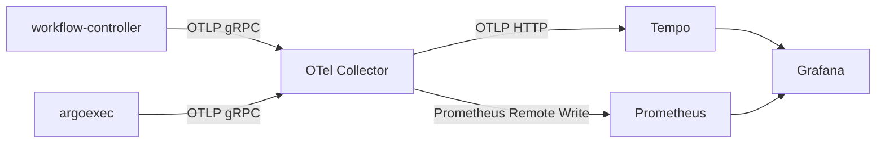

# Getting Started with OpenTelemetry

!!! warning "Opinionated guide"
    This guide walks through one way to set up observability for Argo Workflows.
    It is not a reference architecture or a production recommendation.
    Adapt the components and configuration to suit your environment.

!!! note "Tracing is beta"
    Tracing is not considered finished and may change in incompatible ways in future minor releases.
    See [Tracing](tracing.md#beta) for details.

This guide deploys an OpenTelemetry Collector, Grafana Tempo, Prometheus, and Grafana so you can see traces and metrics from Argo Workflows.

## Prerequisites

- A Kubernetes cluster with Argo Workflows installed (see [Quick Start](quick-start.md))
- `kubectl` configured to access the cluster
- `helm` (v3+)

## Architecture



The workflow-controller and argoexec send spans and metrics to an OpenTelemetry Collector over gRPC.
The collector forwards traces to Tempo over OTLP HTTP and metrics to Prometheus via remote write.
Grafana queries both backends.

## Step 1: Deploy Grafana Tempo

Tempo receives and stores traces. Install it with Helm:

```bash
helm repo add grafana https://grafana.github.io/helm-charts
helm repo update
helm install tempo grafana/tempo --namespace tempo --create-namespace
```

The default chart values accept OTLP over HTTP on port 4318, which is what the collector will use.

## Step 2: Deploy the OpenTelemetry Collector

The collector receives telemetry from Argo Workflows and forwards it to backends.
This guide uses a standalone Deployment rather than the [OpenTelemetry Operator](https://opentelemetry.io/docs/kubernetes/operator/) to avoid its cert-manager dependency.

Apply the following manifest to create a ConfigMap, Deployment, and Service in the `argo` namespace:

```bash
kubectl apply -n argo -f - <<'EOF'
apiVersion: v1
kind: ConfigMap
metadata:
  name: otel-collector-config
data:
  config.yaml: |
    receivers:
      otlp:
        protocols:
          grpc:
            endpoint: 0.0.0.0:4317
    processors:
      batch: {}
    exporters:
      otlphttp:
        endpoint: http://tempo.tempo.svc.cluster.local:4318
        tls:
          insecure: true
      prometheusremotewrite:
        endpoint: http://prometheus-kube-prometheus-prometheus.prometheus.svc.cluster.local:9090/api/v1/write
    service:
      pipelines:
        traces:
          receivers: [otlp]
          processors: [batch]
          exporters: [otlphttp]
        metrics:
          receivers: [otlp]
          processors: [batch]
          exporters: [prometheusremotewrite]
---
apiVersion: apps/v1
kind: Deployment
metadata:
  name: otel-collector
spec:
  replicas: 1
  selector:
    matchLabels:
      app: otel-collector
  template:
    metadata:
      labels:
        app: otel-collector
    spec:
      containers:
        - name: collector
          image: otel/opentelemetry-collector-contrib:0.141.0
          args: ["--config=/etc/otel/config.yaml"]
          ports:
            - containerPort: 4317
              name: otlp-grpc
          volumeMounts:
            - name: config
              mountPath: /etc/otel
      volumes:
        - name: config
          configMap:
            name: otel-collector-config
---
apiVersion: v1
kind: Service
metadata:
  name: otel-collector
spec:
  selector:
    app: otel-collector
  ports:
    - port: 4317
      targetPort: otlp-grpc
      name: otlp-grpc
EOF
```

## Step 3: Deploy Prometheus

Prometheus stores metrics forwarded by the collector. Install it with the kube-prometheus-stack Helm chart, which includes remote write support:

```bash
helm repo add prometheus-community https://prometheus-community.github.io/helm-charts
helm repo update
helm install prometheus prometheus-community/kube-prometheus-stack \
  --namespace prometheus --create-namespace \
  --set 'prometheus.prometheusSpec.enableRemoteWriteReceiver=true'
```

The `enableRemoteWriteReceiver` flag allows the collector to push metrics via the Prometheus remote write API.

## Step 4: Configure Argo Workflows

Setting the `OTEL_EXPORTER_OTLP_ENDPOINT` environment variable on the workflow-controller enables both trace and metric export via OTLP.
Patch the workflow-controller Deployment to point at the collector:

```bash
kubectl patch deployment workflow-controller -n argo --type=json -p='[
  {
    "op": "add",
    "path": "/spec/template/spec/containers/0/env/-",
    "value": {
      "name": "OTEL_EXPORTER_OTLP_ENDPOINT",
      "value": "http://otel-collector.argo.svc.cluster.local:4317"
    }
  }
]'
```

The controller will restart and begin exporting telemetry.
Traces from argoexec (the sidecar that runs in workflow pods) are automatically sent to the same endpoint.

For additional configuration options (protocol, signal-specific endpoints, metric temporality), see [Telemetry Configuration](telemetry-configuration.md).

## Step 5: Deploy Grafana

Install Grafana to visualize traces and metrics:

```bash
helm install grafana grafana/grafana --namespace grafana --create-namespace
```

Get the admin password and port-forward to access the UI:

```bash
kubectl get secret grafana -n grafana -o jsonpath="{.data.admin-password}" | base64 -d; echo
kubectl port-forward svc/grafana -n grafana 3000:80
```

Open [http://localhost:3000](http://localhost:3000) and log in with username `admin` and the password above.

### Add Tempo as a data source

1. Go to **Connections** > **Data sources** > **Add data source**
2. Select **Tempo**
3. Set the URL to `http://tempo.tempo.svc.cluster.local:3200`
4. Click **Save & Test**

### Add Prometheus as a data source

1. Go to **Connections** > **Data sources** > **Add data source**
2. Select **Prometheus**
3. Set the URL to `http://prometheus-kube-prometheus-prometheus.prometheus.svc.cluster.local:9090`
4. Click **Save & Test**

## Step 6: Run a Workflow and View Traces

Submit the DAG diamond example workflow:

```bash
argo submit -n argo --watch https://raw.githubusercontent.com/argoproj/argo-workflows/main/examples/dag-diamond.yaml
```

Once the workflow completes, find its traces in Grafana:

1. Go to **Explore**
2. Select the **Tempo** data source
3. Choose the **Search** tab
4. Select **Service Name**: look for the workflow-controller service
5. Click **Run query** to list recent traces
6. Click a trace to open it

You should see a span hierarchy like:

- **`workflow`** &mdash; the lifetime of the workflow
    - **`node`** (one per DAG node: A, B, C, D) &mdash; each node in the DAG
        - **`create_workflow_pod`** &mdash; pod creation
    - **`reconcile_workflow`** &mdash; reconciliation loops

Each workflow pod also produces spans from argoexec: `run_init_container`, `run_main_container`, `run_wait_container`, and their children.
See [Tracing](tracing.md) for the full span reference.

## Step 7: View Metrics

1. Go to **Explore**
2. Select the **Prometheus** data source
3. Try these example PromQL queries:

```promql
# Workflows currently running
argo_workflows_count{phase="Running"}

# Workflow error rate over 5 minutes
rate(argo_workflows_count{phase="Error"}[5m])

# Pod creation latency (p95)
histogram_quantile(0.95, rate(argo_pod_missing_duration_bucket[5m]))
```

See [Metrics](metrics.md) for the full list of available metrics.

## Cleanup

Remove the resources created in this guide:

```bash
helm uninstall grafana -n grafana
helm uninstall prometheus -n prometheus
helm uninstall tempo -n tempo
kubectl delete deployment otel-collector -n argo
kubectl delete service otel-collector -n argo
kubectl delete configmap otel-collector-config -n argo
kubectl delete namespace grafana prometheus tempo
```

To remove the `OTEL_EXPORTER_OTLP_ENDPOINT` environment variable from the workflow-controller, either revert the patch or redeploy the controller.

## Next Steps

- [Telemetry](telemetry.md) &mdash; overview of all telemetry signals
- [Tracing](tracing.md) &mdash; full span reference
- [Metrics](metrics.md) &mdash; available metrics and custom metrics
- [Telemetry Configuration](telemetry-configuration.md) &mdash; environment variables and ConfigMap options
- [Workflow Telemetry](workflow-telemetry.md) &mdash; custom metrics defined in workflows
- [OpenTelemetry Collector docs](https://opentelemetry.io/docs/collector/)
- [OpenTelemetry Operator](https://opentelemetry.io/docs/kubernetes/operator/) &mdash; alternative collector deployment with auto-instrumentation
