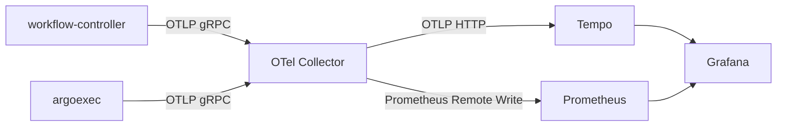

# Getting Started with OpenTelemetry

!!! warning "Opinionated guide"
    This guide walks through one way to set up observability for Argo Workflows to see it working.
    It is not a reference architecture or a production recommendation.
 It is not security hardened nor kept up to date.
    Adapt the components and configuration to suit your environment.

!!! note "Tracing is beta"
    Tracing is not considered finished and may change in incompatible ways in future minor releases.
    See [Tracing](tracing.md#beta) for details.

This guide deploys an OpenTelemetry Collector, Grafana Tempo, Prometheus, and Grafana so you can see traces and metrics from Argo Workflows.

## Prerequisites

- A Kubernetes cluster with `kubectl` configured

## Architecture


```mermaid
flowchart LR
    WC[workflow-controller] -- OTLP gRPC --> Collector[OTel Collector]
    AE[argoexec] -- OTLP gRPC --> Collector
    Collector -- OTLP HTTP --> Tempo
    Collector -- Prometheus Remote Write --> Prometheus
    Tempo --> Grafana
    Prometheus --> Grafana
```

The workflow-controller and argoexec send spans and metrics to an OpenTelemetry Collector over gRPC.
The collector forwards traces to Tempo over OTLP HTTP and metrics to Prometheus via remote write.
Grafana queries both Prometheus and Tempo.

## Step 1: Deploy Argo Workflows with the Observability Stack

The telemetry quick-start manifest installs Argo Workflows together with an OpenTelemetry Collector, Tempo, Prometheus, and Grafana -- all configured to talk to each otherwise:

```bash
kubectl create namespace argo
kubectl apply -n argo --server-side -f https://raw.githubusercontent.com/argoproj/argo-workflows/main/manifests/quick-start-telemetry.yaml
```

Wait for all pods to be ready:

```bash
kubectl wait -n argo --for=condition=Ready pod --all --timeout=120s
```

This single manifest includes:

- **Argo Workflows** (controller, server, MinIO for artifacts)
- **OpenTelemetry Collector** receiving OTLP gRPC/HTTP and forwarding to Tempo and Prometheus
- **Grafana Tempo** for trace storage
- **Prometheus** for metric storage (with remote write receiver enabled)
- **Grafana** with Tempo and Prometheus data sources

The workflow-controller is already configured with `OTEL_EXPORTER_OTLP_ENDPOINT` pointing at the collector, and the executor ConfigMap includes OTEL environment variables so argoexec also sends traces.

## Step 2: Access Grafana

Port-forward to the Grafana service:

```bash
kubectl port-forward svc/grafana -n argo 3000:3000
```

Open [`http://localhost:3000`](http://localhost:3000). Anonymous admin access is enabled -- no login required.

The Tempo and Prometheus data sources are already provisioned.

## Step 3: Run a Workflow and View Traces

Submit the DAG diamond example workflow:

```bash
argo submit -n argo --watch https://raw.githubusercontent.com/argoproj/argo-workflows/main/examples/dag-diamond.yaml
```

Once the workflow completes, find its traces in Grafana:

1. Go to **Explore**
2. Select the **Tempo** data source
3. Choose the **Search** tab
4. Select **Service Name**: look for the workflow-controller service
5. Click **Run query** to list recent traces
6. Click a trace to open it

You should see a span hierarchy like:

- **`workflow`** &mdash; the lifetime of the workflow
    - **`node`** (one per DAG node: A, B, C, D) &mdash; each node in the DAG
        - **`createWorkflowPod`** &mdash; pod creation
    - **`reconcileWorkflow`** &mdash; reconciliation loops

Each workflow pod also produces spans from argoexec: `runInitContainer`, `runMainContainer`, `runWaitContainer`, and their children.
See [Tracing](tracing.md) for the full span reference.

## Step 4: View Metrics

1. Go to **Explore**
2. Select the **Prometheus** data source
3. Try these example `PromQL` queries:

```promql
# Workflows currently running
gauge{phase="Running"}

# Workflow phase counter over 5 minutes
rate(total_count_total{phase="Error"}[5m])

# Operation duration (p95)
histogram_quantile(0.95, rate(operation_duration_seconds_bucket[5m]))
```

See [Metrics](metrics.md) for the full list of available metrics.

## Cleanup

Remove all resources created in this guide:

```bash
kubectl delete namespace argo
```

## Next Steps

- [Telemetry](telemetry.md) &mdash; overview of all telemetry signals
- [Tracing](tracing.md) &mdash; full span reference
- [Metrics](metrics.md) &mdash; available metrics and custom metrics
- [Telemetry Configuration](telemetry-configuration.md) &mdash; environment variables and ConfigMap options
- [Workflow Telemetry](workflow-telemetry.md) &mdash; custom metrics defined in workflows
- [OpenTelemetry Collector docs](https://opentelemetry.io/docs/collector/)
- [OpenTelemetry Operator](https://opentelemetry.io/docs/kubernetes/operator/) &mdash; alternative collector deployment with auto-instrumentation
