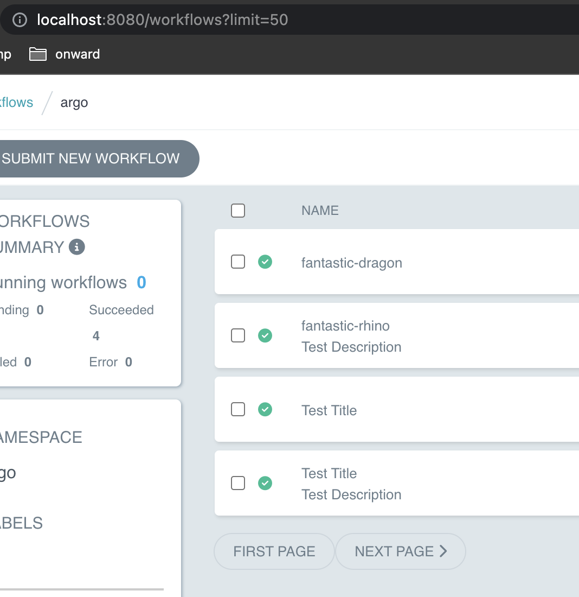

# Title and Description

If you add specific title and description annotations to your workflow they will show up on the workflow lists. It will also work with markdown.

```yaml
apiVersion: argoproj.io/v1alpha1
kind: Workflow
metadata:
  name: my-wf
  annotations:
    workflows.argoproj.io/title: '**Build and test**'
    workflows.argoproj.io/description: '`SuperDuperProject` PR #6529: Implement frobbing (aff39ee)'
```

Examples by row:

- markdown title, markdown description using [`remark-gfm`](https://github.com/remarkjs/remark-gfm) to auto turn URLs into links
- no title or description, defaults to `workflow.metadata.name`
- markdown title, no description
- no title, markdown description (title defaults to `workflow.metadata.name`)
- markdown title, markdown description (description includes URL that auto turns into anchor
- markdown title, markdown description, includes markdown URL
- markdown title, markdown description, includes markdown URL (pr link goes to `github.com`)


