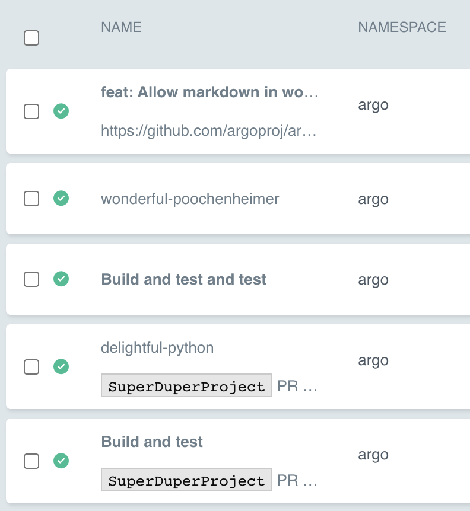
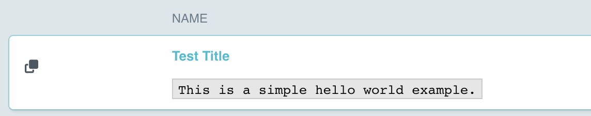
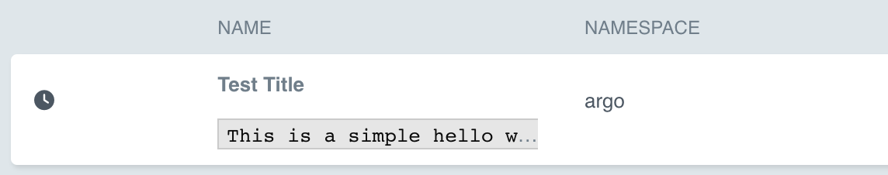

# Title and Description

> v3.4.4 and after

You can add the `workflows.argoproj.io/title` and `workflows.argoproj.io/description` annotations to a Workflow to display in the workflow lists:

```yaml
apiVersion: argoproj.io/v1alpha1
kind: Workflow
metadata:
  name: my-wf
  annotations:
    workflows.argoproj.io/title: 'Build and test' # defaults to `metadata.name` if not specified
    workflows.argoproj.io/description: 'SuperDuperProject PR #6529: Implement frobbing (aff39ee)'
```

The above manifest will render as a row like the below image:


## Embedded Markdown

> v3.6 and after

You can also embed [Markdown](https://www.markdownguide.org/basic-syntax/) into the annotations:

```yaml
apiVersion: argoproj.io/v1alpha1
kind: Workflow
metadata:
  name: my-wf
  annotations:
    workflows.argoproj.io/title: '**Build and test**' # defaults to `metadata.name` if not specified
    workflows.argoproj.io/description: '`SuperDuperProject` PR #6529: Implement frobbing (aff39ee)'
```

The above manifest will render as a row like the below image:


Below are a few more examples:

```yaml
# 1. markdown title, markdown description using [`remark-gfm`](https://github.com/remarkjs/remark-gfm) to convert URLs into anchor links
metadata:
  annotations:
    workflows.argoproj.io/title: '**feat: Allow markdown in workflow title and description. Fixes #10126**'
    workflows.argoproj.io/description: https://github.com/argoproj/argo-workflows/pull/10553

# 2. no title (defaults to `metadata.name`), no description
metadata:
  name: wonderful-poochenheimer

# 3. markdown title, no description
metadata:
  annotations:
    workflows.argoproj.io/title: '**Build and test and test**'

# 4. no title (defaults to `metadata.name`), markdown description
metadata:
  name: delightful-python
  annotations:
    workflows.argoproj.io/description: '`SuperDuperProject` PR #6529: Implement frobbing (aff39ee)'

# 5. markdown title, multi-line markdown description with URL converted into an anchor link
metadata:
  annotations:
    workflows.argoproj.io/title: '**Test Title**'
    workflows.argoproj.io/description: |
      `This is a simple hello world example.`
      You can also run it in Python: https://couler-proj.github.io/couler/examples/#hello-world

# 6. markdown title, markdown description with a markdown link
metadata:
  annotations:
    workflows.argoproj.io/title: '**Build and test**'
    workflows.argoproj.io/description: '`SuperDuperProject` PR [#6529](https://github.com): Implement frobbing (aff39ee)'
```

The above examples will render as rows like the below image:


### For `ClusterWorkflowTemplates`

> v3.7 and after

You can also add the `workflows.argoproj.io/title` and `workflows.argoproj.io/description` annotations with embedded markdown to a `ClusterWorkflowTemplate` to display in the list:

```yaml
apiVersion: argoproj.io/v1alpha1
kind: ClusterWorkflowTemplate
metadata:
  name: my-cluster-workflow-template
  annotations:
    workflows.argoproj.io/title: '**Test Title**'
    workflows.argoproj.io/description: |
      `This is a simple hello world example.`
      You can also run it in Python: https://couler-proj.github.io/couler/examples/#hello-world
```

The above manifest will render as a row like the below image:


### For `CronWorkflows`

> v3.7 and after

You can also add the `workflows.argoproj.io/title` and `workflows.argoproj.io/description` annotations with embedded markdown to a `CronWorkflow` to display in the list:

```yaml
apiVersion: argoproj.io/v1alpha1
kind: CronWorkflow
metadata:
  name: my-cron-workflow
  annotations:
    workflows.argoproj.io/title: '**Test Title**'
    workflows.argoproj.io/description: |
      `This is a simple hello world example.`
      You can also run it in Python: https://couler-proj.github.io/couler/examples/#hello-world
```

The above manifest will render as a row like the below image:


### For `WorkflowTemplates`

> v3.7 and after

You can also add the `workflows.argoproj.io/title` and `workflows.argoproj.io/description` annotations with embedded markdown to a `WorkflowTemplate` to display in the list:

```yaml
apiVersion: argoproj.io/v1alpha1
kind: WorkflowTemplate
metadata:
  name: my-workflow-template
  annotations:
    workflows.argoproj.io/title: '**Test Title**'
    workflows.argoproj.io/description: |
      `This is a simple hello world example.`
      You can also run it in Python: https://couler-proj.github.io/couler/examples/#hello-world
```

The above manifest will render as a row like the below image:

