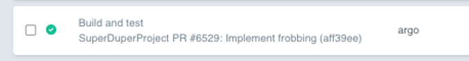

# Title and Description

> v3.4.4 and after

You can add the `workflows.argoproj.io/title` and `workflows.argoproj.io/description` annotations to a Workflow to display in the workflow lists:

```yaml
apiVersion: argoproj.io/v1alpha1
kind: Workflow
metadata:
  name: my-wf
  annotations:
    workflows.argoproj.io/title: 'Build and test' # defaults to `metadata.name` if not specified
    workflows.argoproj.io/description: 'SuperDuperProject PR #6529: Implement frobbing (aff39ee)'
```

The above manifest will render as a row like the below image:

