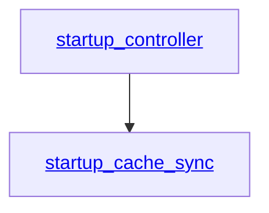

# Tracing

## Introduction

Argo Workflows supports distributed tracing using the OpenTelemetry protocol.

## Beta

Tracing is not considered finished, it is likely to change in incompatible ways in future minor releases of workflows.
For example: we'd like to adopt OpenTelemetry Semantic Conventions.
Feedback is very welcome on how this is useful or how it could be made more useful.

Spans that start in one workflow controller and end in a different workflow controller (because the controller has restarted) will be incomplete.
There is ongoing work to define how to manage long-running spans like this.

## Configuration

Tracing is configured via OpenTelemetry environment variables.
See [Telemetry Configuration](telemetry-configuration.md#tracing) for setup details.

## Spans

<!-- Generated documentation BEGIN -->

### Trace: `StartupController`

### Trace: `Workflow`

```mermaid
flowchart TD
    Workflow[<a href='#workflow'>workflow</a>]
    Node[<a href='#node'>node</a>]
    NodePhase[<a href='#node_phase'>node_phase</a>]
    PersistUpdates[<a href='#persist_updates'>persist_updates</a>]
    ReconcileWorkflow[<a href='#reconcile_workflow'>reconcile_workflow</a>]
    TryAcquireLock[<a href='#try_acquire_lock'>try_acquire_lock</a>]
    WorkflowPhase[<a href='#workflow_phase'>workflow_phase</a>]
    CreateWorkflowPod[<a href='#create_workflow_pod'>create_workflow_pod</a>]
    PodReconciliation[<a href='#pod_reconciliation'>pod_reconciliation</a>]
    ReconcileTaskResults[<a href='#reconcile_task_results'>reconcile_task_results</a>]
    RunInitContainer[<a href='#run_init_container'>run_init_container</a>]
    RunMainContainer[<a href='#run_main_container'>run_main_container</a>]
    RunWaitContainer[<a href='#run_wait_container'>run_wait_container</a>]
    RunWorkload[<a href='#run_workload'>run_workload</a>]
    SaveArtifacts[<a href='#save_artifacts'>save_artifacts</a>]
    SaveLogs[<a href='#save_logs'>save_logs</a>]
    StageFiles[<a href='#stage_files'>stage_files</a>]
    WaitWorkload[<a href='#wait_workload'>wait_workload</a>]
    CaptureScriptResult[<a href='#capture_script_result'>capture_script_result</a>]
    CreateTaskResult[<a href='#create_task_result'>create_task_result</a>]
    LoadArtifacts[<a href='#load_artifacts'>load_artifacts</a>]
    PatchTaskResult[<a href='#patch_task_result'>patch_task_result</a>]
    PatchTaskResultLabels[<a href='#patch_task_result_labels'>patch_task_result_labels</a>]
    ProcessDataTemplate[<a href='#process_data_template'>process_data_template</a>]
    ReconcileTaskResult[<a href='#reconcile_task_result'>reconcile_task_result</a>]
    SaveArtifact[<a href='#save_artifact'>save_artifact</a>]
    SaveContainerLogs[<a href='#save_container_logs'>save_container_logs</a>]
    ArchiveArtifact[<a href='#archive_artifact'>archive_artifact</a>]
    LoadArtifact[<a href='#load_artifact'>load_artifact</a>]
    UnarchiveArtifact[<a href='#unarchive_artifact'>unarchive_artifact</a>]
    Workflow --> Node
    Node --> NodePhase
    Workflow --> PersistUpdates
    Workflow --> ReconcileWorkflow
    Workflow --> TryAcquireLock
    Workflow --> WorkflowPhase
    Node --> CreateWorkflowPod
    ReconcileWorkflow --> PodReconciliation
    ReconcileWorkflow --> ReconcileTaskResults
    CreateWorkflowPod --> RunInitContainer
    CreateWorkflowPod --> RunMainContainer
    CreateWorkflowPod --> RunWaitContainer
    RunMainContainer --> RunWorkload
    RunWaitContainer --> SaveArtifacts
    RunWaitContainer --> SaveLogs
    RunInitContainer --> StageFiles
    RunWaitContainer --> WaitWorkload
    RunWaitContainer --> CaptureScriptResult
    RunWaitContainer --> CreateTaskResult
    RunMainContainer --> CreateTaskResult
    RunInitContainer --> LoadArtifacts
    RunWaitContainer --> PatchTaskResult
    RunMainContainer --> PatchTaskResult
    RunWaitContainer --> PatchTaskResultLabels
    RunMainContainer --> PatchTaskResultLabels
    RunMainContainer --> ProcessDataTemplate
    ReconcileTaskResults --> ReconcileTaskResult
    SaveArtifacts --> SaveArtifact
    SaveLogs --> SaveContainerLogs
    SaveArtifact --> ArchiveArtifact
    LoadArtifacts --> LoadArtifact
    LoadArtifact --> UnarchiveArtifact
```

### Span Reference

#### `archive_artifact`

The compression stage of artifact saving.

This span has no attributes.

#### `capture_script_result`

Capturing script output as a result.

This span has no attributes.

#### `create_task_result`

Creating the WorkflowTaskResult.

This span has no attributes.

#### `create_workflow_pod`

Creating a workflow pod for a node.

| attribute |           explanation            |
|-----------|----------------------------------|
| `node_id` | The unique ID of a node in a DAG |

#### `load_artifact`

Load one artifact.

| attribute |                explanation                |
|-----------|-------------------------------------------|
| `path`    | Local path for artifact being transferred |

#### `load_artifacts`

Load the artifacts.

This span has no attributes.

#### `node`

One node in the DAG of a workflow.

|  attribute  |              explanation              |
|-------------|---------------------------------------|
| `node_id`   | The unique ID of a node in a DAG      |
| `name`      | The name of the workflow              |
| `namespace` | The namespace that the Workflow is in |
| `node_type` | The type of the node                  |

#### `node_phase`

The phase of one node as observed by the controller in the DAG of a workflow.

|      attribute       |                   explanation                   |
|----------------------|-------------------------------------------------|
| `node_id`            | The unique ID of a node in a DAG                |
| `node_phase`         | The phase that the pod's node was in            |
| `message` (optional) | The message associated with the node at the end |

#### `patch_task_result`

Patching the WorkflowTaskResult.

This span has no attributes.

#### `patch_task_result_labels`

Patching the labels of WorkflowTaskResult.

This span has no attributes.

#### `persist_updates`

Persisting workflow status updates to Kubernetes.

This span has no attributes.

#### `pod_reconciliation`

Reconciling pod statuses with workflow nodes.

This span has no attributes.

#### `process_data_template`

Processing a data template transformation.

This span has no attributes.

#### `reconcile_task_result`

Check a single task result.

|  attribute  |                 explanation                 |
|-------------|---------------------------------------------|
| `name`      | The name of the task result                 |
| `completed` | True if the task result is marked completed |

#### `reconcile_task_results`

Check the task results.

This span has no attributes.

#### `reconcile_workflow`

Reconciliation between actual and desired state for a single workflow.

This span has no attributes.

#### `run_init_container`

Run the init container of a workload.

|  attribute  |              explanation              |
|-------------|---------------------------------------|
| `name`      | The name of the workflow              |
| `namespace` | The namespace that the Workflow is in |

#### `run_main_container`

Run the main container of a workload.

|  attribute  |              explanation              |
|-------------|---------------------------------------|
| `name`      | The name of the workflow              |
| `namespace` | The namespace that the Workflow is in |

#### `run_wait_container`

Run the wait container of a workload.

|  attribute  |              explanation              |
|-------------|---------------------------------------|
| `name`      | The name of the workflow              |
| `namespace` | The namespace that the Workflow is in |

#### `run_workload`

This is where your workload will appear if it emits traces.
Workflows never emits this span, it's a placeholder to show what happens if you enable open telemetry tracing in your workloads

This span has no attributes.

#### `save_artifact`

Save one artifact.

This span has no attributes.

#### `save_artifacts`

Save all the artifacts.

This span has no attributes.

#### `save_container_logs`

Saving logs for a specific container.

|    attribute     |        explanation        |
|------------------|---------------------------|
| `container_name` | The name of the container |

#### `save_logs`

Saving container logs as artifacts.

This span has no attributes.

#### `stage_files`

Staging script or manifest files for execution.

This span has no attributes.

#### `startup_cache_sync`

Controllers informer caches have been synchronized.

This span has no attributes.

#### `startup_controller`

Controller startup before it starts processing workflows.

This span has no attributes.

#### `try_acquire_lock`

Attempting to acquire a synchronization lock.

|  attribute  |                explanation                 |
|-------------|--------------------------------------------|
| `lock_name` | The name of the synchronization lock       |
| `acquired`  | Whether the lock was successfully acquired |

#### `unarchive_artifact`

The decompression stage of artifact loading.

| attribute |                    explanation                     |
|-----------|----------------------------------------------------|
| `archive` | Type of archived artifact, one of none, zip or tar |

#### `wait_client_rate_limiter`

Waiting for the kubernetes client's rate limiter.
This span can appear under any active span context (`node`, `reconcileWorkflow`, etc.)
since rate limiter waits can occur during various operations.
This is controlled by --qps and --burst on the workflow-controller

This span has no attributes.

#### `wait_workload`

Wait for the workload to finish.

This span has no attributes.

#### `workflow`

The trace of the lifetime of a workflow.

|  attribute  |              explanation              |
|-------------|---------------------------------------|
| `name`      | The name of the workflow              |
| `namespace` | The namespace that the Workflow is in |

#### `workflow_phase`

One phase of the lifetime of a workflow.

| attribute |               explanation               |
|-----------|-----------------------------------------|
| `phase`   | The phase that the Workflow has entered |
<!-- Generated documentation END -->
