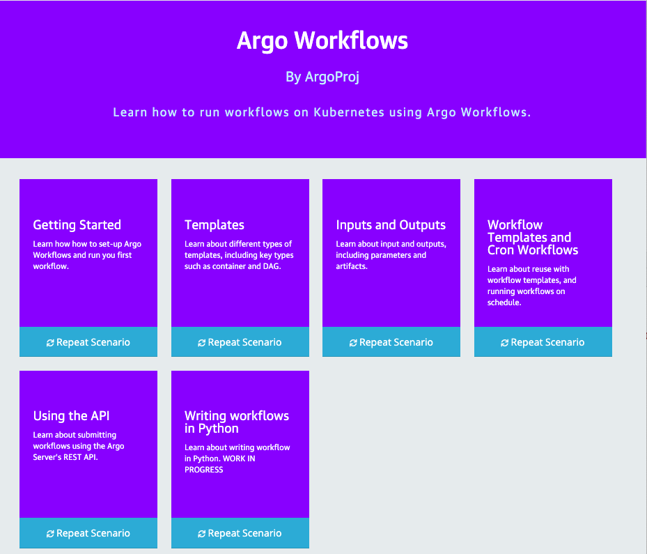

# Training

## Hands-On

We've created a Katacoda course featuring beginner and intermediate lessons. These allow to you try out Argo Workflows
in your web browser without needing to install anything on your computer. Each lesson starts up a Kubernetes cluster
that you can access via a web browser.

The course will take around 2 hours to complete as is by far the fastest way to learn Argo Workflows. 

[ Open the course](https://www.katacoda.com/argoproj/courses/argo-workflows/)

## Videos

We also have a playlist of videos that dive into various topics. This includes contributing to Argo Workflows, not
covered in the hand-on.

[ Open the playlist](https://youtube.com/playlist?list=PLGHfqDpnXFXLHfeapfvtt9URtUF1geuBo)
