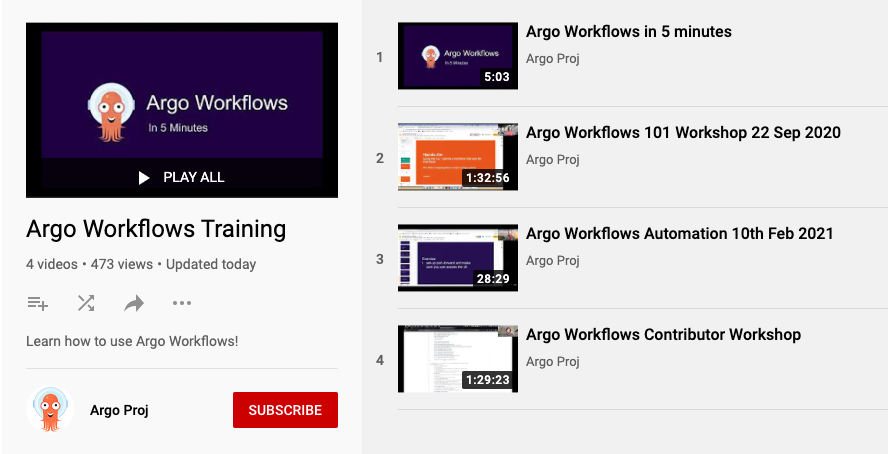

# Training

## Videos

We also have a YouTube playlist of videos that includes workshops you can follow along with:

[ Open the playlist](https://youtube.com/playlist?list=PLGHfqDpnXFXLHfeapfvtt9URtUF1geuBo)

## Hands-On

We are working on a new web-based course featuring beginner and intermediate lessons. These allow to you try out Argo Workflows in your web browser without needing to install anything on your computer. Each lesson starts up a Kubernetes cluster that you can access via a web browser.

The course takes around 2 hours to complete and is the fastest way to learn Argo Workflows.

Please give a thumbs up or comment on [this issue](https://github.com/argoproj/argo-workflows/issues/8899) with your support and feedback for the hands-on course.

## Additional resources

Visit the [awesome-argo GitHub repo](https://github.com/terrytangyuan/awesome-argo) for more educational resources.
