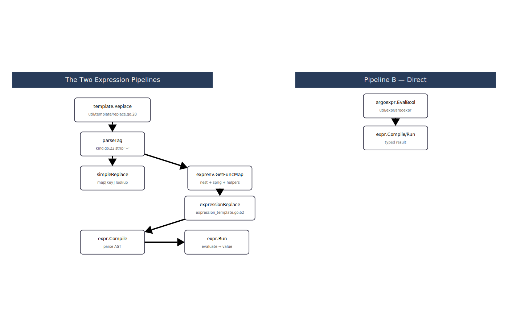
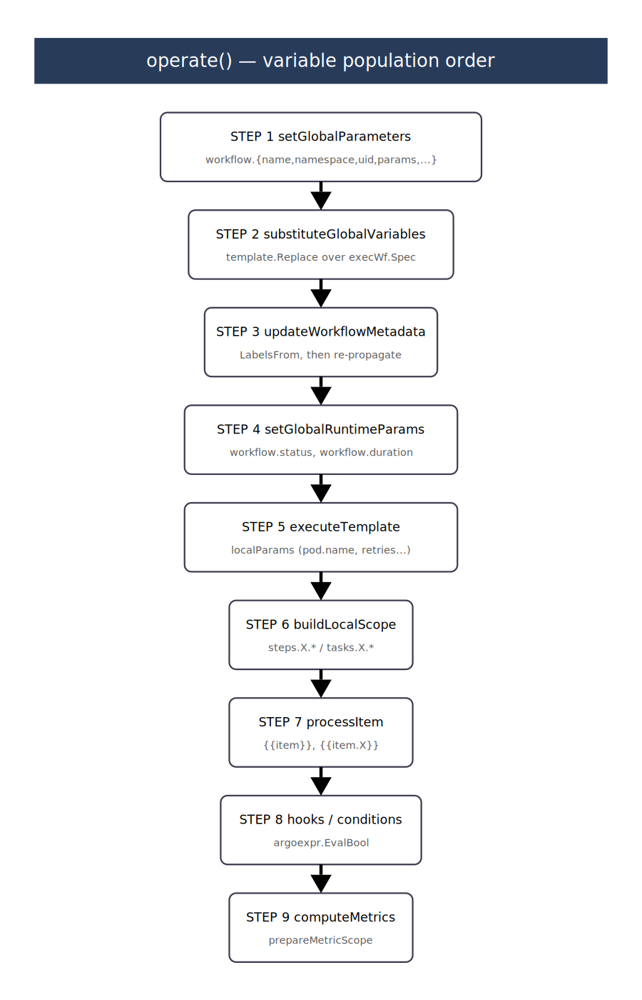
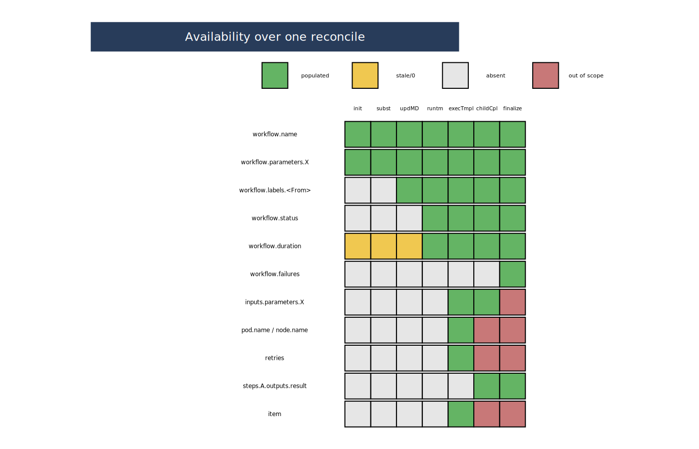

# Variable Propagation in the Argo Workflows Controller

A complete trace of how `{{...}}` and `{{= ... }}` variables are born, propagated, and evaluated during one `operate()` reconciliation of a `Workflow`.

File:line references point at `main` as of commit `51ea54b6c`.

> **Diagrams** — SVG versions of the three main diagrams in this document live next to it: `pipelines.svg`, `operate.svg`, `timeline.svg`.

---

## Table of Contents

1. [High-level picture](#1-high-level-picture)
2. [The two evaluation pipelines](#2-the-two-evaluation-pipelines)
3. [Variable containers](#3-variable-containers)
4. [Lifecycle of one `operate()` call](#4-lifecycle-of-one-operate-call)
5. [Per-variable traces](#5-per-variable-traces)
6. [Call-site inventory (every `expr.Compile` / `expr.Run`)](#6-call-site-inventory-every-exprcompile--exprrun)
7. [Timing diagram](#7-timing-diagram)
8. [Runtime tracing with `util/exprtrace`](#8-runtime-tracing-with-utilexprtrace)

---

## 1. High-level picture

```
                ┌────────────────────────────────────────────────┐
                │                  operate()                      │
                │          workflow/controller/operator.go:193    │
                └────────────────────────────────────────────────┘
                                     │
                                     ▼
   ┌──────────────────────────────────────────────────────────────┐
   │  State carried across the whole reconcile                    │
   │                                                              │
   │   woc.globalParams : common.Parameters  (map[string]string)  │
   │   woc.wf           : *wfv1.Workflow                          │
   │   woc.execWf       : *wfv1.Workflow  (spec being executed)   │
   │   woc.volumes      : []v1.Volume                             │
   └──────────────────────────────────────────────────────────────┘
                                     │
           ┌─────────────────────────┼───────────────────────────┐
           ▼                         ▼                           ▼
   ┌──────────────┐        ┌──────────────────┐        ┌──────────────────┐
   │ Globals init │        │ Per-template     │        │ Node completion  │
   │ setGlobal    │        │ ProcessArgs +    │        │ buildLocalScope  │
   │ Parameters   │        │ SubstituteParams │        │ addOutputsTo…    │
   └──────────────┘        └──────────────────┘        └──────────────────┘
           │                         │                           │
           │                         ▼                           ▼
           │                 ┌─────────────────┐         ┌──────────────────┐
           │                 │ template.Replace│         │    wfScope       │
           └────────────────▶│   pipeline A    │◀────────│ (scope.go:19)    │
                             └─────────────────┘         └──────────────────┘
                                     │
                                     ▼
                             ┌─────────────────┐
                             │   Pipeline B    │
                             │  argoexpr.Eval* │
                             │  direct expr.*  │
                             └─────────────────┘
```

The controller has exactly two ways to evaluate an expression:

- **Pipeline A** — `util/template.Replace(ctx, jsonStr, replaceMap, allowUnresolved)` takes a JSON string and substitutes every `{{...}}` and `{{= ... }}` tag into it, returning a new JSON string. Used whenever the *output* is a stringified value that replaces a placeholder inside a YAML/JSON field.
- **Pipeline B** — a hand-built `map[string]any` is passed directly to `expr.Compile` and `expr.Run` (often via `argoexpr.EvalBool`). Used when the *output* must be a typed Go value: a `bool`, a `string`, an `Artifact`, or a parameter value.

---

## 2. The two evaluation pipelines



### 2.1 Pipeline A — `util/template.Replace`

```
util/template/replace.go:28
                │
                ▼
   ┌───────────────────────────────────┐
   │ Replace(ctx, s, replaceMap, allow)│   s is JSON; replaceMap is map[string]string
   └───────────────────────────────────┘
                │ widen map[string]string → map[string]any
                ▼
   ┌───────────────────────────────────┐
   │     (*impl).Replace               │   util/template/template.go:52
   │     → (*impl).replace             │
   └───────────────────────────────────┘
                │
                ▼ fasttemplate scans for {{…}} tags
   ┌───────────────────────────────────┐
   │ parseTag(tag)                     │   util/template/kind.go:22
   │  strip leading "="                │
   └───────────────────────────────────┘
                │
      ┌─────────┴───────────┐
      │ kindSimple          │ kindExpression
      ▼                     ▼
  ┌──────────────┐   ┌────────────────────────────┐
  │ map lookup:  │   │ env = exprenv.GetFuncMap(  │
  │ replaceMap[t]│   │        replaceMap)         │
  └──────────────┘   │ expressionReplaceStrict    │
                    │   util/template/            │
                    │   expression_template.go:52 │
                    └────────────────────────────┘
                                    │
                                    ▼
                      ┌──────────────────────────┐
                      │  expr.Compile(expr, env) │
                      │  expr.Run(program, env)  │
                      └──────────────────────────┘
                                    │
                                    ▼
                      ┌──────────────────────────┐
                      │  JSON-marshal result,    │
                      │  strip outer quotes,     │
                      │  write into output stream│
                      └──────────────────────────┘
```

**Key fact**: the env for a `{{= … }}` tag inside Pipeline A is built on the fly as `exprenv.GetFuncMap(replaceMap)`. That wraps the caller's flat map:

```
┌───── exprenv.GetFuncMap (util/expr/env/env.go:20) ─────┐
│                                                        │
│   flat map: {"workflow.name": "x",                     │
│              "workflow.parameters.greeting": "hi"}     │
│                           │                            │
│                           ▼                            │
│   removeConflicts (util/expand/expand.go:18)           │
│                           │                            │
│                           ▼                            │
│   bellows.Expand  →  {"workflow":                      │
│                        {"name": "x",                   │
│                         "parameters":                  │
│                          {"greeting": "hi"}}}          │
│                           │                            │
│                           ▼                            │
│   inject helpers:                                      │
│     asInt, asFloat  (builtin.Int, builtin.Float)       │
│     jsonpath        (evilmonkeyinc/jsonpath)           │
│     toJson                                             │
│     sprig           (Masterminds/sprig/v3              │
│                      minus env & expandenv)            │
│                                                        │
└────────────────────────────────────────────────────────┘
```

### 2.2 Pipeline B — direct `expr.Compile` / `expr.Run`

Used when the result must be typed. Eight production call sites:

| Site | File:line | `env` construction |
|---|---|---|
| `ResolveVar` | `util/template/resolve_var.go:16,20` | caller map |
| `processExpression` (Data) | `workflow/data/data.go:60,64` | `{"data": previousStepResult}` |
| `EvalBool` | `util/expr/argoexpr/eval.go:10,14` | caller map |
| `wfScope.resolveParameter` | `workflow/controller/scope.go:80,84` | `env.GetFuncMap(s.scope)` |
| `wfScope.resolveArtifact` | `workflow/controller/scope.go:99,103` | `env.GetFuncMap(s.scope)` |
| LabelsFrom | `workflow/controller/operator.go:593,597` | `env.GetFuncMap(template.EnvMap(woc.globalParams))` |
| event-binding `ValueFrom.Event` | `server/event/dispatch/operation.go:149,153` | `o.env` (no sprig) |
| event-binding metadata | `server/event/dispatch/operation.go:216,220` | `exprenv.GetFuncMap(o.env)` |

Indirect callers go through `argoexpr.EvalBool`:

```
argoexpr.EvalBool(input, env)  ── util/expr/argoexpr/eval.go:9
    │
    ├── hooks.go:28         workflow-level hook      env = GetFuncMap(EnvMap(globalParams))
    ├── hooks.go:71         step/task hook           env = GetFuncMap(EnvMap(globalParams ∪ scope))
    ├── dag.go:984          DAG "depends" logic      env = map[string]TaskResults  (no sprig)
    ├── exit_handler.go:26  exit hook                env = GetFuncMap(EnvMap(globalParams ∪ scope))
    ├── operator.go:1135    retry strategy           env = GetFuncMap(buildRetryStrategyLocalScope)
    ├── dispatch/op.go:92   event selector           env = {namespace, discriminator, metadata, payload}
    ├── agent.go:295        HTTP successCondition    env = {request:{...}, response:{...}}
    ├── cron/op.go:545      CronWorkflow stop cond   env = {cronworkflow:{name, ns, labels, ...}}
    └── gatekeeper.go:250   SSO authorization        env = request-scoped
```

---

## 3. Variable containers

Four distinct maps carry variable state during reconciliation. Knowing which one contains what is the key to reading the code.

### 3.1 `woc.globalParams` — `common.Parameters` (= `map[string]string`)

Populated once per reconcile at the top of `operate()`.

```
setGlobalParameters(args)             operator.go:636
  woc.globalParams["workflow.name"]              = woc.wf.Name
  woc.globalParams["workflow.namespace"]         = woc.wf.Namespace
  woc.globalParams["workflow.mainEntrypoint"]    = woc.execWf.Spec.Entrypoint
  woc.globalParams["workflow.serviceAccountName"]= ...
  woc.globalParams["workflow.uid"]               = string(woc.wf.UID)
  woc.globalParams["workflow.creationTimestamp"] = wf.CreationTimestamp.Format(RFC3339)
  woc.globalParams["workflow.creationTimestamp.<fmt>"] = strftime-style formats
  woc.globalParams["workflow.priority"]          = ...
  woc.globalParams["workflow.duration"]          = "0"        # updated later
  for each arg.Parameters:
    woc.globalParams["workflow.parameters.X"]    = value OR ConfigMap resolved value
  # also: workflow.scheduledTime (cron), workflow.parameters (whole list as JSON)
  for label:  woc.globalParams["workflow.labels.X"] = v
  for annot:  woc.globalParams["workflow.annotations.X"] = v

setGlobalRuntimeParameters()          operator.go:4378  (at the end of reconcile-init)
  woc.globalParams["workflow.status"]   = string(woc.wf.Status.Phase)
  woc.globalParams["workflow.duration"] = fmt.Sprintf("%f", elapsed.Seconds())

operate() failure/status propagation   operator.go:419,441
  woc.globalParams["workflow.failures"] = JSON array of failed nodes
  woc.globalParams["workflow.status"]   = final phase (for onExit)
```

### 3.2 `wfScope` — per-template-execution scope

```go
type wfScope struct {
    tmpl  *wfv1.Template
    scope map[string]any      // flat keys, string or wfv1.Artifact values
}
```

Built by `createScope(tmpl)` at `scope.go:24`:

```
createScope(tmpl)
  for each tmpl.Inputs.Parameters:
    scope["inputs.parameters.X"]    = "<value>"
  for each tmpl.Inputs.Artifacts:
    scope["inputs.artifacts.X"]     = wfv1.Artifact{…}   (not just path)
```

Then grown incrementally as child nodes complete (see `buildLocalScope` / `addOutputsToLocalScope` below).

### 3.3 `replaceMap` — the input to `template.Replace`

Always a `map[string]string` that ends up being widened to `map[string]any` for expression evaluation. Its shape depends on the call site — see [§5.3](#53-substituteparams-the-template-scoped-pass).

### 3.4 `env` for Pipeline B

Built per-call. Never long-lived. Contents depend entirely on which caller (see [§6](#6-call-site-inventory-every-exprcompile--exprrun)).

---

## 4. Lifecycle of one `operate()` call



This is the spine of the whole system. Each numbered step explains which variables are populated and what they touch.

```
┌──────────────────────────────────────────────────────────────────────────┐
│                            operate() entry                                │
│                     workflow/controller/operator.go:193                   │
└──────────────────────────────────────────────────────────────────────────┘
                                    │
                                    ▼
 ╔════════════════════════════════════════════════════════════════════════╗
 ║ STEP 1 — Initialize globalParams                                       ║
 ║                                                                        ║
 ║   setGlobalParameters(execWf.Spec.Arguments)       operator.go:636     ║
 ║     populates woc.globalParams with:                                   ║
 ║       workflow.name,  workflow.namespace,  workflow.uid                ║
 ║       workflow.creationTimestamp and strftime variants                 ║
 ║       workflow.serviceAccountName, workflow.mainEntrypoint             ║
 ║       workflow.parameters.* (with ConfigMap resolution)                ║
 ║       workflow.labels.*, workflow.annotations.*                        ║
 ║       workflow.priority, workflow.duration="0"                         ║
 ╚════════════════════════════════════════════════════════════════════════╝
                                    │
                                    ▼
 ╔════════════════════════════════════════════════════════════════════════╗
 ║ STEP 2 — substituteGlobalVariables                  operator.go:4361   ║
 ║                                                                        ║
 ║   execWfSpec := woc.execWf.Spec                                        ║
 ║   execWfSpec.Templates = nil     (skip templates, done later per-tmpl) ║
 ║   wfSpec, _ := json.Marshal(execWfSpec)                                ║
 ║   resolved, _ := template.Replace(ctx, wfSpec,                         ║
 ║                                    woc.globalParams, true)             ║
 ║   json.Unmarshal(resolved, &woc.execWf.Spec)                           ║
 ║                                                                        ║
 ║   ── This is the FIRST pass that resolves {{…}} in non-template        ║
 ║      fields: spec.arguments, spec.volumeClaimTemplates,                ║
 ║      spec.podMetadata, etc.                                            ║
 ║   ── {{= ... }} tags here get GetFuncMap-wrapped env via Pipeline A.   ║
 ╚════════════════════════════════════════════════════════════════════════╝
                                    │
                                    ▼ (only when wf.Status.Phase == Unknown)
 ╔════════════════════════════════════════════════════════════════════════╗
 ║ STEP 2a — updateWorkflowMetadata                    operator.go:568    ║
 ║                                                                        ║
 ║   Merge md.Labels / md.Annotations into wf and into globalParams.      ║
 ║                                                                        ║
 ║   env := env.GetFuncMap(template.EnvMap(woc.globalParams))             ║
 ║   for name, f := range md.LabelsFrom:                                  ║
 ║     program := expr.Compile(f.Expression, expr.Env(env))               ║
 ║     result  := expr.Run(program, env)                                  ║
 ║     woc.wf.Labels[name]                 = result.(string)              ║
 ║     woc.globalParams["workflow.labels."+name] = result.(string)        ║
 ║                                                                        ║
 ║   substituteGlobalVariables(ctx, updatedParams)   ← re-propagate       ║
 ╚════════════════════════════════════════════════════════════════════════╝
                                    │
                                    ▼
 ╔════════════════════════════════════════════════════════════════════════╗
 ║ STEP 3 — setGlobalRuntimeParameters                 operator.go:4378   ║
 ║                                                                        ║
 ║   woc.globalParams["workflow.status"]   = string(wf.Status.Phase)      ║
 ║   woc.globalParams["workflow.duration"] = fmt.Sprintf("%f", elapsed)   ║
 ║                                                                        ║
 ║   (status/duration are kept fresh for any template scheduled this      ║
 ║    reconcile — crucially, visible to the onExit handler.)              ║
 ╚════════════════════════════════════════════════════════════════════════╝
                                    │
                                    ▼
 ╔════════════════════════════════════════════════════════════════════════╗
 ║ STEP 4 — DAG / Steps traversal                                         ║
 ║                                                                        ║
 ║   executeTemplate(entrypoint, …)                  operator.go:2079     ║
 ║   recurses into executeSteps / executeDAG / executeScript / …          ║
 ║                                                                        ║
 ║   At each node dispatch:                                               ║
 ║                                                                        ║
 ║     ┌──────── executeTemplate(node) ────────┐                          ║
 ║     │                                        │                          ║
 ║     │  STEP 4a: build localParams            │  operator.go:2131      ║
 ║     │    localParams[pod.name]   = getPodName(nodeName, tmpl.Name)     ║
 ║     │    localParams[tasks.name] = orgTmpl.GetName()  if DAG task     ║
 ║     │    localParams[steps.name] = orgTmpl.GetName()  if Step         ║
 ║     │    localParams[node.name]  = nodeName                            ║
 ║     │                                        │                          ║
 ║     │  STEP 4b: ProcessArgs                  │  common/util.go:161    ║
 ║     │    (substitutes globals+locals,        │                          ║
 ║     │     then inputs — two passes           │                          ║
 ║     │     via template.Replace)              │                          ║
 ║     │                                        │                          ║
 ║     │  STEP 4c: retry path                   │  operator.go:2380      ║
 ║     │    localParams[retries]                = strconv.Itoa(n)        ║
 ║     │    localParams[retries.lastExitCode]   = last.Outputs.ExitCode  ║
 ║     │    localParams[retries.lastStatus]     = last.Phase             ║
 ║     │    localParams[retries.lastDuration]   = last.Duration          ║
 ║     │    localParams[retries.lastMessage]    = last.Message           ║
 ║     │    SubstituteParams(tmpl, globals, localParams)   ← second pass ║
 ║     │                                        │                          ║
 ║     └────────────────────────────────────────┘                          ║
 ╚════════════════════════════════════════════════════════════════════════╝
                                    │
                                    ▼
 ╔════════════════════════════════════════════════════════════════════════╗
 ║ STEP 5 — Child completion feedback                                     ║
 ║                                                                        ║
 ║   When a child node completes, the parent's executor writes its        ║
 ║   outputs into the parent's wfScope.                                   ║
 ║                                                                        ║
 ║   buildLocalScope(scope, prefix, node)              operator.go:3467   ║
 ║     scope[prefix.id]           = node.ID                               ║
 ║     scope[prefix.startedAt]    = node.StartedAt                        ║
 ║     scope[prefix.finishedAt]   = node.FinishedAt                       ║
 ║     scope[prefix.ip]           = node.PodIP                            ║
 ║     scope[prefix.status]       = string(node.Phase)                    ║
 ║     scope[prefix.hostNodeName] = node.HostNodeName                     ║
 ║     addOutputsToLocalScope(prefix, node.Outputs, scope)                ║
 ║                                                                        ║
 ║   addOutputsToLocalScope                          operator.go:3504     ║
 ║     scope[prefix.outputs.result]            = *outputs.Result          ║
 ║     scope[prefix.exitCode]                  = *outputs.ExitCode        ║
 ║     scope[prefix.outputs.parameters.<name>] = param.Value              ║
 ║     scope[prefix.outputs.artifacts.<name>]  = art  (wfv1.Artifact)     ║
 ║                                                                        ║
 ║   processAggregateNodeOutputs (withItems/withParam) operator.go:3564   ║
 ║     scope[prefix.outputs.result]          = JSON array of child results║
 ║     scope[prefix.outputs.parameters]      = JSON array of param maps   ║
 ║     scope[prefix.outputs.parameters.<n>]  = JSON array of single param ║
 ║                                                                        ║
 ║   prefix is:                                                           ║
 ║     "steps.<name>"   inside Steps                                      ║
 ║     "tasks.<name>"   inside DAG                                        ║
 ║     "workflow"       for workflow-level outputs                        ║
 ╚════════════════════════════════════════════════════════════════════════╝
                                    │
                                    ▼
 ╔════════════════════════════════════════════════════════════════════════╗
 ║ STEP 6 — withItems / withParam expansion                               ║
 ║                                                                        ║
 ║   expandStep   steps.go:597 (or expandTask)                            ║
 ║   items := parse withItems | unmarshal withParam | expand withSequence ║
 ║   for i, item := range items:                                          ║
 ║     processItem(ctx, tmpl, name, i, item, …, globalScope)              ║
 ║                                                                        ║
 ║   processItem                                operator.go:3912          ║
 ║     replaceMap = copy of globalScope                                   ║
 ║     switch item.Type:                                                  ║
 ║       Number|Bool:  replaceMap["item"]         = fmt.Sprintf("%v", …)  ║
 ║       String:       replaceMap["item"]         = item.GetStrVal()      ║
 ║       Map:          replaceMap["item"]         = JSON of map           ║
 ║                     replaceMap["item.<key>"]   = value                 ║
 ║       List:         replaceMap["item"]         = JSON of list          ║
 ║     tmpl.Replace(ctx, replaceMap, false)   ← substitute into the step  ║
 ╚════════════════════════════════════════════════════════════════════════╝
                                    │
                                    ▼
 ╔════════════════════════════════════════════════════════════════════════╗
 ║ STEP 7 — Hooks and conditional evaluation (Pipeline B)                 ║
 ║                                                                        ║
 ║   Every time a decision has to return a typed value, go direct:        ║
 ║                                                                        ║
 ║     DAG depends logic          (dag.go:984)                            ║
 ║       env = map[string]TaskResults{name: {Succeeded, Failed, …}}       ║
 ║                                                                        ║
 ║     Step/task hook.Expression  (hooks.go:71)                           ║
 ║       env = GetFuncMap(EnvMap(globalParams ∪ scope.getParameters()))   ║
 ║                                                                        ║
 ║     onExit hook expression     (exit_handler.go:26)                    ║
 ║       env = GetFuncMap(EnvMap(globalParams ∪ scope.getParameters()))   ║
 ║                                                                        ║
 ║     Retry strategy expression  (operator.go:1135)                      ║
 ║       env = GetFuncMap(buildRetryStrategyLocalScope(node, nodes))      ║
 ║          =  retries, retries.lastExitCode, …                           ║
 ║                                                                        ║
 ║     Workflow-level hook        (hooks.go:28)                           ║
 ║       env = GetFuncMap(EnvMap(globalParams))                           ║
 ║                                                                        ║
 ║     Output parameter           (operator.go:3310)                      ║
 ║       env = GetFuncMap(scope.scope)                                    ║
 ║                                                                        ║
 ║     Output artifact from expr  (scope.go:99)                           ║
 ║       env = GetFuncMap(scope.scope)                                    ║
 ╚════════════════════════════════════════════════════════════════════════╝
                                    │
                                    ▼
 ╔════════════════════════════════════════════════════════════════════════╗
 ║ STEP 8 — Metrics (if spec.metrics != nil)                              ║
 ║                                                                        ║
 ║   prepareMetricScope(node)                          steps.go:672       ║
 ║     localScope  = globalParams.DeepCopy()                              ║
 ║     localScope[duration]            = …                                ║
 ║     localScope[status]              = string(node.Phase)               ║
 ║     localScope[retries]             = len(Children)-1                  ║
 ║     localScope[inputs.parameters.X] = param.Value                      ║
 ║     localScope[outputs.result]      = *node.Outputs.Result             ║
 ║     localScope[outputs.parameters.X]= param.Value                      ║
 ║     localScope[resourcesDuration.X] = durationSeconds                  ║
 ║                                                                        ║
 ║   computeMetrics(metrics, localScope, realTimeScope, …) operator.go:4085║
 ║     template.Replace over each metric using localScope.                ║
 ╚════════════════════════════════════════════════════════════════════════╝
                                    │
                                    ▼
                          ┌───────────────────┐
                          │ End of operate()  │
                          │ persist wf state  │
                          └───────────────────┘
```

---

## 5. Per-variable traces

Each subsection walks a single variable from birth to consumption.

### 5.1 `{{workflow.name}}` and friends (pure global)

```
┌── Written ──────────────────────────────────────────────────────────┐
│                                                                     │
│ operate() ─▶ setGlobalParameters()          operator.go:636         │
│   woc.globalParams["workflow.name"] = woc.wf.Name                   │
│                                                                     │
└─────────────────────────────────────────────────────────────────────┘
              │
              │ read by
              ▼
┌── Read ─────────────────────────────────────────────────────────────┐
│                                                                     │
│ (a) substituteGlobalVariables(execWf.Spec, globalParams)            │
│        template.Replace with replaceMap=globalParams                │
│        ⇒ any {{workflow.name}} in the spec resolves                 │
│                                                                     │
│ (b) ProcessArgs / SubstituteParams                                  │
│        template.Replace(tmpl, globalParams ∪ localParams)           │
│        ⇒ any {{workflow.name}} inside a template resolves           │
│                                                                     │
│ (c) LabelsFrom (metadata)                                           │
│        env = GetFuncMap(EnvMap(globalParams))                       │
│        ⇒ expression can reference workflow.name                     │
│                                                                     │
│ (d) Hooks (workflow-level + step/task)                              │
│        env = GetFuncMap(EnvMap(globalParams [∪ scope]))             │
│                                                                     │
│ (e) Metrics (prepareMetricScope deep-copies globalParams)           │
│                                                                     │
└─────────────────────────────────────────────────────────────────────┘
```

### 5.2 `{{workflow.status}}`, `{{workflow.duration}}`, `{{workflow.failures}}`

```
operate() stages:

  STEP 1 setGlobalParameters              → workflow.duration = "0"
                                            (no status yet)
  STEP 2 substituteGlobalVariables        (sees "0" for duration, no status)
  STEP 3 setGlobalRuntimeParameters       → workflow.status   = Phase
                                            workflow.duration = elapsed
  STEP 4 executeTemplate (main flow)      (sees the runtime values)

Later, once the DAG fails or completes, operator.go:419 / 441:
                                          → workflow.failures = JSON array

For the onExit handler specifically, the same globalParams-based env is
used, but by then workflow.status has transitioned to its final phase
(Succeeded / Failed / Error) and workflow.duration reflects total time.
```

```
timeline of availability during a reconcile
──────────────────────────────────────────────────────────────────▶

globalParams state:     ┌──init──┐┌──substGlobal──┐┌──runtime──┐┌──failures──┐
                        │  0     ││ "0"           ││ Phase     ││ failed[]   │
workflow.duration       │────────┼┼───────────────┼┼───────────┼┼────────────│
workflow.status         │  —     ││ —             ││ Running   ││ Failed     │
workflow.failures       │  —     ││ —             ││ —         ││ [{id,…}]   │

                        ▲                         ▲            ▲
                        │                         │            │
                 spec-level {{…}}            per-template    onExit handler
                 already resolved            {{…}} and       sees final phase
                 (may be stale)              hooks           and failures
```

### 5.3 `SubstituteParams` — the template-scoped pass

The actual engine for `{{inputs.parameters.X}}`, `{{pod.name}}`, etc. is a two-pass `template.Replace`. Here is the control flow:

```
ProcessArgs(tmpl, args, globalParams, localParams, …)      common/util.go:161
    │
    ├── for each input Parameter:
    │      set to Default
    │      override with args.Parameter.Value / args.Parameter.ValueFrom
    │      substituteAndGetConfigMapValue (may pull from ConfigMap)
    │
    ├── for each input Artifact:
    │      propagate args.Artifact into tmpl
    │
    └── SubstituteParams(tmpl, globalParams, localParams)   common/util.go:223
          │
          │ tmplBytes = json.Marshal(tmpl)
          │
          │ replaceMap1 = globalParams.Merge(localParams)
          │
          │ ┌─── PASS 1 ───────────────────────────────────────┐
          │ │  template.Replace(tmplBytes, replaceMap1, allow) │
          │ │    resolves {{workflow.*}}, {{pod.name}},        │
          │ │    {{steps.name}}, {{tasks.name}}, {{node.name}},│
          │ │    {{retries}}, {{retries.last*}}                │
          │ │    and {{= … }} tags (via GetFuncMap wrap)       │
          │ └──────────────────────────────────────────────────┘
          │
          │ globalReplacedTmpl = json.Unmarshal(pass1_output)
          │
          │ replaceMap2 = replaceMap1 + {
          │     "inputs.parameters.X"     : inParam.Value.String(),
          │     "inputs.parameters"       : <JSON array>,
          │     "inputs.artifacts.X.path" : inArt.Path,
          │     "outputs.artifacts.X.path": outArt.Path,
          │     "outputs.parameters.X.path": param.ValueFrom.Path,
          │ }
          │
          └── ┌─── PASS 2 ─────────────────────────────────────┐
              │  template.Replace(pass1_output, replaceMap2, …) │
              │    resolves {{inputs.*}}, {{outputs.*.path}}   │
              └────────────────────────────────────────────────┘
```

The two passes are required because input parameter values may themselves reference globals. Pass 1 substitutes globals into the parameter values; pass 2 uses those values to substitute `{{inputs.parameters.X}}` elsewhere in the template.

### 5.4 `{{steps.A.outputs.result}}` / `{{tasks.A.outputs.parameters.Y}}`

Two phases: producer writes to `wfScope`, consumer reads via `SubstituteParams`.

```
PRODUCER (node A finishes)
    │
    ▼
executeSteps   steps.go:66   or   executeDAG + buildLocalScopeFromTask
    │                                              dag.go:673
    │ iterate completed children
    ▼
buildLocalScope(scope, "steps.A" | "tasks.A", node)     operator.go:3467
    │
    ├── scope["steps.A.id"]              = node.ID
    ├── scope["steps.A.startedAt"]       = node.StartedAt
    ├── scope["steps.A.finishedAt"]      = node.FinishedAt
    ├── scope["steps.A.ip"]              = node.PodIP
    ├── scope["steps.A.status"]          = string(node.Phase)
    └── scope["steps.A.hostNodeName"]    = node.HostNodeName
    │
    ▼
addOutputsToLocalScope("steps.A", node.Outputs, scope)  operator.go:3504
    ├── scope["steps.A.outputs.result"]              = *Outputs.Result
    ├── scope["steps.A.exitCode"]                    = *Outputs.ExitCode
    ├── scope["steps.A.outputs.parameters.Y"]        = param.Value
    └── scope["steps.A.outputs.artifacts.Z"]         = artifact

─── time passes, next step/task starts ──────────────────────────────

CONSUMER (node B has args referencing {{steps.A.outputs.result}})
    │
    ▼
executeStepGroup / executeDAGTask
    │
    │ resolveDependencyReferences       dag.go:731
    │   scope := buildLocalScopeFromTask(ctx, dagCtx, task)
    │     (for Steps, scope is stepsCtx.scope accumulated across the run)
    │
    │   mergedParams := globalParams.Merge(scope.getParameters())
    │   task  = template.Replace(taskJSON, mergedParams, allowUnresolved)
    │
    ▼
executeTemplate(node B, processedArgs, …)    ← args already resolved
```

If A used `withItems`, `processAggregateNodeOutputs` runs instead of / in addition to `buildLocalScope`, producing the JSON array form.

### 5.5 `{{item}}` and `{{item.key}}`

```
STEP 4 (steps.go:130) / DAG (dag.go:855)
  │
  │ find all step/task children by name
  │ if withItems, withParam or withSequence:
  ▼
expandStep / expandTask            steps.go:597
  │
  │ items = parse WithItems / json.Unmarshal WithParam / expand sequence
  │
  │ tmplBytes = json.Marshal(step)      ← NOTE: step template, not workflow
  │ tmpl      = template.NewTemplate(tmplBytes)
  │
  │ for i, item := range items:
  ▼
processItem(ctx, tmpl, stepName, i, item, &newStep, whenCond, globalScope)
                                                         operator.go:3912
  │ replaceMap = copy of globalScope
  │
  │ switch item.Type:
  │   Number|Bool     → replaceMap["item"] = fmt.Sprintf("%v", item)
  │   String          → replaceMap["item"] = item.GetStrVal()
  │   Map(k→v)        → replaceMap["item.<k>"] = v   (for every key)
  │                     replaceMap["item"]    = json.Marshal(map)
  │   List            → replaceMap["item"]    = json.Marshal(list)
  │
  │ newStepStr = tmpl.Replace(ctx, replaceMap, allowUnresolved)
  │ json.Unmarshal(newStepStr, &newStep)
  │
  └─ produces a new step per item with resolved {{item.*}} tags
```

Inside `processItem`, `globalScope` is the caller's `map[string]string` — for Steps, that's `stepsCtx.scope.getParameters()` + globals; for DAG, the `buildLocalScopeFromTask` output. Both so that `{{steps.X.outputs.result}}` used in a `withParam` resolves to the producer's JSON list before expansion.

### 5.6 `{{pod.name}}`, `{{node.name}}`, `{{steps.name}}`, `{{tasks.name}}`

Set as `localParams` in `executeTemplate` right before `ProcessArgs`:

```
executeTemplate(nodeName, orgTmpl, …)          operator.go:2079
  │
  │ (resolve and merge template defaults)
  │
  ▼ operator.go:2131
  localParams := make(map[string]string)
  if resolvedTmpl.IsPodType() && retryStrategy == nil:
      localParams[pod.name]   = woc.getPodName(nodeName, resolvedTmpl.Name)
  if orgTmpl.IsDAGTask():
      localParams[tasks.name] = orgTmpl.GetName()
  if orgTmpl.IsWorkflowStep():
      localParams[steps.name] = orgTmpl.GetName()
  localParams[node.name]      = nodeName
  │
  ▼
  ProcessArgs(tmpl, args, globalParams, localParams, …)
      → SubstituteParams replaces {{pod.name}} etc. in tmpl
```

If the template has a retry strategy, `pod.name` is injected slightly later — once per retry attempt — so each attempt gets its distinct name:

```
operator.go:2380 (retry path)
  localParams[pod.name]   = woc.getPodName(nodeName, processedTmpl.Name)
  localParams[retries]    = strconv.Itoa(retryNum)
  localParams[retries.lastExitCode] = lastRetryExitCode
  localParams[retries.lastStatus]   = lastRetryStatus
  localParams[retries.lastDuration] = lastRetryDuration
  localParams[retries.lastMessage]  = lastRetryMessage
  processedTmpl, _ = common.SubstituteParams(tmpl, globalParams, localParams)
```

### 5.7 `{{= ... }}` expression tags

```
template.Replace                 util/template/template.go:52
   │
   ▼ fasttemplate finds a `{{…}}` tag
   │
   ▼ parseTag(tag)               util/template/kind.go:22
   │   strip leading "=" → kindExpression, expr
   │
   ▼ impl.replace                util/template/template.go:37
   │   env := exprenv.GetFuncMap(replaceMap)
   │
   ▼ expressionReplaceStrict     util/template/expression_template.go:52
   │   json.Unmarshal to undo character escapes in the expression
   │
   │   getIdentifiers(expr)      (parse AST, walk nodes)
   │   compare against env keys
   │     if expression uses variables not in env AND strictRegex nil:
   │         leave expression unresolved (write {{=…}} back verbatim)
   │     else if strict prefix matches a missing var:
   │         return error
   │
   ▼ expressionReplaceCore       expression_template.go:146
   │   scan env for placeholder values (maps.VisitMap)
   │   if any value is itself an unresolved placeholder:
   │       shouldAllowFailure = true  (tolerate failures this pass)
   │
   ▼ expr.Compile(expr, Env(env))
   ▼ expr.Run(program, env)
   │
   │ result is JSON-marshaled; outer quotes stripped to embed in JSON string
   │
   ▼ write into the output buffer
```

Key insight: `{{= … }}` tags are **evaluated in the same pass as simple tags**, against the **same replaceMap** (just wrapped with `GetFuncMap`). There is no separate "expression phase". That is why `{{= steps.A.outputs.result == "10" }}` only works when `steps.A` has already been added to the consumer's scope — the same condition as for simple tags.

---

## 6. Call-site inventory (every `expr.Compile` / `expr.Run`)

```
┌─────────────────────────────────────────────────────────────────────┐
│                                                                     │
│                         expr.Compile / expr.Run                     │
│                                                                     │
├─────────────────────────────────────────────────────────────────────┤

╔══ 1. util/template/resolve_var.go:16,20 ═══════════════════════════╗
║  ResolveVar(s, m)                                                  ║
║    called from: wfScope.resolveVar  (scope.go:71)                  ║
║    env =  m  (no sprig)                                            ║
║    m composition at scope.go:63-71 :                               ║
║      copy(m, s.scope)                                              ║
║      m["inputs.artifacts.<name>"] = tmpl.Inputs artifacts          ║
║    Reaches expression branch only if caller tag starts with "=",   ║
║    which the current code path never does (ValueFrom.Parameter     ║
║    expressions go through resolveParameter instead).               ║
╚════════════════════════════════════════════════════════════════════╝

╔══ 2. util/template/expression_template.go:182,189 ═════════════════╗
║  expressionReplaceCore — the main {{= … }} evaluator               ║
║    called from: impl.replace (template.go:43) which wraps the      ║
║      caller's replaceMap with exprenv.GetFuncMap.                  ║
║    env = GetFuncMap(replaceMap)                                    ║
║                                                                    ║
║    All `template.Replace` callers feed this:                       ║
║                                                                    ║
║    +-----------------------------------------------------------+   ║
║    | Call site                     | replaceMap contents       |   ║
║    +-----------------------------------------------------------+   ║
║    | common/util.go:230  pass 1    | globals ∪ locals          |   ║
║    | common/util.go:269  pass 2    | pass 1 + inputs.*         |   ║
║    | scope.go:133  artifact subpath| scope.getParameters()     |   ║
║    | exit_handler.go:74 exit args  | globals ∪ scope params    |   ║
║    | operator.go:4052 volumes      | scope.getParameters()     |   ║
║    | operator.go:4105 metric tmpl  | prepareMetricScope(node)  |   ║
║    | operator.go:4162 metric value | prepareMetricScope(node)  |   ║
║    | operator.go:4507 global subst | woc.globalParams          |   ║
║    | workflowpod.go:717 pod spec   | podParams (per-pod)       |   ║
║    +-----------------------------------------------------------+   ║
╚════════════════════════════════════════════════════════════════════╝

╔══ 3. util/expr/argoexpr/eval.go:10,14 ═════════════════════════════╗
║  EvalBool(input, env) bool                                         ║
║    generic helper; env composition is caller's responsibility.     ║
║                                                                    ║
║    Callers (LSP find_references):                                  ║
║      controller/hooks.go:28      workflow hook                     ║
║      controller/hooks.go:71      step/task hook                    ║
║      controller/dag.go:984       DAG depends                       ║
║      controller/exit_handler.go:26  exit hook                      ║
║      controller/operator.go:1135  retry strategy                   ║
║      dispatch/operation.go:92    event selector                    ║
║      executor/agent.go:295       HTTP successCondition             ║
║      cron/operator.go:545        CronWorkflow stop condition       ║
║      server/auth/gatekeeper.go:250  SSO authz                      ║
╚════════════════════════════════════════════════════════════════════╝

╔══ 4. workflow/data/data.go:60,64 ══════════════════════════════════╗
║  processExpression(expr, data)                                     ║
║    called from: ProcessData / processTransformation                ║
║    called in: argoexec (workflow/executor/data.go:19), NOT         ║
║      the controller.                                               ║
║    env = {"data": <result of previous step>}                       ║
║    Each transformation step reassigns data, chaining step N env    ║
║    to the output of step N-1.                                      ║
╚════════════════════════════════════════════════════════════════════╝

╔══ 5. workflow/controller/scope.go:80,84 ═══════════════════════════╗
║  wfScope.resolveParameter(p.Expression)                            ║
║    called from: getTemplateOutputsFromScope (operator.go:3310)     ║
║    env = env.GetFuncMap(s.scope)                                   ║
║                                                                    ║
║    s.scope holds:                                                  ║
║      - inputs.parameters.*, inputs.artifacts.*    (createScope)    ║
║      - all prefix.{id,startedAt,finishedAt,ip,status,              ║
║        hostNodeName,outputs.result,exitCode,                       ║
║        outputs.parameters.*,outputs.artifacts.*}                   ║
║        where prefix is "steps.<name>", "tasks.<name>", or          ║
║        "workflow" for workflow-level.                              ║
╚════════════════════════════════════════════════════════════════════╝

╔══ 6. workflow/controller/scope.go:99,103 ══════════════════════════╗
║  wfScope.resolveArtifact(art.FromExpression)                       ║
║    called from: dag.go:823, exit_handler.go:87,                    ║
║                 operator.go:3325, steps.go:521                     ║
║    env = env.GetFuncMap(s.scope)                                   ║
║    Same scope contents as #5.                                      ║
╚════════════════════════════════════════════════════════════════════╝

╔══ 7. workflow/controller/operator.go:593,597 ══════════════════════╗
║  updateWorkflowMetadata LabelsFrom loop                            ║
║    env = env.GetFuncMap(template.EnvMap(woc.globalParams))         ║
║    Runs only when wf.Status.Phase == WorkflowUnknown (first        ║
║    reconcile). Results are stored back into globalParams and       ║
║    propagated via substituteGlobalVariables(updatedParams).        ║
╚════════════════════════════════════════════════════════════════════╝

╔══ 8a. server/event/dispatch/operation.go:149,153 ══════════════════╗
║  Submit.Arguments[*].ValueFrom.Event                               ║
║    env = o.env   (no sprig, no GetFuncMap!)                        ║
║    o.env = expressionEnvironment(ns, disc, payload) at :232        ║
║          = jsonutil.Jsonify({                                      ║
║               namespace, discriminator,                            ║
║               metadata (x-* headers only), payload })              ║
║    The result is JSON-marshaled and used as the parameter value.   ║
╚════════════════════════════════════════════════════════════════════╝

╔══ 8b. server/event/dispatch/operation.go:216,220 ══════════════════╗
║  populateWorkflowMetadata — evaluateStringExpression               ║
║    env = exprenv.GetFuncMap(o.env)   (has sprig)                   ║
║    For submit.name, generateName, labels.*, annotations.*.         ║
║    Asymmetry vs 8a is intentional: metadata commonly uses sprig.   ║
╚════════════════════════════════════════════════════════════════════╝

└─────────────────────────────────────────────────────────────────────┘
```

---

## 7. Timing diagram



Rows are variables; columns are stages within `operate()`. `●` = populated with real value, `○` = stale/placeholder, `·` = not present yet.

```
                                    ┌──────────── one operate() call ────────────┐
                                    │                                             │
Stage:                           init subst updMD runtm execTmpl  childCompl  fin
─────────────────────────────────────────────────────────────────────────────────
workflow.name                     ●     ●     ●     ●      ●          ●         ●
workflow.namespace                ●     ●     ●     ●      ●          ●         ●
workflow.uid                      ●     ●     ●     ●      ●          ●         ●
workflow.creationTimestamp        ●     ●     ●     ●      ●          ●         ●
workflow.parameters.X             ●     ●     ●     ●      ●          ●         ●
workflow.labels.X                 ●     ●     ●     ●      ●          ●         ●
workflow.annotations.X            ●     ●     ●     ●      ●          ●         ●
workflow.labels.<LabelsFrom>      ·     ·     ●     ●      ●          ●         ●
workflow.status                   ·     ·     ·     ●      ●          ●         ●
workflow.duration                 ○     ○     ○     ●      ●          ●         ●
workflow.failures                 ·     ·     ·     ·      ·          ·         ●(*)
inputs.parameters.X               ·     ·     ·     ·      ●          ●         —
inputs.artifacts.X.path           ·     ·     ·     ·      ●          ●         —
pod.name                          ·     ·     ·     ·      ●          —         —
node.name                         ·     ·     ·     ·      ●          —         —
steps.name / tasks.name           ·     ·     ·     ·      ●          —         —
retries, retries.last*            ·     ·     ·     ·      ●          —         —
steps.A.outputs.result            ·     ·     ·     ·      ·          ●         ●
steps.A.status                    ·     ·     ·     ·      ·          ●         ●
item / item.X                     ·     ·     ·     ·      ●(expand)  —         —

(*) workflow.failures is populated only when the workflow enters a failing state.
```

The consequence of this shape: **an expression in `spec.arguments` sees only the left half of the table**. An expression in a template body sees the per-execution snapshot. An expression in `onExit` sees the full right half.

---

## 8. Runtime tracing with `util/exprtrace`

The `util/exprtrace` package lets you dump, as a [d2](https://d2lang.com/) diagram, the contents of the expression env at every `expr.Compile` call site — with provenance for each key. Useful when an expression misbehaves in production or you want to confirm empirically that variable X was populated by function Y at reconcile time.

### 8.1 How it works

`exprtrace.Map` is a string-keyed map that records `(file, line, function)` of every `Set`, captured via `runtime.Caller`. `wfScope.scope` uses it, so every `addParamToScope` / `addArtifactToScope` write records where it came from (e.g. `buildLocalScope`, `createScope`, `processAggregateNodeOutputs`).

Before each `expr.Compile`, a dumper emits one `.d2` file per evaluation, containing:
- A `compile` node describing where `expr.Compile` was called from and the expression text.
- An `env` container with one sub-node per key, labelled with the key name. The comment on each sub-node records the populating call site (e.g. `# set at workflow/controller/operator.go:3481 in (*wfOperationCtx).buildLocalScope`).
- A `sources` container with one node per unique (file, line, function) that produced env entries.
- A `stack` container showing the runtime call chain into this `expr.Compile` (e.g. `operate → executeTemplate → executeSteps → getTemplateOutputsFromScope → resolveArtifact`), parsed from `runtime.Stack`. Frames inside the runtime, `exprtrace` itself, and expr-lang internals are filtered out.
- Edges `sources.srcN -> env.<key>: set`, `env -> compile: evaluated`, `stack.f0 → f1 → … → compile: enters`.

The three groups give you: (1) **what's in the env** (the env container), (2) **where each key came from** (sources), (3) **how we got to this compile call** (stack). Together they are the full dataflow into a single expression evaluation.

### 8.2 Instrumented sites

| Site | File:line | Tracking quality |
|---|---|---|
| `wfScope.resolveParameter` | `workflow/controller/scope.go:80` | full (scope is a tracked Map) |
| `wfScope.resolveArtifact` fromExpression | `workflow/controller/scope.go:99` | full |
| Pipeline A `expressionReplaceCore` | `util/template/expression_template.go:182` | lifted (one-hop provenance: `FromAnyMap` attributes all keys to the Pipeline A site itself) |
| `LabelsFrom` | `workflow/controller/operator.go:593` | lifted |

Sites that were not instrumented: event-dispatch (`server/event/dispatch/operation.go`), retry strategy (`operator.go:1135`), DAG `depends` (`dag.go:984`), HTTP success (`executor/agent.go:295`), CronWorkflow stop (`cron/operator.go:545`). They use per-call envs that are already simple and hand-constructed; add instrumentation there only if needed.

### 8.3 Enabling

Set `ARGO_EXPR_TRACE_DIR` to an output directory before running the controller (or the tests):

```
mkdir -p /tmp/exprtrace
export ARGO_EXPR_TRACE_DIR=/tmp/exprtrace

# or as part of a go test:
ARGO_EXPR_TRACE_DIR=/tmp/exprtrace go test -run TestWorkflowReferItselfFromExpression \
  ./workflow/controller/
```

When `ARGO_EXPR_TRACE_DIR` is unset, `exprtrace.Enabled()` returns `false` and the dump call is a no-op — no allocations on the hot path.

Optional: set `ARGO_EXPR_TRACE_STACK=1` to capture the full goroutine stack at each `Set`. This is expensive; use only when tracing.

### 8.4 Rendering the output

The dumper writes one `<timestamp>-<label>-<hash>.d2` file per expression evaluation. Rendering requires the [`d2`](https://d2lang.com/tour/install) CLI:

```
d2 /tmp/exprtrace/20260423T043011.360-resolveArtifact-db3f93f2.d2 /tmp/resolveArtifact.svg
```

Or to preview all traces in a watch loop:

```
d2 --watch /tmp/exprtrace/*.d2 /tmp/exprtrace/out.svg
```

### 8.5 Example output

Running `TestWorkflowReferItselfFromExpression` with tracing produces a file containing (abbreviated):

```
# expression : 1 == 1 ? inputs.artifacts.foo : inputs.artifacts.foo
# call site  : workflow/controller/scope.go:101

env: {
  "inputs.artifacts.foo": {
    # set at scope.go:36 in controller.createScope
  }
  "steps.hello.id": {
    # set at operator.go:3481 in (*wfOperationCtx).buildLocalScope
  }
  "steps.hello.startedAt": {
    # set at operator.go:3486 in (*wfOperationCtx).buildLocalScope
  }
  "steps.hello.status": {
    # set at operator.go:3500 in (*wfOperationCtx).buildLocalScope
  }
}

compile: expr.Compile at controller/scope.go:101

sources.src_0 -> env.inputs.artifacts.foo: set
sources.src_1 -> env.steps.hello.id: set
...
env -> compile: evaluated
```

Each time you run a new reconcile with `ARGO_EXPR_TRACE_DIR` set, you get a fresh per-expression file — run the test under `dlv` or wrap the controller binary to capture production traces.

### 8.6 API sketch

```go
// util/exprtrace/map.go
type Entry struct {
    Value    any
    File     string
    Line     int
    Function string
    Stack    string  // if ARGO_EXPR_TRACE_STACK=1
}

type Map struct { /* ... */ }

func New() *Map
func FromAnyMap(m map[string]any) *Map   // last-mile lift
func Enabled() bool                      // cheap gate for hot paths

func (m *Map) Set(key string, value any)
func (m *Map) SetFromCaller(key string, value any, skip int)  // for helpers
func (m *Map) Get(key string) (any, bool)
func (m *Map) Entry(key string) (Entry, bool)
func (m *Map) Keys() []string
func (m *Map) Entries() map[string]Entry
func (m *Map) AsAnyMap() map[string]any
func (m *Map) Merge(other *Map)
func (m *Map) Clone() *Map

// util/exprtrace/d2.go
type DumpTarget struct {
    Dir, Expression, CallerFile, Label string
    CallerLine                          int
}

func (m *Map) DumpD2(target DumpTarget) (path string, err error)
func (m *Map) RenderD2(target DumpTarget) string
```

All read methods and `DumpD2` are nil-safe, so zero-value `&wfScope{}` (used in a few unit tests) still works.

---

## Appendix A — Key files and functions

```
Substitution core
─────────────────
util/template/
  replace.go:28          Replace(ctx, s, replaceMap, allow)          — pkg entry
  template.go:37         impl.replace                                — dispatch
  template.go:43         kindExpression → exprenv.GetFuncMap         — env wrap
  kind.go:22             parseTag                                    — {{=…}} split
  expression_template.go:52  expressionReplaceStrict                  — AST check
  expression_template.go:146 expressionReplaceCore                    — runs expr
  simple_template.go     simpleReplaceStrict                         — map lookup
  resolve_var.go:11      ResolveVar                                  — single-key
util/expr/
  env/env.go:20          GetFuncMap                                  — nest+sprig
  argoexpr/eval.go:9     EvalBool                                    — bool helper
util/expand/
  expand.go:10           Expand                                      — bellows wrap
util/exprtrace/
  map.go                 Map (provenance-tracking map)               — §8
  d2.go                  DumpD2 / RenderD2                           — d2 output

Globals & scope
───────────────
workflow/controller/
  operator.go:636        setGlobalParameters
  operator.go:4378       setGlobalRuntimeParameters
  operator.go:4495       substituteGlobalVariables
  operator.go:568        updateWorkflowMetadata (+ LabelsFrom)
  operator.go:2079       executeTemplate
  operator.go:2131       localParams (pod.name, node.name, steps/tasks.name)
  operator.go:2380       retry localParams (retries.*)
  operator.go:3467       buildLocalScope
  operator.go:3504       addOutputsToLocalScope
  operator.go:3564       processAggregateNodeOutputs
  operator.go:3912       processItem ({{item}}, {{item.X}})
  operator.go:1135       retry strategy expression
  scope.go:19            wfScope type
  scope.go:24            createScope
  scope.go:54            addParamToScope
  scope.go:58            addArtifactToScope
  scope.go:74            resolveParameter
  scope.go:89            resolveArtifact
  dag.go:673             buildLocalScopeFromTask
  dag.go:731             resolveDependencyReferences
  dag.go:933             evaluateDependsLogic
  steps.go:597           expandStep (+ loop handling)
  steps.go:650           prepareDefaultMetricScope
  steps.go:672           prepareMetricScope

Workflow common
───────────────
workflow/common/util.go:161  ProcessArgs
workflow/common/util.go:223  SubstituteParams    (two-pass substitution)

Hooks
─────
workflow/controller/hooks.go:28        workflow-level hook env
workflow/controller/hooks.go:71        step/task hook env
workflow/controller/exit_handler.go:26 onExit hook env

Events
──────
server/event/dispatch/operation.go:232 expressionEnvironment
server/event/dispatch/operation.go:149 ValueFrom.Event env
server/event/dispatch/operation.go:216 evaluateStringExpression env
```

## Appendix B — Mental model, one paragraph

The controller layers variables into four containers. `woc.globalParams` holds workflow-wide facts and is populated at the top of every reconcile, with `workflow.status`/`duration` refreshed at the end of initialization and `workflow.failures` folded in if the DAG is failing. A `wfScope` is a per-template execution scope, grown incrementally as child nodes complete via `buildLocalScope` / `addOutputsToLocalScope`. A `replaceMap` is the merged snapshot handed to `template.Replace` for one pass of substitution over a marshaled template. Pipeline A (`template.Replace`) handles **both** simple `{{x}}` and expression `{{= … }}` tags in the same pass, wrapping the replaceMap with `exprenv.GetFuncMap` (nested keys + sprig + helpers) whenever it sees an `=`-prefixed tag. Pipeline B (`argoexpr.EvalBool` / direct `expr.Compile`) is used wherever the controller needs a typed return value; each call site assembles its own env from the scope it cares about. The deepest source of subtle bugs is the ordering inside `operate()`: which container is populated *when*, which is why section 7's table is the single most useful view of the system.
