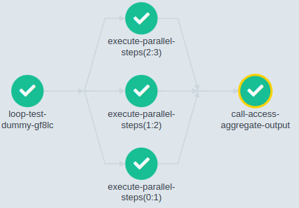

# Loops

When writing workflows, it is often very useful to be able to iterate over a set of inputs, as this is how argo-workflows can perform loops.

There are three basic ways of running a template multiple times.

- `withSequence` iterates over a sequence of numbers.
- `withItems` takes a list of things to work on. Either
    - plain, single values, which are then usable in your template as '{{item}}'
    - a JSON object where each element in the object can be addressed by it's key as '{{item.key}}'
- `withParam` takes a JSON array of items, and iterates over it - again the items can be objects like with `withItems`. This is very powerful, as you can generate the JSON in another step in your workflow, so creating a dynamic workflow.

## `withSequence` example

This runs a template multiple times using `withSequence`.

/// tab | YAML

```yaml
apiVersion: argoproj.io/v1alpha1
kind: Workflow
metadata:
  generateName: loop-sequence-
spec:
  entrypoint: loop-sequence-example

  templates:
  - name: loop-sequence-example
    steps:
    - - name: hello-world-x5
        template: hello-world
        withSequence:
          count: "5"

  - name: hello-world
    container:
      image: busybox
      command: [echo]
      args: ["hello world!"]
```

///

/// tab | Python

```python
from hera.workflows import Container, Steps, Workflow
from hera.workflows.models import Sequence

with Workflow(
    generate_name="loop-sequence-",
    entrypoint="loop-sequence-example",
) as w:
    hello_world = Container(
        name="hello-world", image="busybox", command=["echo"], args=["hello world!"]
    )
    with Steps(name="loop-sequence-example") as steps:
        hello_world(
            name="hello-world-x5",
            with_sequence=Sequence(count=5),
        )
```

///

## `withItems` basic example

This iterates over a list of items with `withItems`, substituting a string for each instantiated template.

/// tab | YAML

```yaml
apiVersion: argoproj.io/v1alpha1
kind: Workflow
metadata:
  generateName: loops-
spec:
  entrypoint: loop-example
  templates:
  - name: loop-example
    steps:
    - - name: print-message-loop
        template: print-message
        arguments:
          parameters:
          - name: message
            value: "{{item}}"
        withItems:              # invoke print-message once for each item in parallel
        - hello world           # item 1
        - goodbye world         # item 2

  - name: print-message
    inputs:
      parameters:
      - name: message
    container:
      image: busybox
      command: [echo]
      args: ["{{inputs.parameters.message}}"]
```

///

/// tab | Python

```python
from hera.workflows import Container, Steps, Workflow
from hera.workflows.models import Inputs, Parameter

with Workflow(
    generate_name="loops-",
    entrypoint="loop-example",
) as w:
    print_message = Container(
        name="print-message",
        image="busybox",
        command=["echo"],
        args=["{{inputs.parameters.message}}"],
        inputs=[Parameter(name="message")],
    )
    with Steps(name="loop-example") as steps:
        print_message(
            name="print-message-loop",
            arguments={"message": "{{item}}"},
            with_items=["hello world", "goodbye world"],
        )
```

///

## `withItems` more complex example

If we'd like to pass more than one piece of information in each workflow, you can instead use a JSON object for each entry in `withItems` and then address the elements by key, as shown in this example.

/// tab | YAML

```yaml
apiVersion: argoproj.io/v1alpha1
kind: Workflow
metadata:
  generateName: loops-maps-
spec:
  entrypoint: loop-map-example
  templates:
  - name: loop-map-example # parameter specifies the list to iterate over
    steps:
    - - name: test-linux
        template: cat-os-release
        arguments:
          parameters:
          - name: image
            value: "{{item.image}}"
          - name: tag
            value: "{{item.tag}}"
        withItems:
        - { image: 'debian', tag: '9.1' }       # item set 1
        - { image: 'debian', tag: '8.9' }       # item set 2
        - { image: 'alpine', tag: '3.6' }       # item set 3
        - { image: 'ubuntu', tag: '17.10' }     # item set 4

  - name: cat-os-release
    inputs:
      parameters:
      - name: image
      - name: tag
    container:
      image: "{{inputs.parameters.image}}:{{inputs.parameters.tag}}"
      command: [cat]
      args: [/etc/os-release]
```

///

/// tab | Python

```python
from hera.workflows import Container, Parameter, Steps, Workflow

with Workflow(
    generate_name="loops-maps-",
    entrypoint="loop-map-example",
) as w:
    cat_os_release = Container(
        name="cat-os-release",
        inputs=[Parameter(name="image"), Parameter(name="tag")],
        image="{{inputs.parameters.image}}:{{inputs.parameters.tag}}",
        command=["cat"],
        args=["/etc/os-release"],
    )

    with Steps(name="loop-map-example") as loop_map_example:
        cat_os_release(
            name="test-linux",
            arguments=[
                Parameter(name="image", value="{{item.image}}"),
                Parameter(name="tag", value="{{item.tag}}"),
            ],
            with_items=[
                {"image": "debian", "tag": "9.1"},
                {"image": "debian", "tag": "8.9"},
                {"image": "alpine", "tag": "3.6"},
                {"image": "ubuntu", "tag": "17.10"},
            ],
        )
```

///

## `withParam` example

This example does exactly the same job as the previous example, but using `withParam` to pass the information as a JSON array argument, instead of hard-coding it into the template.

/// tab | YAML

```yaml
apiVersion: argoproj.io/v1alpha1
kind: Workflow
metadata:
  generateName: loops-param-arg-
spec:
  entrypoint: loop-param-arg-example
  arguments:
    parameters:
    - name: os-list                                     # a list of items
      value: |
        [
          { "image": "debian", "tag": "9.1" },
          { "image": "debian", "tag": "8.9" },
          { "image": "alpine", "tag": "3.6" },
          { "image": "ubuntu", "tag": "17.10" }
        ]

  templates:
  - name: loop-param-arg-example
    inputs:
      parameters:
      - name: os-list
    steps:
    - - name: test-linux
        template: cat-os-release
        arguments:
          parameters:
          - name: image
            value: "{{item.image}}"
          - name: tag
            value: "{{item.tag}}"
        withParam: "{{inputs.parameters.os-list}}"      # parameter specifies the list to iterate over

  # This template is the same as in the previous example
  - name: cat-os-release
    annotations: 
      workflows.argoproj.io/display-name: "os-{{inputs.parameters.image}}-{{inputs.parameters.tag}}" # this sets a custom name for the node in the UI, based on the template's parameters
    inputs:
      parameters:
      - name: image
      - name: tag
    container:
      image: "{{inputs.parameters.image}}:{{inputs.parameters.tag}}"
      command: [cat]
      args: [/etc/os-release]
```

///

/// tab | Python

```python
from hera.workflows import Container, Steps, Workflow
from hera.workflows.models import Parameter

with Workflow(
    generate_name="loops-param-arg-",
    entrypoint="loop-param-arg-example",
    arguments={
        "os-list": """[
  { "image": "debian", "tag": "9.1" },
  { "image": "debian", "tag": "8.9" },
  { "image": "alpine", "tag": "3.6" },
  { "image": "ubuntu", "tag": "17.10" }
]
""",
    },
) as w:
    cat_os_release = Container(
        name="cat-os-release",
        annotations={"workflows.argoproj.io/display-name": "os-{{inputs.parameters.image}}-{{inputs.parameters.tag}}"},
        inputs=[
            Parameter(
                name="image",
            ),
            Parameter(
                name="tag",
            ),
        ],
        command=["cat"],
        args=["/etc/os-release"],
        image="{{inputs.parameters.image}}:{{inputs.parameters.tag}}",
    )

    with Steps(
        name="loop-param-arg-example",
        inputs=[Parameter(name="os-list")],
    ) as invocator:
        cat_os_release(
            name="test-linux",
            with_param="{{inputs.parameters.os-list}}",
            arguments={
                "image": "{{item.image}}",
                "tag": "{{item.tag}}",
            },
        )
```

///

## `withParam` example from another step in the workflow

Finally, the most powerful form of this is to generate that JSON array of objects dynamically in one step, and then pass it to the next step so that the number and values used in the second step are only calculated at runtime.

/// tab | YAML

```yaml
apiVersion: argoproj.io/v1alpha1
kind: Workflow
metadata:
  generateName: loops-param-result-
spec:
  entrypoint: loop-param-result-example
  templates:
  - name: loop-param-result-example
    steps:
    - - name: generate
        template: gen-number-list
    # Iterate over the list of numbers generated by the generate step above
    - - name: sleep
        template: sleep-n-sec
        arguments:
          parameters:
          - name: seconds
            value: "{{item}}"
        withParam: "{{steps.generate.outputs.result}}"

  # Generate a list of numbers in JSON format
  - name: gen-number-list
    script:
      image: python:alpine3.6
      command: [python]
      source: |
        import json
        import sys
        json.dump([i for i in range(20, 31)], sys.stdout)

  - name: sleep-n-sec
    inputs:
      parameters:
      - name: seconds
    container:
      image: alpine:latest
      command: [sh, -c]
      args: ["echo sleeping for {{inputs.parameters.seconds}} seconds; sleep {{inputs.parameters.seconds}}; echo done"]
```

///

/// tab | Python

```python
from hera.workflows import Container, Steps, Workflow, script
from hera.workflows.models import Parameter


@script()
def gen_number_list():
    import json
    import sys
    json.dump([i for i in range(20, 31)], sys.stdout)

with Workflow(
    generate_name="loops-param-result-",
    entrypoint="loop-param-result-example",
) as w:
    sleep_n_sec = Container(
        name="sleep-n-sec",
        image="alpine:latest",
        command=["sh", "-c"],
        args=[
            "echo sleeping for {{inputs.parameters.seconds}} seconds; sleep {{inputs.parameters.seconds}}; echo done"
        ],
        inputs=[Parameter(name="seconds")],
    )
    with Steps(name="loop-param-result-example") as steps:
        gen_number_list(name="generate")
        sleep_n_sec(
            name="sleep",
            arguments={"seconds": "{{item}}"},
            with_param="{{steps.generate.outputs.result}}",
        )
```

///

## Accessing the aggregate results of a loop

The output of all iterations can be accessed as a JSON array, once the loop is done.
The example below shows how you can read it.

Please note: the output of each iteration _must_ be a **valid JSON**.

/// tab | YAML

```yaml
apiVersion: argoproj.io/v1alpha1
kind: WorkflowTemplate
metadata:
  name: loop-test
spec:
  entrypoint: main
  templates:
  - name: main
    steps:
    - - name: execute-parallel-steps
        template: print-json-entry
        arguments:
          parameters:
          - name: index
            value: '{{item}}'
        withParam: '[1, 2, 3]'
    - - name: call-access-aggregate-output
        template: access-aggregate-output
        arguments:
          parameters:
          - name: aggregate-results
            # If the value of each loop iteration isn't a valid JSON,
            # you get a JSON parse error:
            value: '{{steps.execute-parallel-steps.outputs.result}}'
  - name: print-json-entry
    inputs:
      parameters:
      - name: index
    # The output must be a valid JSON
    script:
      image: alpine:latest
      command: [sh]
      source: |
        cat <<EOF
        {
        "input": "{{inputs.parameters.index}}",
        "transformed-input": "{{inputs.parameters.index}}.jpeg"
        }
        EOF
  - name: access-aggregate-output
    inputs:
      parameters:
      - name: aggregate-results
        value: 'no-value'
    script:
      image: alpine:latest
      command: [sh]
      source: |
        echo 'inputs.parameters.aggregate-results: "{{inputs.parameters.aggregate-results}}"'
```

///

/// tab | Python

```python
from hera.workflows import Script, Step, Steps, WorkflowTemplate
from hera.workflows.models import Inputs, Parameter

with WorkflowTemplate(
    name="loop-test",
    entrypoint="main",
) as w:
    print_json_entry = Script(
        name="print-json-entry",
        image="alpine:latest",
        command=["sh"],
        source='cat <<EOF\n{\n"input": "{{inputs.parameters.index}}",\n"transformed-input": "{{inputs.parameters.index}}.jpeg"\n}\nEOF\n',
        inputs=Inputs(parameters=[Parameter(name="index")]),
    )
    access_aggregate_output = Script(
        name="access-aggregate-output",
        image="alpine:latest",
        command=["sh"],
        source="echo 'inputs.parameters.aggregate-results: \"{{inputs.parameters.aggregate-results}}\"'\n",
        inputs=[Parameter(name="aggregate-results", value="no-value")],
    )

    with Steps(name="main") as steps:
        execute = Step(
            name="execute-parallel-steps",
            with_param="[1, 2, 3]",
            arguments={"index": "{{item}}"},
            template="print-json-entry"
        )
        access_aggregate_output(
            name="call-access-aggregate-output",
            arguments={"aggregate-results": execute.result},
        )
```

///



The last step of the workflow above should have this output:

```console
inputs.parameters.aggregate-results: "[{"input":"1","transformed-input":"1.jpeg"},{"input":"2","transformed-input":"2.jpeg"},{"input":"3","transformed-input":"3.jpeg"}]"
```
