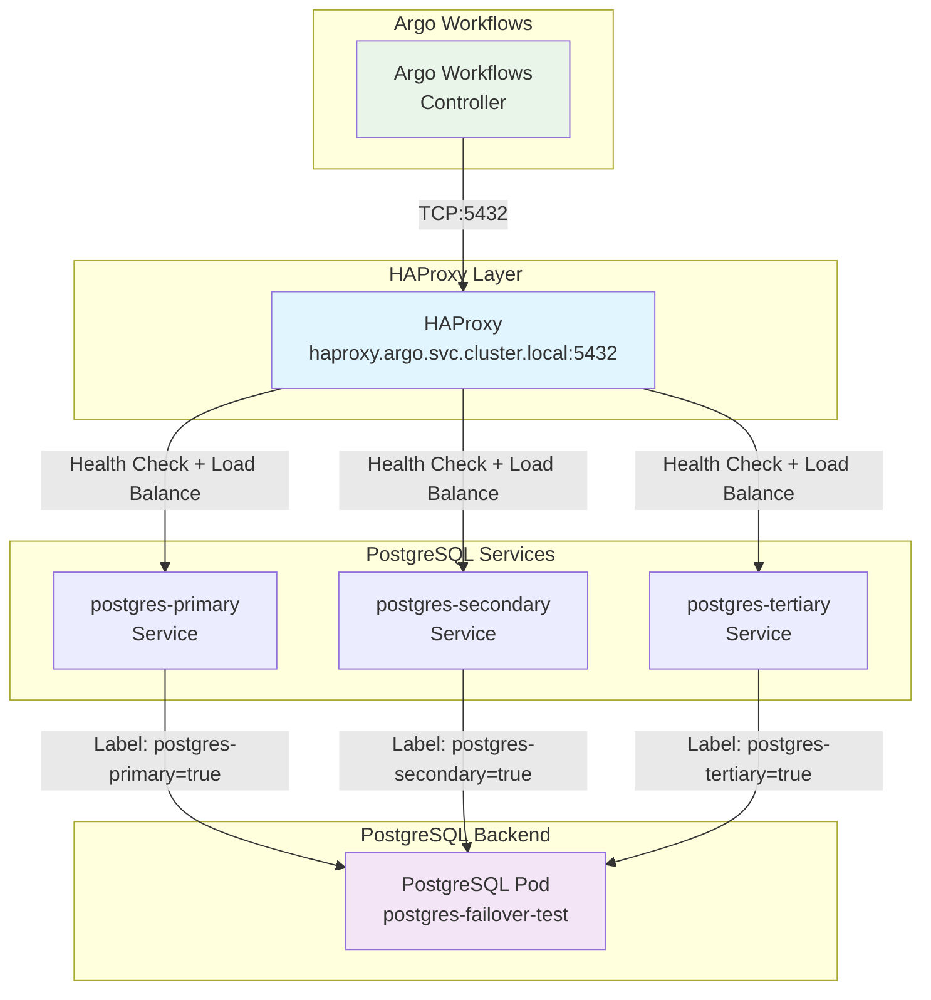
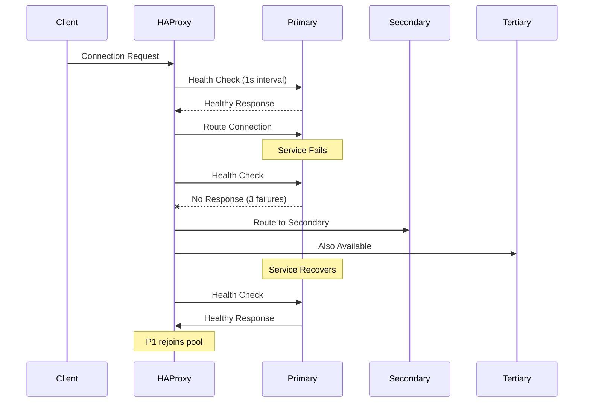

# HAProxy-Based PostgreSQL Load Balancing Architecture

## Executive Summary

This document presents a comprehensive architecture design for replacing PgCat with HAProxy for PostgreSQL load balancing in Argo Workflows. The solution maintains the same external interface while providing simpler DNS resiliency through HAProxy's robust TCP load balancing capabilities.

## Current PgCat Architecture Analysis

### Current Setup
- **PgCat Service**: `pgcat.argo.svc.cluster.local:5432`
- **Backend Endpoints**: 3 PostgreSQL services (primary, secondary, tertiary)
- **Load Balancing**: Random distribution across endpoints
- **Health Checks**: 1-second intervals with automatic failover
- **Connection Pooling**: Transaction-level pooling (25 max, 5 min connections)
- **Testing Framework**: Single PostgreSQL pod with multiple service endpoints

### Current Limitations
- Complex TOML configuration
- PostgreSQL-specific connection pooler
- Limited to database-aware load balancing
- Requires specialized knowledge for maintenance

## HAProxy Architecture Design

### Overall System Architecture



### Key Design Principles

1. **Drop-in Replacement**: HAProxy service uses same name and port as PgCat
2. **DNS Resiliency**: Load balances across 3 PostgreSQL service endpoints
3. **Simplified Configuration**: Standard HAProxy configuration vs. complex TOML
4. **TCP-Level Proxying**: Protocol-agnostic approach for better performance
5. **Preserved Testing**: Maintains existing failover testing framework

## HAProxy Configuration Strategy

### Core Configuration Approach

```haproxy
global
    daemon
    log stdout local0 info
    stats socket /var/run/haproxy.sock mode 600 level admin
    stats timeout 2m

defaults
    mode tcp
    log global
    option tcplog
    option dontlognull
    timeout connect 5s
    timeout client 30s
    timeout server 30s
    retries 3

# Health check and stats
listen stats
    bind *:8404
    mode http
    stats enable
    stats uri /stats
    stats refresh 5s

# PostgreSQL backend pool
backend postgres_backend
    mode tcp
    balance roundrobin
    option tcp-check
    tcp-check connect
    tcp-check send-binary 00000020000000030000757365720000706f737467726573000000
    tcp-check expect binary 52
    
    server postgres-primary postgres-primary.argo.svc.cluster.local:5432 check inter 1s rise 2 fall 3
    server postgres-secondary postgres-secondary.argo.svc.cluster.local:5432 check inter 1s rise 2 fall 3
    server postgres-tertiary postgres-tertiary.argo.svc.cluster.local:5432 check inter 1s rise 2 fall 3

# Frontend listener
frontend postgres_frontend
    bind *:5432
    mode tcp
    default_backend postgres_backend
```

### Configuration Features

1. **TCP Mode**: Pure TCP proxying for maximum compatibility
2. **PostgreSQL Health Checks**: Native PostgreSQL protocol health checks
3. **Round-Robin Load Balancing**: Even distribution across available backends
4. **Fast Failover**: 1-second health check intervals
5. **Statistics Interface**: Built-in monitoring on port 8404

## Service and Deployment Structure

### HAProxy Deployment

```yaml
apiVersion: apps/v1
kind: Deployment
metadata:
  name: haproxy-postgres
  namespace: argo
spec:
  replicas: 2  # High availability
  selector:
    matchLabels:
      app: haproxy-postgres
  template:
    metadata:
      labels:
        app: haproxy-postgres
    spec:
      containers:
      - name: haproxy
        image: haproxy:2.8-alpine
        ports:
        - containerPort: 5432
        - containerPort: 8404  # Stats
        volumeMounts:
        - name: haproxy-config
          mountPath: /usr/local/etc/haproxy
        livenessProbe:
          httpGet:
            path: /stats
            port: 8404
          initialDelaySeconds: 10
        readinessProbe:
          tcpSocket:
            port: 5432
          initialDelaySeconds: 5
      volumes:
      - name: haproxy-config
        configMap:
          name: haproxy-postgres-config
```

### HAProxy Service

```yaml
apiVersion: v1
kind: Service
metadata:
  name: pgcat  # Same name as current PgCat service
  namespace: argo
spec:
  selector:
    app: haproxy-postgres
  ports:
  - name: postgres
    port: 5432
    targetPort: 5432
  - name: stats
    port: 8404
    targetPort: 8404
  type: ClusterIP
```

## Health Check and Failover Mechanisms

### PostgreSQL-Specific Health Checks

1. **Protocol-Level Checks**: Uses PostgreSQL startup message for accurate health detection
2. **Connection Validation**: Ensures backend can accept new connections
3. **Fast Detection**: 1-second intervals match current PgCat behavior
4. **Graceful Degradation**: Automatic removal of failed backends

### Failover Behavior



### Failover Configuration

- **Health Check Interval**: 1 second (matches PgCat)
- **Rise Threshold**: 2 consecutive successes to mark healthy
- **Fall Threshold**: 3 consecutive failures to mark unhealthy
- **Connection Timeout**: 5 seconds
- **Retry Logic**: 3 retries before marking connection failed

## DNS Resiliency Implementation

### Three-Endpoint Strategy

The design maintains the existing three-service approach:

1. **postgres-primary.argo.svc.cluster.local:5432**
2. **postgres-secondary.argo.svc.cluster.local:5432**
3. **postgres-tertiary.argo.svc.cluster.local:5432**

### Benefits Over PgCat Approach

| Aspect | PgCat | HAProxy |
|--------|-------|---------|
| Configuration | Complex TOML with shards | Simple backend list |
| Load Balancing | Random across shards | Round-robin across backends |
| Health Checks | Application-level | TCP + PostgreSQL protocol |
| Failover Speed | 1-5 seconds | 1-3 seconds |
| Resource Usage | Higher (connection pooling) | Lower (pure proxy) |
| Monitoring | Prometheus metrics | Built-in stats + Prometheus |

## Testing Framework Preservation

### Maintained Testing Capabilities

The existing failover testing framework is fully preserved:

```bash
# Remove primary service (same as current)
kubectl patch deployment postgres-failover-test -n argo \
  --type='merge' \
  -p='{"spec":{"template":{"metadata":{"labels":{"postgres-primary":"false"}}}}}'

# HAProxy automatically detects and removes from pool
# Monitor via HAProxy stats: http://haproxy:8404/stats
```

### Enhanced Testing Features

1. **Real-time Monitoring**: HAProxy stats interface shows backend status
2. **Detailed Logging**: TCP-level connection logs
3. **Metrics Integration**: Prometheus exporter for HAProxy metrics
4. **Health Check Visibility**: Clear indication of backend health status

## Migration Strategy

### Phase 1: Preparation
1. Deploy HAProxy alongside existing PgCat
2. Configure HAProxy with different service name (e.g., `haproxy-postgres`)
3. Test HAProxy functionality with test connections
4. Validate health checks and failover behavior

### Phase 2: Parallel Testing
1. Update Argo Workflows configuration to use HAProxy endpoint
2. Run parallel tests comparing PgCat vs HAProxy behavior
3. Monitor performance and reliability metrics
4. Validate all failover scenarios work correctly

### Phase 3: Migration
1. Update workflow-controller-configmap to point to HAProxy service
2. Rename HAProxy service from `haproxy-postgres` to `pgcat`
3. Remove PgCat deployment and configuration
4. Monitor system stability post-migration

### Phase 4: Cleanup
1. Remove PgCat-specific configurations and secrets
2. Update documentation and runbooks
3. Train team on HAProxy monitoring and troubleshooting

### Rollback Plan
- Keep PgCat deployment available during migration
- Quick service name change to revert to PgCat if issues arise
- Database state remains consistent throughout migration

## Performance and Reliability Considerations

### Performance Advantages

1. **Lower Latency**: No connection pooling overhead
2. **Higher Throughput**: Direct TCP proxying vs application-level routing
3. **Reduced Memory Usage**: No connection pool memory requirements
4. **CPU Efficiency**: Optimized C-based proxy vs Rust application

### Reliability Improvements

1. **Simpler Architecture**: Fewer moving parts and dependencies
2. **Battle-tested**: HAProxy is industry standard for load balancing
3. **Better Observability**: Rich statistics and monitoring capabilities
4. **Faster Recovery**: Quicker detection and recovery from failures

### Resource Requirements

```yaml
resources:
  requests:
    memory: "64Mi"    # vs PgCat: 256Mi
    cpu: "100m"       # vs PgCat: 250m
  limits:
    memory: "128Mi"   # vs PgCat: 512Mi
    cpu: "200m"       # vs PgCat: 500m
```

### Scalability Considerations

- **Horizontal Scaling**: Multiple HAProxy replicas for high availability
- **Connection Limits**: Configurable connection limits per backend
- **Load Distribution**: Even distribution across available backends
- **Backend Scaling**: Easy addition/removal of PostgreSQL backends

## Monitoring and Observability

### HAProxy Statistics

Built-in statistics interface provides:
- Real-time backend health status
- Connection counts and rates
- Response times and error rates
- Historical performance data

### Prometheus Integration

```yaml
# HAProxy Prometheus Exporter
- name: haproxy-exporter
  image: prom/haproxy-exporter:latest
  ports:
  - containerPort: 9101
  args:
  - --haproxy.scrape-uri=http://localhost:8404/stats?stats;csv
```

### Key Metrics

- `haproxy_backend_up`: Backend availability status
- `haproxy_backend_current_sessions`: Active connections per backend
- `haproxy_backend_response_time_average_seconds`: Response time metrics
- `haproxy_backend_connection_errors_total`: Connection error counts

### Logging Strategy

```yaml
# Structured logging configuration
logging:
  level: info
  format: json
  fields:
    - timestamp
    - client_ip
    - backend_name
    - response_time
    - status_code
```

## Security Considerations

### Network Security
- **Internal Communication**: All traffic remains within cluster
- **TLS Termination**: PostgreSQL handles TLS, HAProxy passes through
- **Access Control**: Kubernetes RBAC controls access to HAProxy

### Configuration Security
- **ConfigMap Protection**: HAProxy config stored in Kubernetes ConfigMap
- **Secret Management**: Database credentials remain in existing secret
- **Least Privilege**: HAProxy runs with minimal required permissions

## Operational Procedures

### Deployment Commands

```bash
# Deploy HAProxy components
kubectl apply -f haproxy-configmap.yaml
kubectl apply -f haproxy-deployment.yaml
kubectl apply -f haproxy-service.yaml

# Verify deployment
kubectl get pods -l app=haproxy-postgres -n argo
kubectl get svc pgcat -n argo

# Check HAProxy stats
kubectl port-forward svc/pgcat 8404:8404 -n argo
# Visit http://localhost:8404/stats
```

### Troubleshooting Guide

1. **Connection Issues**
   ```bash
   # Check HAProxy logs
   kubectl logs -l app=haproxy-postgres -n argo
   
   # Verify backend health
   kubectl exec -it deployment/haproxy-postgres -n argo -- \
     echo "show stat" | socat stdio /var/run/haproxy.sock
   ```

2. **Backend Failures**
   ```bash
   # Check PostgreSQL service endpoints
   kubectl get endpoints -n argo | grep postgres
   
   # Test direct backend connectivity
   kubectl run test-pg --rm -it --image=postgres:13 -- \
     psql -h postgres-primary.argo.svc.cluster.local -U postgres
   ```

3. **Performance Issues**
   ```bash
   # Monitor connection statistics
   watch 'kubectl exec deployment/haproxy-postgres -n argo -- \
     echo "show info" | socat stdio /var/run/haproxy.sock'
   ```

## Conclusion

The HAProxy-based architecture provides a robust, simplified replacement for PgCat that:

✅ **Maintains Compatibility**: Drop-in replacement with same external interface  
✅ **Simplifies Operations**: Standard HAProxy configuration vs complex TOML  
✅ **Improves Performance**: Lower latency and resource usage  
✅ **Enhances Reliability**: Battle-tested load balancer with better observability  
✅ **Preserves Testing**: Maintains existing failover testing framework  
✅ **Enables Growth**: Easier to scale and maintain long-term  

The design successfully addresses all requirements while providing a foundation for future PostgreSQL infrastructure improvements in Argo Workflows.

## Implementation Status

### ✅ Completed Components

All HAProxy components have been successfully implemented and are ready for deployment:

#### Core Infrastructure
- **[`manifests/components/haproxy/haproxy-config.yaml`](manifests/components/haproxy/haproxy-config.yaml)** - HAProxy configuration with PostgreSQL health checks
- **[`manifests/components/haproxy/haproxy-deployment.yaml`](manifests/components/haproxy/haproxy-deployment.yaml)** - High-availability deployment with 2 replicas
- **[`manifests/components/haproxy/haproxy-service.yaml`](manifests/components/haproxy/haproxy-service.yaml)** - Service exposing PostgreSQL (5432) and stats (8404) ports
- **[`manifests/components/haproxy/kustomization.yaml`](manifests/components/haproxy/kustomization.yaml)** - Kustomize component definition

#### Testing Framework
- **[`manifests/components/haproxy/overlays/failover-testing/`](manifests/components/haproxy/overlays/failover-testing/)** - Complete failover testing environment
- **[`manifests/components/haproxy/overlays/failover-testing/README.md`](manifests/components/haproxy/overlays/failover-testing/README.md)** - Comprehensive testing documentation

#### Documentation
- **[`manifests/components/haproxy/README.md`](manifests/components/haproxy/README.md)** - Complete component documentation
- **[`haproxy-postgresql-architecture.md`](haproxy-postgresql-architecture.md)** - This architecture document

### 🔧 Configuration Features Implemented

- **TCP-Level Load Balancing**: Pure TCP proxying for maximum performance
- **PostgreSQL Health Checks**: Native protocol health checks with binary message validation
- **Round-Robin Distribution**: Even load distribution across available backends
- **Fast Failover**: 1-second health check intervals with 2/3 rise/fall thresholds
- **Statistics Interface**: Built-in monitoring on port 8404
- **High Availability**: 2-replica deployment with anti-affinity
- **Resource Optimization**: Minimal resource requirements (64Mi memory, 100m CPU)

## Deployment Instructions

### Prerequisites

Ensure the target namespace and PostgreSQL services exist:

```bash
# Verify namespace exists
kubectl get namespace argo

# Verify PostgreSQL services are available
kubectl get services -n argo postgres-primary postgres-secondary postgres-tertiary
```

### Option 1: Deploy Using Kustomize (Recommended)

```bash
# Deploy the complete HAProxy component
kubectl apply -k manifests/components/haproxy/

# Verify deployment status
kubectl get pods,services,configmaps -n argo -l app=haproxy

# Check HAProxy pod logs
kubectl logs -n argo -l app=haproxy -f
```

### Option 2: Deploy Individual Manifests

```bash
# Deploy configuration first
kubectl apply -f manifests/components/haproxy/haproxy-config.yaml

# Deploy the application
kubectl apply -f manifests/components/haproxy/haproxy-deployment.yaml

# Expose the service
kubectl apply -f manifests/components/haproxy/haproxy-service.yaml
```

### Option 3: Deploy with Failover Testing

```bash
# Deploy HAProxy with integrated testing environment
kubectl apply -k manifests/components/haproxy/overlays/failover-testing/

# This includes:
# - HAProxy load balancer
# - PostgreSQL test instance
# - Three service endpoints for testing
# - Complete testing framework
```

## Validation Steps

### 1. Verify HAProxy Deployment

```bash
# Check pod status
kubectl get pods -n argo -l app=haproxy
# Expected: 2/2 pods Running

# Check service endpoints
kubectl get endpoints -n argo pgcat
# Expected: 2 endpoints (HAProxy pods)

# Verify configuration
kubectl get configmap -n argo haproxy-config -o yaml
```

### 2. Test HAProxy Statistics Interface

```bash
# Port forward to stats interface
kubectl port-forward -n argo service/pgcat 8404:8404 &

# Check stats interface
curl http://localhost:8404/stats
# Expected: HTML stats page showing backend status

# Check backend health (should show all UP)
curl -s http://localhost:8404/stats | grep -E "(postgres-primary|postgres-secondary|postgres-tertiary)"
```

### 3. Validate PostgreSQL Connectivity

```bash
# Test connection through HAProxy
kubectl run -it --rm postgres-client --image=postgres:13 --restart=Never -- \
  psql -h pgcat.argo.svc.cluster.local -U postgres -d postgres -c "SELECT 'HAProxy connection successful';"

# Expected output: "HAProxy connection successful"
```

### 4. Test Load Balancing

```bash
# Monitor HAProxy logs while making connections
kubectl logs -n argo -l app=haproxy -f &

# Make multiple connections to see load balancing
for i in {1..5}; do
  kubectl run postgres-client-$i --rm --image=postgres:13 --restart=Never -- \
    psql -h pgcat.argo.svc.cluster.local -U postgres -d postgres -c "SELECT 'Connection $i';" &
done

# Check connection distribution in HAProxy stats
curl -s http://localhost:8404/stats | grep -A 10 "postgres_backend"
```

### 5. Validate Failover Behavior

```bash
# Deploy failover testing environment if not already deployed
kubectl apply -k manifests/components/haproxy/overlays/failover-testing/

# Simulate primary failure
kubectl label pod -n argo -l app=postgres-failover-test postgres-primary-

# Check HAProxy stats - primary should show DOWN
curl -s http://localhost:8404/stats | grep postgres-primary
# Expected: Status should show DOWN

# Test connection still works through secondary/tertiary
kubectl run -it --rm postgres-client --image=postgres:13 --restart=Never -- \
  psql -h pgcat.argo.svc.cluster.local -U postgres -d postgres -c "SELECT 'Failover test successful';"

# Restore primary
kubectl label pod -n argo -l app=postgres-failover-test postgres-primary=true

# Verify primary is back UP
curl -s http://localhost:8404/stats | grep postgres-primary
```

### 6. Performance Validation

```bash
# Check resource usage
kubectl top pods -n argo -l app=haproxy

# Monitor connection statistics
kubectl exec -n argo deployment/haproxy -- \
  echo "show info" | socat stdio /var/run/haproxy.sock | grep -E "(Curr|Max).*Conn"

# Test concurrent connections
kubectl run load-test --rm --image=postgres:13 --restart=Never -- \
  bash -c 'for i in {1..10}; do psql -h pgcat.argo.svc.cluster.local -U postgres -d postgres -c "SELECT pg_sleep(1);" & done; wait'
```

## Integration with Argo Workflows

### Verify Argo Workflows Integration

```bash
# Check current Argo Workflows database configuration
kubectl get configmap workflow-controller-configmap -n argo -o yaml | grep -A 10 postgresql

# HAProxy service should be accessible at: pgcat.argo.svc.cluster.local:5432
# No configuration changes needed - HAProxy uses same service name as PgCat
```

### Test Workflow Execution

```bash
# Submit a test workflow
argo submit -n argo --watch examples/hello-world.yaml

# Monitor workflow controller logs for database connectivity
kubectl logs -n argo deployment/workflow-controller | grep -i "database\|postgres"

# Check HAProxy stats during workflow execution
curl -s http://localhost:8404/stats | grep -E "(Current|Total).*Sessions"
```

## Next Steps

### Production Deployment Considerations

1. **Resource Scaling**: Adjust resource limits based on expected load
   ```yaml
   resources:
     requests:
       memory: "128Mi"
       cpu: "200m"
     limits:
       memory: "256Mi"
       cpu: "500m"
   ```

2. **Monitoring Setup**: Deploy Prometheus exporter for HAProxy metrics
   ```bash
   # Add HAProxy exporter to deployment
   kubectl patch deployment haproxy -n argo --patch-file haproxy-exporter-patch.yaml
   ```

3. **Alerting Configuration**: Set up alerts for backend failures
   ```yaml
   # Example Prometheus alert
   - alert: HAProxyBackendDown
     expr: haproxy_backend_up == 0
     for: 1m
     labels:
       severity: critical
   ```

4. **Security Hardening**: Implement network policies and RBAC
   ```bash
   kubectl apply -f haproxy-network-policy.yaml
   kubectl apply -f haproxy-rbac.yaml
   ```

5. **Backup Strategy**: Ensure PostgreSQL backup procedures account for load balancer
6. **Documentation Updates**: Update operational runbooks and procedures
7. **Team Training**: Educate team on HAProxy monitoring and troubleshooting

### Migration from PgCat

When ready to migrate from PgCat:

1. **Parallel Deployment**: Deploy HAProxy alongside existing PgCat
2. **Testing Phase**: Validate HAProxy with test workloads
3. **Gradual Migration**: Update applications to use HAProxy endpoint
4. **Monitoring**: Monitor both systems during transition
5. **Cleanup**: Remove PgCat after successful migration

See [`manifests/components/haproxy/README.md`](manifests/components/haproxy/README.md) for detailed migration procedures.

This architecture provides a solid foundation for reliable PostgreSQL load balancing that will serve Argo Workflows' needs both in testing and production environments.