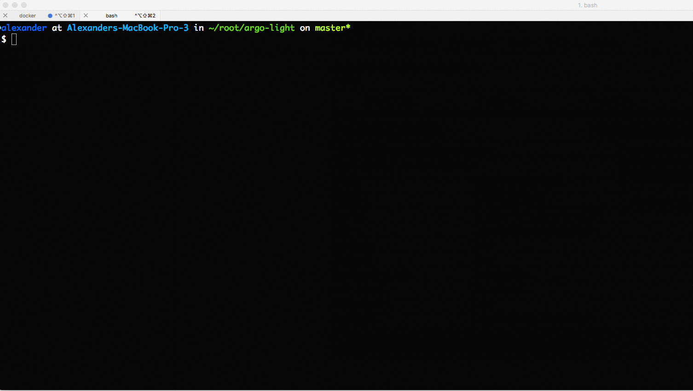

# Argo Lite

Argo Lite is a lightweight workflow engine that executes container-native workflows defined using [Argo YAML Domain-Specific Language (DSL)](https://argoproj.github.io/docs/yaml/dsl_reference_intro.html).  Argo Lite implements the same APIs as [Argo](https://github.com/argoproj/argo). This allows you to execute Argo Lite with both [Argo CLI](https://argoproj.github.io/docs/dev-cli-reference.html) and Argo UI. Currently, Argo Lite supports Docker and Kubernetes as the backend container execution engines.

## Argo Lite will be released in mid-October

Argo Lite is not yet fully tested and may crash under load. Early testing/contributions are very welcome.

## Why?

Argo Lite may be used to quickly experience [Argo](https://github.com/argoproj/argo) workflows without deploying a complete Kubernetes cluster or to debug Argo workflows locally on your laptop.

## Try it

Prerequisite: The [Argo CLI](https://applatix.com/open-source/argo/get-started/installation) must be installed first before you start using Argo Lite.

### On your laptop:

* *Using Docker*

 1. Run Argo Lite server:

    ```
   
    docker run --rm -p 8080:8080  -v /var/run/docker.sock:/var/run/docker.sock -dt argoproj/argo-lite node /app/dist/main.js -u /app/dist/ui

    ```

 2. Configure [Argo CLI](https://argoproj.github.io/docs/dev-cli-reference.html) to talk to your Argo Lite instance:

    ```

    argo login --config argo-lite http://localhost:8080 --username test --password test

    ```

* *Using Minikube*

  NOTE: Before you use Minikube, you must have installed a hypervisor, `kubectl` (command-line for a Kubernetes cluster), and minikube. For instructions, see [Install Minikube](https://kubernetes.io/docs/tasks/tools/install-minikube/).

 1. Create Argo Lite deployment

    *Manually*
    
  -  Deploy Argo Lite on Minikube
 
    ```
    $ curl -o /tmp/argo.yaml https://raw.githubusercontent.com/argoproj/argo/master/lite/argo-lite.yaml && kubectl create -f    /tmp/argo.yaml
    ```
    
  - Get Argo Lite's serivce URL 
  
    ```
    $ export ARGO_SVC_URL=`minikube service --url argo-lite`
    ```

  - Configure [Argo CLI](https://argoproj.github.io/docs/dev-cli-reference.html) to talk to your Argo Lite instance:
  
    ```
    $ argo login --config argo-lite-kube $ARGO_SVC_URL --username test --password test
    ```
  
    *Using [helm](https://docs.helm.sh/using_helm/#installing-helm):*

    ```
    helm repo add argo https://argoproj.github.io/argo-helm
    kubectl config view

    ```

 2. Configure [Argo CLI](https://argoproj.github.io/docs/dev-cli-reference.html) to talk to your Argo Lite instance:

    ```

    # Argo Lite UI is available at http://<deployed Argo Lite service URL>
    argo login --config argo-lite-kube <deployed Argo Lite service URL> --username test --password test

    ```

### On your Kubernetes cluster:

 1. Create Argo Lite deployment

    *Manually*

    ```

    # Argo Lite UI is available at http://localhost:8080
    curl -o /tmp/argo.yaml https://raw.githubusercontent.com/argoproj/argo/master/lite/argo-lite.yaml && kubectl create -f /tmp/argo.yaml

    ```

    *Using [helm](https://docs.helm.sh/using_helm/#installing-helm):*

    ```
    helm repo add argo https://argoproj.github.io/argo-helm
    kubectl config view

    ```

 2. Configure [Argo CLI](https://argoproj.github.io/docs/dev-cli-reference.html) to talk to your Argo Lite instance:

    ```

    # Argo Lite UI is available at http://<deployed Argo Lite service URL>
    argo login --config argo-lite-kube <deployed Argo Lite service URL> --username test --password test

    ```

### Run the Sample Workflows

You can run sample workflows on Argo Lite by cloning them from the Argo repo and submitting them using the Argo CLI commands:

* InfluxDB build/test workflow ([repo](https://github.com/argoproj/influxdb)): `argo job submit 'InfluxDB CI' --config argo-lite-kube --local`
* Selenium test workflow ([repo](https://github.com/argoproj/appstore)): `argo job submit 'Selenium Demo' --config argo-lite-kube --local`
* Docker In Docker usage example ([repo](https://github.com/argoproj/example-dind)): `argo job submit 'example-build-using-dind' --config argo-lite-kube --local`
* Argo-lite build workflow ([repo](https://github.com/argoproj/argo)): `argo job submit 'Argo Lite CI' --config argo-lite-kube --local`


